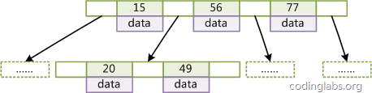
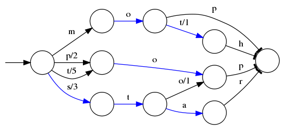

# ElasticSearch

### Windows下安装elasticsearch

在安装Elasticsearch引擎之前，必须安装ES需要的软件环境

注意：安装elasticsearch7.4运行需要jdk11及以上

elasticsearch与jdk有依赖关系

1. [下载地址](https://www.elastic.co/cn/downloads/)

2. 配置环境变量


3. 测试运行

点击/bin目录下的elasticsearch.bat开始安装

### 安装elasticsearch的head插件

 es5以上版本安装head需要安装node和grunt(之前的直接用plugin命令即可安装) 

 (一)从地址：https://nodejs.org/en/download/ 下载相应系统的msi，双击安装。
 


 （二）安装完成用cmd进入安装目录执行 node -v可查看版本号
 

（三）执行 npm install -g grunt-cli 安装grunt ，安装完成后执行grunt -version查看是否安装成功，会显示安装的版本号


（四）开始安装head
① 进入安装目录下的config目录，修改elasticsearch.yml文件.在文件的末尾加入以下代码

http.cors.enabled: true

http.cors.allow-origin: "*"

node.master: true

node.data: true

然后去掉network.host: 192.168.0.1的注释并改为network.host: 0.0.0.0，去掉cluster.name；node.name；http.port的注释（也就是去掉#）

 elasticsearch-7.1.1 版本 yml文件需要这个 cluster.initial_master_nodes: ["node-1"] 

②双击elasticsearch.bat重启es
③在https://github.com/mobz/elasticsearch-head中下载head插件，选择下载zip


④解压到指定文件夹下，G:\elasticsearch-6.4.1\elasticsearch-head-master 进入该文件夹，修改G:\elasticsearch-6.4.1\elasticsearch-head-master\Gruntfile.js 在对应的位置加上hostname:'*'


⑤在G:\elasticsearch-6.6.2\elasticsearch-head-master 下执行npm install 安装完成后执行grunt server 或者npm run start 运行head插件，如果不成功重新安装grunt。成功如下


⑥浏览器下访问http://localhost:9100/


## 整合springboot

参考博客 https://segmentfault.com/a/1190000018625101?utm_source=tag-newest 

 https://blog.csdn.net/chen_2890/article/details/83895646 

1. properties

```properties
spring.data.elasticsearch.cluster-name=elasticsearch
spring.data.elasticsearch.cluster-nodes=127.0.0.1:9300
spring.data.elasticsearch.repositories.enabled=true
```

2. pom.xml

```xml
 		<dependency>
            <groupId>org.springframework.boot</groupId>
            <artifactId>spring-boot-starter-data-elasticsearch</artifactId>
        </dependency>
        <!--集合工具包-->
        <dependency>
            <groupId>com.google.guava</groupId>
            <artifactId>guava</artifactId>
            <version>19.0</version>
        </dependency>
```

3. ```java
   	/**
        *
        * @Description:matchQuery
        *@Author: https://blog.csdn.net/chen_2890
        */
       @Test
       public void testMathQuery(){
           // 创建对象
           NativeSearchQueryBuilder queryBuilder = new NativeSearchQueryBuilder();
           // 在queryBuilder对象中自定义查询
           //matchQuery:底层就是使用的termQuery
           queryBuilder.withQuery(QueryBuilders.matchQuery("title","坚果"));
           //查询，search 默认就是分页查找
           Page<Item> page = this.itemRepository.search(queryBuilder.build());
           //获取数据
           long totalElements = page.getTotalElements();
           System.out.println("获取的总条数:"+totalElements);
      
           for(Item item:page){
               System.out.println(item);
           }
    }
    ```

   


```java
   /**
    * @Description:
    * termQuery:功能更强大，除了匹配字符串以外，还可以匹配
    * int/long/double/float/....	
    * @Author: https://blog.csdn.net/chen_2890			
    */
   @Test
   public void testTermQuery(){
       NativeSearchQueryBuilder builder = new NativeSearchQueryBuilder();
       builder.withQuery(QueryBuilders.termQuery("price",998.0));
       // 查找
       Page<Item> page = this.itemRepository.search(builder.build());
   
       for(Item item:page){
           System.out.println(item);
       }
   }
```

```java
/**
     * @Description:布尔查询
     * @author: https://blog.csdn.net/chen_2890
     */
    @Test
    public void testBooleanQuery() {
        NativeSearchQueryBuilder builder = new NativeSearchQueryBuilder();    builder.withQuery(QueryBuilders.boolQuery().must(QueryBuilders.matchQuery("title","华为")).must(QueryBuilders.matchQuery("brand", "华为")));
        // 查找
        Page<Item> page = this.itemRepository.search(builder.build());
        for (Item item : page) {
            System.out.println(item);
        }
    }
```

  ```java
/**

   * @Description:模糊查询
     uthor: https://blog.csdn.net/chen_2890			
             */
            @Test
            public void testFuzzyQuery(){
     NativeSearchQueryBuilder builder = new NativeSearchQueryBuilder();
     builder.withQuery(QueryBuilders.fuzzyQuery("title","faceoooo"));
     Page<Item> page = this.itemRepository.search(builder.build());
     for(Item item:page){
         System.out.println(item);
     }

   } 
  ```

# Elasticsearch－基础介绍及索引原理分析

最近在参与一个基于Elasticsearch作为底层数据框架提供大数据量(亿级)的实时统计查询的方案设计工作，花了些时间学习Elasticsearch的基础理论知识，整理了一下，希望能对Elasticsearch感兴趣/想了解的同学有所帮助。 同时也希望有发现内容不正确或者有疑问的地方，望指明，一起探讨，学习，进步。

## 介绍

Elasticsearch 是一个分布式可扩展的实时搜索和分析引擎,一个建立在全文搜索引擎 Apache Lucene(TM) 基础上的搜索引擎.当然 Elasticsearch 并不仅仅是 Lucene 那么简单，它不仅包括了全文搜索功能，还可以进行以下工作:

- 分布式实时文件存储，并将每一个字段都编入索引，使其可以被搜索。
- 实时分析的分布式搜索引擎。
- 可以扩展到上百台服务器，处理PB级别的结构化或非结构化数据。

### 基本概念

先说Elasticsearch的文件存储，Elasticsearch是面向文档型数据库，一条数据在这里就是一个文档，用JSON作为文档序列化的格式，比如下面这条用户数据：

```json
{
    "name" :     "John",
    "sex" :      "Male",
    "age" :      25,
    "birthDate": "1990/05/01",
    "about" :    "I love to go rock climbing",
    "interests": [ "sports", "music" ]
}
```

用Mysql这样的数据库存储就会容易想到建立一张User表，有balabala的字段等，在Elasticsearch里这就是一个*文档*，当然这个文档会属于一个User的*类型*，各种各样的类型存在于一个*索引*当中。这里有一份简易的将Elasticsearch和关系型数据术语对照表:

```
关系数据库     ⇒ 数据库 ⇒ 表    ⇒ 行    ⇒ 列(Columns)

Elasticsearch  ⇒ 索引(Index)   ⇒ 类型(type)  ⇒ 文档(Docments)  ⇒ 字段(Fields)  
```

一个 Elasticsearch 集群可以包含多个索引(数据库)，也就是说其中包含了很多类型(表)。这些类型中包含了很多的文档(行)，然后每个文档中又包含了很多的字段(列)。Elasticsearch的交互，可以使用Java API，也可以直接使用HTTP的Restful API方式，比如我们打算插入一条记录，可以简单发送一个HTTP的请求：

```json
PUT /megacorp/employee/1  
{
    "name" :     "John",
    "sex" :      "Male",
    "age" :      25,
    "about" :    "I love to go rock climbing",
    "interests": [ "sports", "music" ]
}
```

更新，查询也是类似这样的操作，具体操作手册可以参见[Elasticsearch权威指南](http://www.learnes.net/data/README.html)

------

## 索引

Elasticsearch最关键的就是提供强大的索引能力了，其实InfoQ的这篇[时间序列数据库的秘密(2)——索引](http://www.infoq.com/cn/articles/database-timestamp-02?utm_source=infoq&utm_medium=related_content_link&utm_campaign=relatedContent_articles_clk)写的非常好，我这里也是围绕这篇结合自己的理解进一步梳理下，也希望可以帮助大家更好的理解这篇文章。

Elasticsearch索引的精髓：

> 一切设计都是为了提高搜索的性能

另一层意思：为了提高搜索的性能，难免会牺牲某些其他方面，比如插入/更新，否则其他数据库不用混了。前面看到往Elasticsearch里插入一条记录，其实就是直接PUT一个json的对象，这个对象有多个fields，比如上面例子中的*name, sex, age, about, interests*，那么在插入这些数据到Elasticsearch的同时，Elasticsearch还默默[1](http://blog.pengqiuyuan.com/ji-chu-jie-shao-ji-suo-yin-yuan-li-fen-xi/#fn:1)的为这些字段建立索引--倒排索引，因为Elasticsearch最核心功能是搜索。

### Elasticsearch是如何做到快速索引的

InfoQ那篇文章里说Elasticsearch使用的倒排索引比关系型数据库的B-Tree索引快，为什么呢？

#### 什么是B-Tree索引?

上大学读书时老师教过我们，二叉树查找效率是logN，同时插入新的节点不必移动全部节点，所以用树型结构存储索引，能同时兼顾插入和查询的性能。因此在这个基础上，再结合磁盘的读取特性(顺序读/随机读)，传统关系型数据库采用了B-Tree/B+Tree这样的数据结构：



为了提高查询的效率，减少磁盘寻道次数，将多个值作为一个数组通过连续区间存放，一次寻道读取多个数据，同时也降低树的高度。

#### 什么是倒排索引?


继续上面的例子，假设有这么几条数据(为了简单，去掉about, interests这两个field):

```
| ID | Name | Age  |  Sex     |
| -- |:------------:| -----:| -----:| 
| 1  | Kate         | 24 | Female
| 2  | John         | 24 | Male
| 3  | Bill         | 29 | Male
```

ID是Elasticsearch自建的文档id，那么Elasticsearch建立的索引如下:

**Name:**

```
| Term | Posting List |
| -- |:----:|
| Kate | 1 |
| John | 2 |
| Bill | 3 |
```

**Age:**

```
| Term | Posting List |
| -- |:----:|
| 24 | [1,2] |
| 29 | 3 |
```

**Sex:**

```
| Term | Posting List |
| -- |:----:|
| Female | 1 |
| Male | [2,3] |
```

##### Posting List

Elasticsearch分别为每个field都建立了一个倒排索引，Kate, John, 24, Female这些叫term，而[1,2]就是**Posting List**。Posting list就是一个int的数组，存储了所有符合某个term的文档id。

看到这里，不要认为就结束了，精彩的部分才刚开始...

通过posting list这种索引方式似乎可以很快进行查找，比如要找age=24的同学，爱回答问题的小明马上就举手回答：我知道，id是1，2的同学。但是，如果这里有上千万的记录呢？如果是想通过name来查找呢？

##### Term Dictionary

Elasticsearch为了能快速找到某个term，将所有的term排个序，二分法查找term，logN的查找效率，就像通过字典查找一样，这就是**Term Dictionary**。现在再看起来，似乎和传统数据库通过B-Tree的方式类似啊，为什么说比B-Tree的查询快呢？

##### Term Index

B-Tree通过减少磁盘寻道次数来提高查询性能，Elasticsearch也是采用同样的思路，直接通过内存查找term，不读磁盘，但是如果term太多，term dictionary也会很大，放内存不现实，于是有了**Term Index**，就像字典里的索引页一样，A开头的有哪些term，分别在哪页，可以理解term index是一颗树：


这棵树不会包含所有的term，它包含的是term的一些前缀。通过term index可以快速地定位到term dictionary的某个offset，然后从这个位置再往后顺序查找。


所以term index不需要存下所有的term，而仅仅是他们的一些前缀与Term Dictionary的block之间的映射关系，再结合FST(Finite State Transducers)的压缩技术，可以使term index缓存到内存中。从term index查到对应的term dictionary的block位置之后，再去磁盘上找term，大大减少了磁盘随机读的次数。

这时候爱提问的小明又举手了:"那个FST是神马东东啊?"

一看就知道小明是一个上大学读书的时候跟我一样不认真听课的孩子，数据结构老师一定讲过什么是FST。但没办法，我也忘了，这里再补下课：

> FSTs are finite-state machines that **map** a **term (byte sequence)** to an arbitrary **output**.

假设我们现在要将mop, moth, pop, star, stop and top(term index里的term前缀)映射到序号：0，1，2，3，4，5(term dictionary的block位置)。最简单的做法就是定义个Map<string, integer="">，大家找到自己的位置对应入座就好了，但从内存占用少的角度想想，有没有更优的办法呢？答案就是：**FST**([理论依据在此，但我相信99%的人不会认真看完的](http://www.cs.nyu.edu/~mohri/pub/fla.pdf))



⭕️表示一种状态

-->表示状态的变化过程，上面的字母/数字表示状态变化和权重

将单词分成单个字母通过⭕️和-->表示出来，0权重不显示。如果⭕️后面出现分支，就标记权重，最后整条路径上的权重加起来就是这个单词对应的序号。

> FSTs are finite-state machines that map a term (**byte sequence**) to an arbitrary output.

FST以字节的方式存储所有的term，这种压缩方式可以有效的缩减存储空间，使得term index足以放进内存，但这种方式也会导致查找时需要更多的CPU资源。

后面的更精彩，看累了的同学可以喝杯咖啡……

------

#### 压缩技巧

Elasticsearch里除了上面说到用FST压缩term index外，对posting list也有压缩技巧。 
小明喝完咖啡又举手了:"posting list不是已经只存储文档id了吗？还需要压缩？"

嗯，我们再看回最开始的例子，如果Elasticsearch需要对同学的性别进行索引(这时传统关系型数据库已经哭晕在厕所……)，会怎样？如果有上千万个同学，而世界上只有男/女这样两个性别，每个posting list都会有至少百万个文档id。 Elasticsearch是如何有效的对这些文档id压缩的呢？

##### Frame Of Reference

> 增量编码压缩，将大数变小数，按字节存储

首先，Elasticsearch要求posting list是有序的(为了提高搜索的性能，再任性的要求也得满足)，这样做的一个好处是方便压缩，看下面这个图例： 

如果数学不是体育老师教的话，还是比较容易看出来这种压缩技巧的。

原理就是通过增量，将原来的大数变成小数仅存储增量值，再精打细算按bit排好队，最后通过字节存储，而不是大大咧咧的尽管是2也是用int(4个字节)来存储。

##### Roaring bitmaps

说到Roaring bitmaps，就必须先从bitmap说起。Bitmap是一种数据结构，假设有某个posting list：

[1,3,4,7,10]

对应的bitmap就是：

[1,0,1,1,0,0,1,0,0,1]

非常直观，用0/1表示某个值是否存在，比如10这个值就对应第10位，对应的bit值是1，这样用一个字节就可以代表8个文档id，旧版本(5.0之前)的Lucene就是用这样的方式来压缩的，但这样的压缩方式仍然不够高效，如果有1亿个文档，那么需要12.5MB的存储空间，这仅仅是对应一个索引字段(我们往往会有很多个索引字段)。于是有人想出了Roaring bitmaps这样更高效的数据结构。

Bitmap的缺点是存储空间随着文档个数线性增长，Roaring bitmaps需要打破这个魔咒就一定要用到某些指数特性：

将posting list按照65535为界限分块，比如第一块所包含的文档id范围在0~65535之间，第二块的id范围是65536~131071，以此类推。再用<商，余数>的组合表示每一组id，这样每组里的id范围都在0~65535内了，剩下的就好办了，既然每组id不会变得无限大，那么我们就可以通过最有效的方式对这里的id存储。


细心的小明这时候又举手了:"为什么是以65535为界限?"

程序员的世界里除了1024外，65535也是一个经典值，因为它=2^16-1，正好是用2个字节能表示的最大数，一个short的存储单位，注意到上图里的最后一行“If a block has more than 4096 values, encode as a bit set, and otherwise as a simple array using 2 bytes per value”，如果是大块，用节省点用bitset存，小块就豪爽点，2个字节我也不计较了，用一个short[]存着方便。

那为什么用4096来区分大块还是小块呢？

个人理解：都说程序员的世界是二进制的，4096*2bytes ＝ 8192bytes < 1KB, 磁盘一次寻道可以顺序把一个小块的内容都读出来，再大一位就超过1KB了，需要两次读。

------

#### 联合索引

上面说了半天都是单field索引，如果多个field索引的联合查询，倒排索引如何满足快速查询的要求呢？

- 利用跳表(Skip list)的数据结构快速做“与”运算，或者
- 利用上面提到的bitset按位“与”

先看看跳表的数据结构：


将一个有序链表level0，挑出其中几个元素到level1及level2，每个level越往上，选出来的指针元素越少，查找时依次从高level往低查找，比如55，先找到level2的31，再找到level1的47，最后找到55，一共3次查找，查找效率和2叉树的效率相当，但也是用了一定的空间冗余来换取的。

假设有下面三个posting list需要联合索引：


如果使用跳表，对最短的posting list中的每个id，逐个在另外两个posting list中查找看是否存在，最后得到交集的结果。

如果使用bitset，就很直观了，直接按位与，得到的结果就是最后的交集。

------

### 总结和思考

Elasticsearch的索引思路:

> 将磁盘里的东西尽量搬进内存，减少磁盘随机读取次数(同时也利用磁盘顺序读特性)，结合各种奇技淫巧的压缩算法，用及其苛刻的态度使用内存。

所以，对于使用Elasticsearch进行索引时需要注意:

- 不需要索引的字段，一定要明确定义出来，因为默认是自动建索引的
- 同样的道理，对于String类型的字段，不需要analysis的也需要明确定义出来，因为默认也是会analysis的
- 选择有规律的ID很重要，随机性太大的ID(比如java的UUID)不利于查询

关于最后一点，个人认为有多个因素:

其中一个(也许不是最重要的)因素: 上面看到的压缩算法，都是对Posting list里的大量ID进行压缩的，那如果ID是顺序的，或者是有公共前缀等具有一定规律性的ID，压缩比会比较高；

另外一个因素: 可能是最影响查询性能的，应该是最后通过Posting list里的ID到磁盘中查找Document信息的那步，因为Elasticsearch是分Segment存储的，根据ID这个大范围的Term定位到Segment的效率直接影响了最后查询的性能，如果ID是有规律的，可以快速跳过不包含该ID的Segment，从而减少不必要的磁盘读次数，具体可以参考这篇[如何选择一个高效的全局ID方案](http://blog.mikemccandless.com/2014/05/choosing-fast-unique-identifier-uuid.html)(评论也很精彩)