官网手册：https://www.springcloud.cc/spring-cloud-dalston.html

# springcloud(一)：大话Spring Cloud

## Spring Cloud是什么鬼？

Spring Cloud是一系列框架的有序集合。它利用Spring Boot的开发便利性巧妙地简化了分布式系统基础设施的开发，如服务发现注册、配置中心、消息总线、负载均衡、断路器、数据监控等，都可以用Spring Boot的开发风格做到一键启动和部署。Spring并没有重复制造轮子，它只是将目前各家公司开发的比较成熟、经得起实际考验的服务框架组合起来，通过Spring Boot风格进行再封装屏蔽掉了复杂的配置和实现原理，最终给开发者留出了一套简单易懂、易部署和易维护的分布式系统开发工具包。

微服务是可以独立部署、水平扩展、独立访问（或者有独立的数据库）的服务单元，springcloud就是这些微服务的大管家，采用了微服务这种架构之后，项目的数量会非常多，springcloud做为大管家需要管理好这些微服务，自然需要很多小弟来帮忙。

主要的小弟有：Spring Cloud Config、Spring Cloud Netflix（Eureka、Hystrix、Zuul、Archaius…）、Spring Cloud Bus、Spring Cloud for Cloud Foundry、Spring Cloud Cluster、Spring Cloud Consul、Spring Cloud Security、Spring Cloud Sleuth、Spring Cloud Data Flow、Spring Cloud Stream、Spring Cloud Task、Spring Cloud Zookeeper、Spring Cloud Connectors、Spring Cloud Starters、Spring Cloud CLI，每个小弟身怀独门绝技武功高强下面来做一一介绍。

## 核心成员

### Spring Cloud Netflix

这可是个大boss，地位仅次于老大，老大各项服务依赖与它，与各种Netflix OSS组件集成，组成微服务的核心，它的小弟主要有Eureka, Hystrix, Zuul, Archaius… 太多了

**Netflix Eureka**

服务中心，云端服务发现，一个基于 REST 的服务，用于定位服务，以实现云端中间层服务发现和故障转移。这个可是springcloud最牛鼻的小弟，服务中心，任何小弟需要其它小弟支持什么都需要从这里来拿，同样的你有什么独门武功的都赶紧过报道，方便以后其它小弟来调用；它的好处是你不需要直接找各种什么小弟支持，只需要到服务中心来领取，也不需要知道提供支持的其它小弟在哪里，还是几个小弟来支持的，反正拿来用就行，服务中心来保证稳定性和质量。

**Netflix Hystrix**

熔断器，容错管理工具，旨在通过熔断机制控制服务和第三方库的节点,从而对延迟和故障提供更强大的容错能力。比如突然某个小弟生病了，但是你还需要它的支持，然后调用之后它半天没有响应，你却不知道，一直在等等这个响应；有可能别的小弟也正在调用你的武功绝技，那么当请求多之后，就会发生严重的阻塞影响老大的整体计划。这个时候Hystrix就派上用场了，当Hystrix发现某个小弟不在状态不稳定立马马上让它下线，让其它小弟来顶上来，或者给你说不用等了这个小弟今天肯定不行，该干嘛赶紧干嘛去别在这排队了。

**Netflix Zuul**

Zuul 是在云平台上提供动态路由,监控,弹性,安全等边缘服务的框架。Zuul 相当于是设备和 Netflix 流应用的 Web 网站后端所有请求的前门。当其它门派来找大哥办事的时候一定要先经过zuul,看下有没有带刀子什么的给拦截回去，或者是需要找那个小弟的直接给带过去。

**Netflix Archaius**

配置管理API，包含一系列配置管理API，提供动态类型化属性、线程安全配置操作、轮询框架、回调机制等功能。可以实现动态获取配置， 原理是每隔60s（默认，可配置）从配置源读取一次内容，这样修改了配置文件后不需要重启服务就可以使修改后的内容生效，前提使用archaius的API来读取。

### Spring Cloud Config

俗称的配置中心，配置管理工具包，让你可以把配置放到远程服务器，集中化管理集群配置，目前支持本地存储、Git以及Subversion。就是以后大家武器、枪火什么的东西都集中放到一起，别随便自己带，方便以后统一管理、升级装备。

### Spring Cloud Bus

事件、消息总线，用于在集群（例如，配置变化事件）中传播状态变化，可与Spring Cloud Config联合实现热部署。相当于水浒传中日行八百里的神行太保戴宗，确保各个小弟之间消息保持畅通。

### Spring Cloud for Cloud Foundry

Cloud Foundry是VMware推出的业界第一个开源PaaS云平台，它支持多种框架、语言、运行时环境、云平台及应用服务，使开发人员能够在几秒钟内进行应用程序的部署和扩展，无需担心任何基础架构的问题

其实就是与CloudFoundry进行集成的一套解决方案，抱了Cloud Foundry的大腿。

### Spring Cloud Cluster

Spring Cloud Cluster将取代Spring Integration。提供在分布式系统中的集群所需要的基础功能支持，如：选举、集群的状态一致性、全局锁、tokens等常见状态模式的抽象和实现。

如果把不同的帮派组织成统一的整体，Spring Cloud Cluster已经帮你提供了很多方便组织成统一的工具。

### Spring Cloud Consul

Consul 是一个支持多数据中心分布式高可用的服务发现和配置共享的服务软件,由 HashiCorp 公司用 Go 语言开发, 基于 Mozilla Public License 2.0 的协议进行开源. Consul 支持健康检查,并允许 HTTP 和 DNS 协议调用 API 存储键值对.

Spring Cloud Consul 封装了Consul操作，consul是一个服务发现与配置工具，与Docker容器可以无缝集成。

## 其它小弟

**Spring Cloud Security**

基于spring security的安全工具包，为你的应用程序添加安全控制。这个小弟很牛鼻专门负责整个帮派的安全问题，设置不同的门派访问特定的资源，不能把秘籍葵花宝典泄漏了。

**Spring Cloud Sleuth**

日志收集工具包，封装了Dapper和log-based追踪以及Zipkin和HTrace操作，为SpringCloud应用实现了一种分布式追踪解决方案。

**Spring Cloud Data Flow**

- Data flow 是一个用于开发和执行大范围数据处理其模式包括ETL，批量运算和持续运算的统一编程模型和托管服务。
- 对于在现代运行环境中可组合的微服务程序来说，Spring Cloud data flow是一个原生云可编配的服务。使用Spring Cloud data flow，开发者可以为像数据抽取，实时分析，和数据导入/导出这种常见用例创建和编配数据通道 （data pipelines）。
- Spring Cloud data flow 是基于原生云对 spring XD的重新设计，该项目目标是简化大数据应用的开发。Spring XD 的流处理和批处理模块的重构分别是基于 Spring Boot的stream 和 task/batch 的微服务程序。这些程序现在都是自动部署单元而且他们原生的支持像 Cloud Foundry、Apache YARN、Apache Mesos和Kubernetes 等现代运行环境。
- Spring Cloud data flow 为基于微服务的分布式流处理和批处理数据通道提供了一系列模型和最佳实践。

**Spring Cloud Stream**

Spring Cloud Stream是创建消息驱动微服务应用的框架。Spring Cloud Stream是基于Spring Boot创建，用来建立单独的／工业级spring应用，使用spring integration提供与消息代理之间的连接。数据流操作开发包，封装了与Redis,Rabbit、Kafka等发送接收消息。

一个业务会牵扯到多个任务，任务之间是通过事件触发的，这就是Spring Cloud stream要干的事了

**Spring Cloud Task**

Spring Cloud Task 主要解决短命微服务的任务管理，任务调度的工作，比如说某些定时任务晚上就跑一次，或者某项数据分析临时就跑几次。

**Spring Cloud Zookeeper**

ZooKeeper是一个分布式的，开放源码的分布式应用程序协调服务，是Google的Chubby一个开源的实现，是Hadoop和Hbase的重要组件。它是一个为分布式应用提供一致性服务的软件，提供的功能包括：配置维护、域名服务、分布式同步、组服务等。ZooKeeper的目标就是封装好复杂易出错的关键服务，将简单易用的接口和性能高效、功能稳定的系统提供给用户。

操作Zookeeper的工具包，用于使用zookeeper方式的服务发现和配置管理，抱了Zookeeper的大腿。

**Spring Cloud Connectors**

Spring Cloud Connectors 简化了连接到服务的过程和从云平台获取操作的过程，有很强的扩展性，可以利用Spring Cloud Connectors来构建你自己的云平台。

便于云端应用程序在各种PaaS平台连接到后端，如：数据库和消息代理服务。

**Spring Cloud Starters**

Spring Boot式的启动项目，为Spring Cloud提供开箱即用的依赖管理。

**Spring Cloud CLI**

基于 Spring Boot CLI，可以让你以命令行方式快速建立云组件。

## 和Spring Boot 是什么关系

Spring Boot 是 Spring 的一套快速配置脚手架，可以基于Spring Boot 快速开发单个微服务，Spring Cloud是一个基于Spring Boot实现的云应用开发工具；Spring Boot专注于快速、方便集成的单个个体，Spring Cloud是关注全局的服务治理框架；Spring Boot使用了默认大于配置的理念，很多集成方案已经帮你选择好了，能不配置就不配置，Spring Cloud很大的一部分是基于Spring Boot来实现,可以不基于Spring Boot吗？不可以。

Spring Boot可以离开Spring Cloud独立使用开发项目，但是Spring Cloud离不开Spring Boot，属于依赖的关系。

> spring -> spring boot > Spring Cloud 这样的关系。

## Spring Cloud的优势

微服务的框架那么多比如：dubbo、Kubernetes，为什么就要使用Spring Cloud的呢？

- 产出于spring大家族，spring在企业级开发框架中无人能敌，来头很大，可以保证后续的更新、完善。比如dubbo现在就差不多死了
- 有Spring Boot 这个独立干将可以省很多事，大大小小的活Spring Boot都搞的挺不错。
- 作为一个微服务治理的大家伙，考虑的很全面，几乎服务治理的方方面面都考虑到了，方便开发开箱即用。
- Spring Cloud 活跃度很高，教程很丰富，遇到问题很容易找到解决方案
- 轻轻松松几行代码就完成了熔断、均衡负载、服务中心的各种平台功能

Spring Cloud对于中小型互联网公司来说是一种福音，因为这类公司往往没有实力或者没有足够的资金投入去开发自己的分布式系统基础设施，使用Spring Cloud一站式解决方案能在从容应对业务发展的同时大大减少开发成本。同时，随着近几年微服务架构和Docker容器概念的火爆，也会让Spring Cloud在未来越来越“云”化的软件开发风格中立有一席之地，尤其是在目前五花八门的分布式解决方案中提供了标准化的、全站式的技术方案，意义可能会堪比当前Servlet规范的诞生，有效推进服务端软件系统技术水平的进步。

# springcloud(二)：注册中心Eureka

Eureka是Netflix开源的一款提供服务注册和发现的产品，它提供了完整的Service Registry和Service Discovery实现。也是springcloud体系中最重要最核心的组件之一。

## 背景介绍

### 服务中心

服务中心又称注册中心，管理各种服务功能包括服务的注册、发现、熔断、负载、降级等，比如dubbo admin后台的各种功能。

有了服务中心调用关系会有什么变化，画几个简图来帮忙理解

项目A调用项目B

正常调用项目A请求项目B


有了服务中心之后，任何一个服务都不能直接去掉用，都需要通过服务中心来调用


项目A调用项目B，项目B在调用项目C


这时候调用的步骤就会为两步：第一步，项目A首先从服务中心请求项目B服务器，然后项目B在从服务中心请求项目C服务。

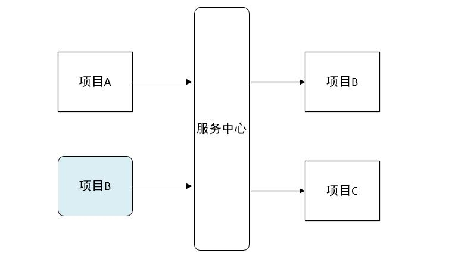

上面的项目只是两三个相互之间的简单调用，但是如果项目超过20个30个呢，在15年底的时候我司分布式的项目就达到了二十几个，画一张图来描述几十个项目之间的相互调用关系全是线条，任何其中的一个项目改动，就会牵连好几个项目跟着重启，巨麻烦而且容易出错。通过服务中心来获取服务你不需要关注你调用的项目IP地址，由几台服务器组成，每次直接去服务中心获取可以使用的服务去调用既可。

由于各种服务都注册到了服务中心，就有了去做很多高级功能条件。比如几台服务提供相同服务来做均衡负载；监控服务器调用成功率来做熔断，移除服务列表中的故障点；监控服务调用时间来对不同的服务器设置不同的权重等等。

说Eureka之前我先八卦一下Netflix

### Netflix

以下介绍来自于百度百科：

> Netflix是一家美国公司，在美国、加拿大提供互联网随选流媒体播放，定制DVD、蓝光光碟在线出租业务。该公司成立于1997年，总部位于加利福尼亚州洛斯盖图，1999年开始订阅服务。2009年，该公司可提供多达10万部DVD电影，并有1千万的订户。2007年2月25日，Netflix宣布已经售出第10亿份DVD。HIS一份报告中表示，2011年Netflix网络电影销量占据美国用户在线电影总销量的45%。

我第一次看到这个单词的时候，是在各种美剧或者电影的开头，Netflix拍摄的代表性的美剧有《纸牌屋》、《毒枭》、《怪奇物语》。后来研究springcloud的时候发现了Netflix公司，就在想它们是不是同一家公司，经过核对github上面邮件后缀判定确实是同一家公司，其实springcloud的微服务就基于Netflix公司的开源产品来做的。

Netflix的开源框架组件已经在Netflix的大规模分布式微服务环境中经过多年的生产实战验证，正逐步被社区接受为构造微服务框架的标准组件。Spring Cloud开源产品，主要是基于对Netflix开源组件的进一步封装，方便Spring开发人员构建微服务基础框架。对于一些打算构建微服务框架体系的公司来说，充分利用或参考借鉴Netflix的开源微服务组件(或Spring Cloud)，在此基础上进行必要的企业定制，无疑是通向微服务架构的捷径。

### Eureka

按照官方介绍：

> Eureka is a REST (Representational State Transfer) based service that is primarily used in the AWS cloud for locating services for the purpose of load balancing and failover of middle-tier servers.
>
> Eureka 是一个基于 REST 的服务，主要在 AWS 云中使用, 定位服务来进行中间层服务器的负载均衡和故障转移。

Spring Cloud 封装了 Netflix 公司开发的 Eureka 模块来实现服务注册和发现。Eureka 采用了 C-S 的设计架构。Eureka Server 作为服务注册功能的服务器，它是服务注册中心。而系统中的其他微服务，使用 Eureka 的客户端连接到 Eureka Server，并维持心跳连接。这样系统的维护人员就可以通过 Eureka Server 来监控系统中各个微服务是否正常运行。Spring Cloud 的一些其他模块（比如Zuul）就可以通过 Eureka Server 来发现系统中的其他微服务，并执行相关的逻辑。

Eureka由两个组件组成：Eureka服务器和Eureka客户端。Eureka服务器用作服务注册服务器。Eureka客户端是一个java客户端，用来简化与服务器的交互、作为轮询负载均衡器，并提供服务的故障切换支持。Netflix在其生产环境中使用的是另外的客户端，它提供基于流量、资源利用率以及出错状态的加权负载均衡。

用一张图来认识以下：


上图简要描述了Eureka的基本架构，由3个角色组成：

1、Eureka Server

- 提供服务注册和发现

2、Service Provider

- 服务提供方
- 将自身服务注册到Eureka，从而使服务消费方能够找到

3、Service Consumer

- 服务消费方
- 从Eureka获取注册服务列表，从而能够消费服务

## 案例实践

### Eureka Server

spring cloud已经帮我实现了服务注册中心，我们只需要很简单的几个步骤就可以完成。

1、pom中添加依赖

```
<dependencies>
	<dependency>
		<groupId>org.springframework.cloud</groupId>
		<artifactId>spring-cloud-starter</artifactId>
	</dependency>
	<dependency>
		<groupId>org.springframework.cloud</groupId>
		<artifactId>spring-cloud-starter-eureka-server</artifactId>
	</dependency>
	<dependency>
		<groupId>org.springframework.boot</groupId>
		<artifactId>spring-boot-starter-test</artifactId>
		<scope>test</scope>
	</dependency>
</dependencies>
```

2、添加启动代码中添加`@EnableEurekaServer`注解

```
@SpringBootApplication
@EnableEurekaServer
public class SpringCloudEurekaApplication {

	public static void main(String[] args) {
		SpringApplication.run(SpringCloudEurekaApplication.class, args);
	}
}
```

3、配置文件

在默认设置下，该服务注册中心也会将自己作为客户端来尝试注册它自己，所以我们需要禁用它的客户端注册行为，在`application.properties`添加以下配置：

```
spring.application.name=spring-cloud-eureka

server.port=8000
eureka.client.register-with-eureka=false
eureka.client.fetch-registry=false

eureka.client.serviceUrl.defaultZone=http://localhost:${server.port}/eureka/
```

- `eureka.client.register-with-eureka` ：表示是否将自己注册到Eureka Server，默认为true。
- `eureka.client.fetch-registry` ：表示是否从Eureka Server获取注册信息，默认为true。
- `eureka.client.serviceUrl.defaultZone` ：设置与Eureka Server交互的地址，查询服务和注册服务都需要依赖这个地址。默认是http://localhost:8761/eureka ；多个地址可使用 , 分隔。

启动工程后，访问：http://localhost:8000/，可以看到下面的页面，其中还没有发现任何服务


## 集群

注册中心这么关键的服务，如果是单点话，遇到故障就是毁灭性的。在一个分布式系统中，服务注册中心是最重要的基础部分，理应随时处于可以提供服务的状态。为了维持其可用性，使用集群是很好的解决方案。Eureka通过互相注册的方式来实现高可用的部署，所以我们只需要将Eureke Server配置其他可用的serviceUrl就能实现高可用部署。

### 双节点注册中心

首次我们尝试一下双节点的注册中心的搭建。

1、创建application-peer1.properties，作为peer1服务中心的配置，并将serviceUrl指向peer2

```
spring.application.name=spring-cloud-eureka
server.port=8000
eureka.instance.hostname=peer1

eureka.client.serviceUrl.defaultZone=http://peer2:8001/eureka/
```

2、创建application-peer2.properties，作为peer2服务中心的配置，并将serviceUrl指向peer1

```
spring.application.name=spring-cloud-eureka
server.port=8001
eureka.instance.hostname=peer2

eureka.client.serviceUrl.defaultZone=http://peer1:8000/eureka/
```

3、host转换

在hosts文件中加入如下配置

```
127.0.0.1 peer1  
127.0.0.1 peer2  
```

4、打包启动

依次执行下面命令

```
#打包
mvn clean package
# 分别以peer1和peeer2 配置信息启动eureka
java -jar spring-cloud-eureka-0.0.1-SNAPSHOT.jar --spring.profiles.active=peer1
java -jar spring-cloud-eureka-0.0.1-SNAPSHOT.jar --spring.profiles.active=peer2
```

依次启动完成后，浏览器输入：`http://localhost:8000/` 效果图如下：


根据图可以看出peer1的注册中心DS Replicas已经有了peer2的相关配置信息，并且出现在available-replicas中。我们手动停止peer2来观察，发现peer2就会移动到unavailable-replicas一栏中，表示peer2不可用。

到此双节点的配置已经完成。

### eureka集群使用

在生产中我们可能需要三台或者大于三台的注册中心来保证服务的稳定性，配置的原理其实都一样，将注册中心分别指向其它的注册中心。这里只介绍三台集群的配置情况，其实和双节点的注册中心类似，每台注册中心分别又指向其它两个节点即可，使用application.yml来配置。

application.yml配置详情如下：

```
---
spring:
  application:
    name: spring-cloud-eureka
  profiles: peer1
server:
  port: 8000
eureka:
  instance:
    hostname: peer1
  client:
    serviceUrl:
      defaultZone: http://peer2:8001/eureka/,http://peer3:8002/eureka/
---
spring:
  application:
    name: spring-cloud-eureka
  profiles: peer2
server:
  port: 8001
eureka:
  instance:
    hostname: peer2
  client:
    serviceUrl:
      defaultZone: http://peer1:8000/eureka/,http://peer3:8002/eureka/
---
spring:
  application:
    name: spring-cloud-eureka
  profiles: peer3
server:
  port: 8002
eureka:
  instance:
    hostname: peer3
  client:
    serviceUrl:
      defaultZone: http://peer1:8000/eureka/,http://peer2:8001/eureka/
```

分别以peer1、peer2、peer3的配置参数启动eureka注册中心。

```
java -jar spring-cloud-eureka-0.0.1-SNAPSHOT.jar --spring.profiles.active=peer1
java -jar spring-cloud-eureka-0.0.1-SNAPSHOT.jar --spring.profiles.active=peer2
java -jar spring-cloud-eureka-0.0.1-SNAPSHOT.jar --spring.profiles.active=peer3
```

依次启动完成后，浏览器输入：`http://localhost:8000/` 效果图如下：


可以在peer1中看到了peer2、peer3的相关信息。至此eureka集群也已经完成了

# springcloud(三)：服务提供与调用

上一篇文章我们介绍了eureka服务注册中心的搭建，这篇文章介绍一下如何使用eureka服务注册中心，搭建一个简单的服务端注册服务，客户端去调用服务使用的案例。

案例中有三个角色：服务注册中心、服务提供者、服务消费者，其中服务注册中心就是我们上一篇的eureka单机版启动既可，流程是首先启动注册中心，服务提供者生产服务并注册到服务中心中，消费者从服务中心中获取服务并执行。

## 服务提供

我们假设服务提供者有一个hello方法，可以根据传入的参数，提供输出“hello xxx，this is first messge”的服务

### 1、pom包配置

创建一个springboot项目，pom.xml中添加如下配置：

```
<dependencies>
	<dependency>
		<groupId>org.springframework.cloud</groupId>
		<artifactId>spring-cloud-starter-eureka</artifactId>
	</dependency>
	<dependency>
		<groupId>org.springframework.boot</groupId>
		<artifactId>spring-boot-starter-test</artifactId>
		<scope>test</scope>
	</dependency>
</dependencies>
```

### 2、配置文件

application.properties配置如下：

```
spring.application.name=spring-cloud-producer
server.port=9000
eureka.client.serviceUrl.defaultZone=http://localhost:8000/eureka/
```

参数在上一篇都已经解释过，这里不多说。

### 3、启动类

启动类中添加`@EnableDiscoveryClient`注解

```
@SpringBootApplication
@EnableDiscoveryClient
public class ProducerApplication {

	public static void main(String[] args) {
		SpringApplication.run(ProducerApplication.class, args);
	}
}
```

### 4、controller

提供hello服务

```
@RestController
public class HelloController {
	
    @RequestMapping("/hello")
    public String index(@RequestParam String name) {
        return "hello "+name+"，this is first messge";
    }
}
```

添加`@EnableDiscoveryClient`注解后，项目就具有了服务注册的功能。启动工程后，就可以在注册中心的页面看到SPRING-CLOUD-PRODUCER服务。


到此服务提供者配置就完成了。

## 服务调用

### 1、pom包配置

和服务提供者一致

```
<dependencies>
	<dependency>
		<groupId>org.springframework.cloud</groupId>
		<artifactId>spring-cloud-starter-eureka</artifactId>
	</dependency>
	<dependency>
		<groupId>org.springframework.boot</groupId>
		<artifactId>spring-boot-starter-test</artifactId>
		<scope>test</scope>
	</dependency>
</dependencies>
```

### 2、配置文件

application.properties配置如下：

```
spring.application.name=spring-cloud-consumer
server.port=9001
eureka.client.serviceUrl.defaultZone=http://localhost:8000/eureka/
```

### 3、启动类

启动类添加`@EnableDiscoveryClient`和`@EnableFeignClients`注解。

```
@SpringBootApplication
@EnableDiscoveryClient
@EnableFeignClients
public class ConsumerApplication {

	public static void main(String[] args) {
		SpringApplication.run(ConsumerApplication.class, args);
	}

}
```

- `@EnableDiscoveryClient` :启用服务注册与发现
- `@EnableFeignClients`：启用feign进行远程调用

> Feign是一个声明式Web Service客户端。使用Feign能让编写Web Service客户端更加简单, 它的使用方法是定义一个接口，然后在上面添加注解，同时也支持JAX-RS标准的注解。Feign也支持可拔插式的编码器和解码器。Spring Cloud对Feign进行了封装，使其支持了Spring MVC标准注解和HttpMessageConverters。Feign可以与Eureka和Ribbon组合使用以支持负载均衡。

### 4、feign调用实现

```
@FeignClient(name= "spring-cloud-producer")
public interface HelloRemote {
    @RequestMapping(value = "/hello")
    public String hello(@RequestParam(value = "name") String name);
}
```

- name:远程服务名，及spring.application.name配置的名称

此类中的方法和远程服务中contoller中的方法名和参数需保持一致。

### 5、web层调用远程服务

将HelloRemote注入到controller层，像普通方法一样去调用即可。

```
@RestController
public class ConsumerController {

    @Autowired
    HelloRemote HelloRemote;
	
    @RequestMapping("/hello/{name}")
    public String index(@PathVariable("name") String name) {
        return HelloRemote.hello(name);
    }

}
```

到此，最简单的一个服务注册与调用的例子就完成了。

## 测试

### 简单调用

依次启动spring-cloud-eureka、spring-cloud-producer、spring-cloud-consumer三个项目

先输入：`http://localhost:9000/hello?name=neo` 检查spring-cloud-producer服务是否正常

返回：`hello neo，this is first messge`

说明spring-cloud-producer正常启动，提供的服务也正常。

浏览器中输入：`http://localhost:9001/hello/neo`

返回：`hello neo，this is first messge`

说明客户端已经成功的通过feign调用了远程服务hello，并且将结果返回到了浏览器。

### 负载均衡

以上面spring-cloud-producer为例子修改，将其中的controller改动如下：

```
@RestController
public class HelloController {
	
    @RequestMapping("/hello")
    public String index(@RequestParam String name) {
        return "hello "+name+"，this is producer 2  send first messge";
    }
}
```

在配置文件中改动端口：

```
spring.application.name=spring-cloud-producer
server.port=9003
eureka.client.serviceUrl.defaultZone=http://localhost:8000/eureka/
```

打包启动后，在eureka就会发现两个服务提供者，如下图：


然后在浏览器再次输入：`http://localhost:9001/hello/neo` 进行测试：

第一次返回结果：`hello neo，this is first messge`

第二次返回结果：`hello neo，this is producer 2 send first messge`

不断的进行测试下去会发现两种结果交替出现，说明两个服务中心自动提供了服务均衡负载的功能。如果我们将服务提供者的数量在提高为N个，测试结果一样，请求会自动轮询到每个服务端来处理。

# springcloud(四)：熔断器Hystrix

 2017/05/16

说起springcloud熔断让我想起了去年股市中的熔断，多次痛的领悟，随意实施的熔断对整个系统的影响是灾难性的，好了接下来我们还是说正事。

## 熔断器

### 雪崩效应

在微服务架构中通常会有多个服务层调用，基础服务的故障可能会导致级联故障，进而造成整个系统不可用的情况，这种现象被称为服务雪崩效应。服务雪崩效应是一种因“服务提供者”的不可用导致“服务消费者”的不可用,并将不可用逐渐放大的过程。

如果下图所示：A作为服务提供者，B为A的服务消费者，C和D是B的服务消费者。A不可用引起了B的不可用，并将不可用像滚雪球一样放大到C和D时，雪崩效应就形成了。


### 熔断器（CircuitBreaker）

熔断器的原理很简单，如同电力过载保护器。它可以实现快速失败，如果它在一段时间内侦测到许多类似的错误，会强迫其以后的多个调用快速失败，不再访问远程服务器，从而防止应用程序不断地尝试执行可能会失败的操作，使得应用程序继续执行而不用等待修正错误，或者浪费CPU时间去等到长时间的超时产生。熔断器也可以使应用程序能够诊断错误是否已经修正，如果已经修正，应用程序会再次尝试调用操作。

熔断器模式就像是那些容易导致错误的操作的一种代理。这种代理能够记录最近调用发生错误的次数，然后决定使用允许操作继续，或者立即返回错误。 熔断器开关相互转换的逻辑如下图：

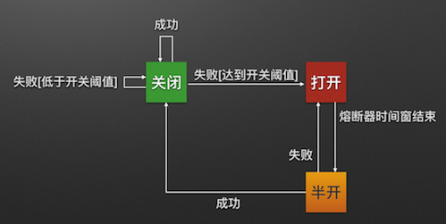

熔断器就是保护服务高可用的最后一道防线。

### Hystrix特性

**1.断路器机制**

断路器很好理解, 当Hystrix Command请求后端服务失败数量超过一定比例(默认50%), 断路器会切换到开路状态(Open). 这时所有请求会直接失败而不会发送到后端服务. 断路器保持在开路状态一段时间后(默认5秒), 自动切换到半开路状态(HALF-OPEN). 这时会判断下一次请求的返回情况, 如果请求成功, 断路器切回闭路状态(CLOSED), 否则重新切换到开路状态(OPEN). Hystrix的断路器就像我们家庭电路中的保险丝, 一旦后端服务不可用, 断路器会直接切断请求链, 避免发送大量无效请求影响系统吞吐量, 并且断路器有自我检测并恢复的能力.

**2.Fallback**

Fallback相当于是降级操作. 对于查询操作, 我们可以实现一个fallback方法, 当请求后端服务出现异常的时候, 可以使用fallback方法返回的值. fallback方法的返回值一般是设置的默认值或者来自缓存.

**3.资源隔离**

在Hystrix中, 主要通过线程池来实现资源隔离. 通常在使用的时候我们会根据调用的远程服务划分出多个线程池. 例如调用产品服务的Command放入A线程池, 调用账户服务的Command放入B线程池. 这样做的主要优点是运行环境被隔离开了. 这样就算调用服务的代码存在bug或者由于其他原因导致自己所在线程池被耗尽时, 不会对系统的其他服务造成影响. 但是带来的代价就是维护多个线程池会对系统带来额外的性能开销. 如果是对性能有严格要求而且确信自己调用服务的客户端代码不会出问题的话, 可以使用Hystrix的信号模式(Semaphores)来隔离资源.

## Feign Hystrix

因为熔断只是作用在服务调用这一端，因此我们根据上一篇的示例代码只需要改动spring-cloud-consumer项目相关代码就可以。因为，Feign中已经依赖了Hystrix所以在maven配置上不用做任何改动。

### 1、配置文件

application.properties添加这一条：

```
feign.hystrix.enabled=true
```

### 2、创建回调类

创建HelloRemoteHystrix类继承与HelloRemote实现回调的方法

```
@Component
public class HelloRemoteHystrix implements HelloRemote{

    @Override
    public String hello(@RequestParam(value = "name") String name) {
        return "hello" +name+", this messge send failed ";
    }
}
```

### 3、添加fallback属性

在`HelloRemote`类添加指定fallback类，在服务熔断的时候返回fallback类中的内容。

```
@FeignClient(name= "spring-cloud-producer",fallback = HelloRemoteHystrix.class)
public interface HelloRemote {

    @RequestMapping(value = "/hello")
    public String hello(@RequestParam(value = "name") String name);

}
```

改动点就这点，很简单吧。

### 4、测试

那我们就来测试一下看看效果吧。

依次启动spring-cloud-eureka、spring-cloud-producer、spring-cloud-consumer三个项目。

浏览器中输入：`http://localhost:9001/hello/neo`

返回：`hello neo，this is first messge`

说明加入熔断相关信息后，不影响正常的访问。接下来我们手动停止spring-cloud-producer项目再次测试：

浏览器中输入：`http://localhost:9001/hello/neo`

返回：`hello neo, this messge send failed`

根据返回结果说明熔断成功。

# springcloud(五)：熔断监控Hystrix Dashboard和Turbine

Hystrix-dashboard是一款针对Hystrix进行实时监控的工具，通过Hystrix Dashboard我们可以在直观地看到各Hystrix Command的请求响应时间, 请求成功率等数据。但是只使用Hystrix Dashboard的话, 你只能看到单个应用内的服务信息, 这明显不够. 我们需要一个工具能让我们汇总系统内多个服务的数据并显示到Hystrix Dashboard上, 这个工具就是Turbine.

## Hystrix Dashboard

我们在熔断示例项目spring-cloud-consumer-hystrix的基础上更改，重新命名为：spring-cloud-consumer-hystrix-dashboard。

### 1、添加依赖

```
<dependency>
	<groupId>org.springframework.cloud</groupId>
	<artifactId>spring-cloud-starter-hystrix</artifactId>
</dependency>
<dependency>
	<groupId>org.springframework.cloud</groupId>
	<artifactId>spring-cloud-starter-hystrix-dashboard</artifactId>
</dependency>
<dependency>
	<groupId>org.springframework.boot</groupId>
	<artifactId>spring-boot-starter-actuator</artifactId>
</dependency>
```

这三个包必须添加

### 2、启动类

启动类添加启用Hystrix Dashboard和熔断器

```
@SpringBootApplication
@EnableDiscoveryClient
@EnableFeignClients
@EnableHystrixDashboard
@EnableCircuitBreaker
public class ConsumerApplication {

	public static void main(String[] args) {
		SpringApplication.run(ConsumerApplication.class, args);
	}
}
```

### 3、测试

启动工程后访问 http://localhost:9001/hystrix，将会看到如下界面：

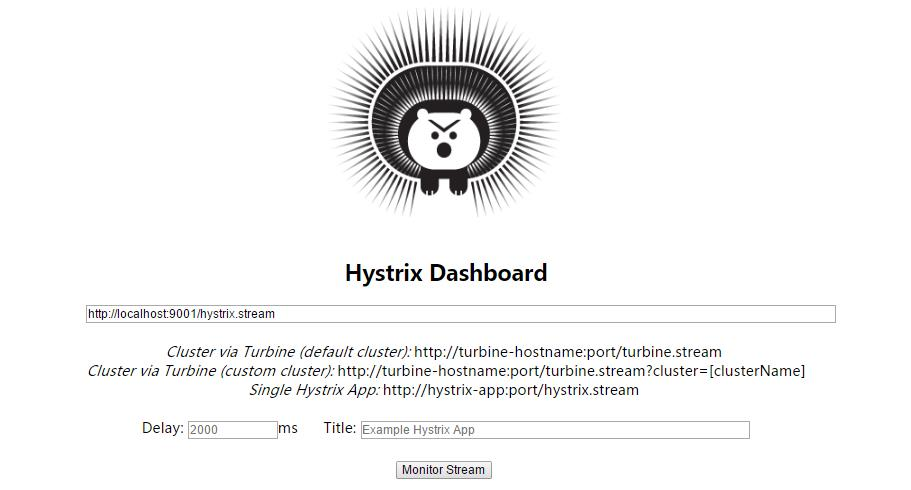

图中会有一些提示：

> Cluster via Turbine (default cluster): http://turbine-hostname:port/turbine.stream 
> Cluster via Turbine (custom cluster): http://turbine-hostname:port/turbine.stream?cluster=[clusterName]
> Single Hystrix App: http://hystrix-app:port/hystrix.stream

大概意思就是如果查看默认集群使用第一个url,查看指定集群使用第二个url,单个应用的监控使用最后一个，我们暂时只演示单个应用的所以在输入框中输入： http://localhost:9001/hystrix.stream ，输入之后点击 monitor，进入页面。

如果没有请求会先显示`Loading ...`，访问http://localhost:9001/hystrix.stream 也会不断的显示ping。

请求服务http://localhost:9001/hello/neo，就可以看到监控的效果了，首先访问http://localhost:9001/hystrix.stream，显示如下：

```
ping: 

data: {"type":...}

data: {"type":...}
```

说明已经返回了监控的各项结果

到监控页面就会显示如下图：


其实就是http://localhost:9001/hystrix.stream返回结果的图形化显示，Hystrix Dashboard Wiki上详细说明了图上每个指标的含义，如下图：


到此单个应用的熔断监控已经完成。

## Turbine

在复杂的分布式系统中，相同服务的节点经常需要部署上百甚至上千个，很多时候，运维人员希望能够把相同服务的节点状态以一个整体集群的形式展现出来，这样可以更好的把握整个系统的状态。 为此，Netflix提供了一个开源项目（Turbine）来提供把多个hystrix.stream的内容聚合为一个数据源供Dashboard展示。

### 1、添加依赖

```
<dependencies>
	<dependency>
		<groupId>org.springframework.cloud</groupId>
		<artifactId>spring-cloud-starter-turbine</artifactId>
	</dependency>
	<dependency>
		<groupId>org.springframework.cloud</groupId>
		<artifactId>spring-cloud-netflix-turbine</artifactId>
	</dependency>
	<dependency>
		<groupId>org.springframework.boot</groupId>
		<artifactId>spring-boot-starter-actuator</artifactId>
	</dependency>
	<dependency>
		<groupId>org.springframework.cloud</groupId>
		<artifactId>spring-cloud-starter-hystrix-dashboard</artifactId>
	</dependency>
</dependencies>
```

### 2、配置文件

```
spring.application.name=hystrix-dashboard-turbine
server.port=8001
turbine.appConfig=node01,node02
turbine.aggregator.clusterConfig= default
turbine.clusterNameExpression= new String("default")

eureka.client.serviceUrl.defaultZone=http://localhost:8000/eureka/
```

- `turbine.appConfig` ：配置Eureka中的serviceId列表，表明监控哪些服务
- `turbine.aggregator.clusterConfig` ：指定聚合哪些集群，多个使用”,”分割，默认为default。可使用`http://.../turbine.stream?cluster={clusterConfig之一}`访问
- `turbine.clusterNameExpression` ： 1. clusterNameExpression指定集群名称，默认表达式appName；此时：`turbine.aggregator.clusterConfig`需要配置想要监控的应用名称；2. 当clusterNameExpression: default时，`turbine.aggregator.clusterConfig`可以不写，因为默认就是default；3. 当clusterNameExpression: metadata[‘cluster’]时，假设想要监控的应用配置了`eureka.instance.metadata-map.cluster: ABC`，则需要配置，同时`turbine.aggregator.clusterConfig: ABC`

### 3、启动类

启动类添加`@EnableTurbine`，激活对Turbine的支持

```
@SpringBootApplication
@EnableHystrixDashboard
@EnableTurbine
public class DashboardApplication {

	public static void main(String[] args) {
		SpringApplication.run(DashboardApplication.class, args);
	}

}
```

到此Turbine（hystrix-dashboard-turbine）配置完成

### 4、测试

在示例项目spring-cloud-consumer-hystrix基础上修改为两个服务的调用者spring-cloud-consumer-node1和spring-cloud-consumer-node2

spring-cloud-consumer-node1项目改动如下： application.properties文件内容

```
spring.application.name=node01
server.port=9001
feign.hystrix.enabled=true

eureka.client.serviceUrl.defaultZone=http://localhost:8000/eureka/
```

spring-cloud-consumer-node2项目改动如下： application.properties文件内容

```
spring.application.name=node02
server.port=9002
feign.hystrix.enabled=true

eureka.client.serviceUrl.defaultZone=http://localhost:8000/eureka/
```

HelloRemote类修改：

```
@FeignClient(name= "spring-cloud-producer2", fallback = HelloRemoteHystrix.class)
public interface HelloRemote {

    @RequestMapping(value = "/hello")
    public String hello2(@RequestParam(value = "name") String name);

}
```

对应的`HelloRemoteHystrix`和`ConsumerController`类跟随修改，具体查看代码

修改完毕后，依次启动spring-cloud-eureka、spring-cloud-consumer-node1、spring-cloud-consumer-node1、hystrix-dashboard-turbine（Turbine）

打开eureka后台可以看到注册了三个服务：

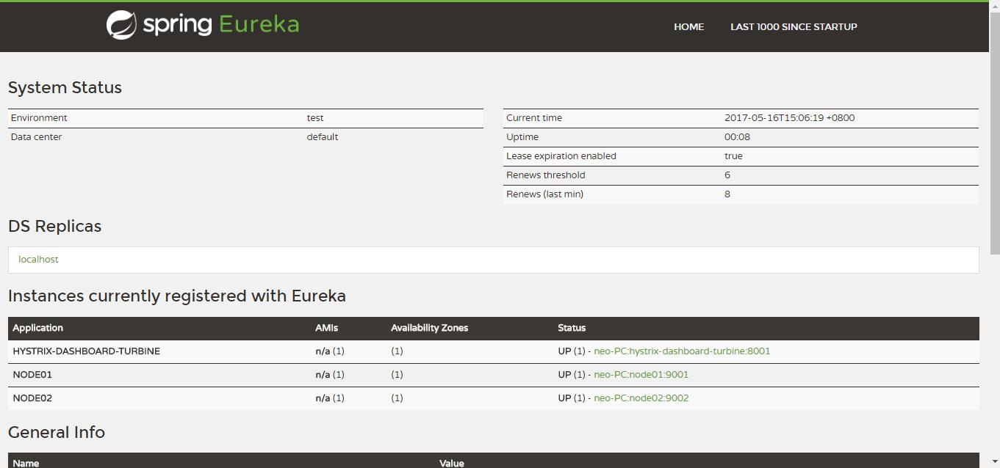

访问 http://localhost:8001/turbine.stream

返回：

```
: ping
data: {"reportingHostsLast10Seconds":1,"name":"meta","type":"meta","timestamp":1494921985839}
```

并且会不断刷新以获取实时的监控数据，说明和单个的监控类似，返回监控项目的信息。进行图形化监控查看，输入：http://localhost:8001/hystrix，返回酷酷的小熊界面，输入： http://localhost:8001/turbine.stream，然后点击 Monitor Stream ,可以看到出现了俩个监控列表


# springcloud(六)：配置中心git示例

随着线上项目变的日益庞大，每个项目都散落着各种配置文件，如果采用分布式的开发模式，需要的配置文件随着服务增加而不断增多。某一个基础服务信息变更，都会引起一系列的更新和重启，运维苦不堪言也容易出错。配置中心便是解决此类问题的灵丹妙药。

市面上开源的配置中心有很多，BAT每家都出过，360的QConf、淘宝的diamond、百度的disconf都是解决这类问题。国外也有很多开源的配置中心Apache Commons Configuration、owner、cfg4j等等。这些开源的软件以及解决方案都很优秀，但是我最钟爱的却是Spring Cloud Config，因为它功能全面强大，可以无缝的和spring体系相结合，够方便够简单颜值高我喜欢。

## Spring Cloud Config

在我们了解spring cloud config之前，我可以想想一个配置中心提供的核心功能应该有什么

- 提供服务端和客户端支持
- 集中管理各环境的配置文件
- 配置文件修改之后，可以快速的生效
- 可以进行版本管理
- 支持大的并发查询
- 支持各种语言

Spring Cloud Config可以完美的支持以上所有的需求。

Spring Cloud Config项目是一个解决分布式系统的配置管理方案。它包含了Client和Server两个部分，server提供配置文件的存储、以接口的形式将配置文件的内容提供出去，client通过接口获取数据、并依据此数据初始化自己的应用。Spring cloud使用git或svn存放配置文件，默认情况下使用git，我们先以git为例做一套示例。

首先在github上面创建了一个文件夹config-repo用来存放配置文件，为了模拟生产环境，我们创建以下三个配置文件：

```
// 开发环境
neo-config-dev.properties
// 测试环境
neo-config-test.properties
// 生产环境
neo-config-pro.properties
```

每个配置文件中都写一个属性neo.hello,属性值分别是 hello im dev/test/pro 。下面我们开始配置server端

## server 端

### 1、添加依赖

```
<dependencies>
	<dependency>
		<groupId>org.springframework.cloud</groupId>
		<artifactId>spring-cloud-config-server</artifactId>
	</dependency>
</dependencies>
```

只需要加入spring-cloud-config-server包引用既可。

### 2、配置文件

```
server:
  port: 8001
spring:
  application:
    name: spring-cloud-config-server
  cloud:
    config:
      server:
        git:
          uri: https://github.com/ityouknow/spring-cloud-starter/     # 配置git仓库的地址
          search-paths: config-repo                             # git仓库地址下的相对地址，可以配置多个，用,分割。
          username:                                             # git仓库的账号
          password:                                             # git仓库的密码
```

Spring Cloud Config也提供本地存储配置的方式。我们只需要设置属性`spring.profiles.active=native`，Config Server会默认从应用的`src/main/resource`目录下检索配置文件。也可以通过`spring.cloud.config.server.native.searchLocations=file:E:/properties/`属性来指定配置文件的位置。虽然Spring Cloud Config提供了这样的功能，但是为了支持更好的管理内容和版本控制的功能，还是推荐使用git的方式。

### 3、启动类

启动类添加`@EnableConfigServer`，激活对配置中心的支持

```
@EnableConfigServer
@SpringBootApplication
public class ConfigServerApplication {

	public static void main(String[] args) {
		SpringApplication.run(ConfigServerApplication.class, args);
	}
}
```

到此server端相关配置已经完成

### 4、测试

首先我们先要测试server端是否可以读取到github上面的配置信息，直接访问：`http://localhost:8001/neo-config/dev`

返回信息如下：

```
{
    "name": "neo-config", 
    "profiles": [
        "dev"
    ], 
    "label": null, 
    "version": null, 
    "state": null, 
    "propertySources": [
        {
            "name": "https://github.com/ityouknow/spring-cloud-starter/config-repo/neo-config-dev.properties", 
            "source": {
                "neo.hello": "hello im dev"
            }
        }
    ]
}
```

上述的返回的信息包含了配置文件的位置、版本、配置文件的名称以及配置文件中的具体内容，说明server端已经成功获取了git仓库的配置信息。

如果直接查看配置文件中的配置信息可访问：`http://localhost:8001/neo-config-dev.properties`，返回：`neo.hello: hello im dev`

修改配置文件`neo-config-dev.properties`中配置信息为：`neo.hello=hello im dev update`,再次在浏览器访问`http://localhost:8001/neo-config-dev.properties`，返回：`neo.hello: hello im dev update`。说明server端会自动读取最新提交的内容

仓库中的配置文件会被转换成web接口，访问可以参照以下的规则：

- /{application}/{profile}[/{label}]
- /{application}-{profile}.yml
- /{label}/{application}-{profile}.yml
- /{application}-{profile}.properties
- /{label}/{application}-{profile}.properties

以neo-config-dev.properties为例子，它的application是neo-config，profile是dev。client会根据填写的参数来选择读取对应的配置。

## client 端

主要展示如何在业务项目中去获取server端的配置信息

### 1、添加依赖

```
<dependencies>
	<dependency>
		<groupId>org.springframework.cloud</groupId>
		<artifactId>spring-cloud-starter-config</artifactId>
	</dependency>
	<dependency>
		<groupId>org.springframework.boot</groupId>
		<artifactId>spring-boot-starter-web</artifactId>
	</dependency>
	<dependency>
		<groupId>org.springframework.boot</groupId>
		<artifactId>spring-boot-starter-test</artifactId>
		<scope>test</scope>
	</dependency>
</dependencies>
```

引入spring-boot-starter-web包方便web测试

### 2、配置文件

需要配置两个配置文件，application.properties和bootstrap.properties

application.properties如下：

```
spring.application.name=spring-cloud-config-client
server.port=8002
```

bootstrap.properties如下：

```
spring.cloud.config.name=neo-config
spring.cloud.config.profile=dev
spring.cloud.config.uri=http://localhost:8001/
spring.cloud.config.label=master
```

- spring.application.name：对应{application}部分
- spring.cloud.config.profile：对应{profile}部分
- spring.cloud.config.label：对应git的分支。如果配置中心使用的是本地存储，则该参数无用
- spring.cloud.config.uri：配置中心的具体地址
- spring.cloud.config.discovery.service-id：指定配置中心的service-id，便于扩展为高可用配置集群。

> 特别注意：上面这些与spring-cloud相关的属性必须配置在bootstrap.properties中，config部分内容才能被正确加载。因为config的相关配置会先于application.properties，而bootstrap.properties的加载也是先于application.properties。

### 3、启动类

启动类添加`@EnableConfigServer`，激活对配置中心的支持

```
@SpringBootApplication
public class ConfigClientApplication {

	public static void main(String[] args) {
		SpringApplication.run(ConfigClientApplication.class, args);
	}
}
```

启动类只需要`@SpringBootApplication`注解就可以

### 4、web测试

使用`@Value`注解来获取server端参数的值

```
@RestController
class HelloController {
    @Value("${neo.hello}")
    private String hello;

    @RequestMapping("/hello")
    public String from() {
        return this.hello;
    }
}
```

启动项目后访问：`http://localhost:8002/hello`，返回：`hello im dev update`说明已经正确的从server端获取到了参数。到此一个完整的服务端提供配置服务，客户端获取配置参数的例子就完成了。

我们在进行一些小实验，手动修改`neo-config-dev.properties`中配置信息为：`neo.hello=hello im dev update1`提交到github,再次在浏览器访问`http://localhost:8002/hello`，返回：`neo.hello: hello im dev update`，说明获取的信息还是旧的参数，这是为什么呢？因为springboot项目只有在启动的时候才会获取配置文件的值，修改github信息后，client端并没有在次去获取，所以导致这个问题。如何去解决这个问题呢？留到下一章我们在介绍。

# springcloud(七)：配置中心svn示例和refresh

上一篇[springcloud(六)：配置中心git示例](http://www.ityouknow.com/springcloud/2017/05/22/springcloud-config-git.html)留了一个小问题，当重新修改配置文件提交后，客户端获取的仍然是修改前的信息，这个问题我们先放下，待会再讲。国内很多公司都使用的svn来做代码的版本控制，我们先介绍以下如何使用svn+Spring Cloud Config来做配置中心。

## svn版本

同样先示例server端的代码，基本步骤一样。

### 1、添加依赖

```
<dependencies>
	<dependency>
		<groupId>org.springframework.cloud</groupId>
		<artifactId>spring-cloud-config-server</artifactId>
	</dependency>
	<dependency>
		<groupId>org.tmatesoft.svnkit</groupId>
		<artifactId>svnkit</artifactId>
	</dependency>
</dependencies>
```

需要多引入svnkitr包

### 2、配置文件

```
server:
  port: 8001

spring:
  cloud:
    config:
      server:
        svn:
          uri: http://192.168.0.6/svn/repo/config-repo
          username: username
          password: password
        default-label: trunk
  profiles:
    active: subversion
  application:
    name: spring-cloud-config-server
```

和git版本稍有区别，需要显示声明subversion.

### 3、启动类

启动类没有变化，添加`@EnableConfigServer`激活对配置中心的支持

```
@EnableConfigServer
@SpringBootApplication
public class ConfigServerApplication {

	public static void main(String[] args) {
		SpringApplication.run(ConfigServerApplication.class, args);
	}
}
```

### 4、测试

**服务端测试**

访问：`http://localhost:8001/neo-config-dev.properties`，返回：`neo.hello: hello im dev`，说明服务端可以正常读取到svn代码库中的配置信息。修改配置文件`neo-config-dev.properties`中配置信息为：`neo.hello=hello im dev update`,再次在浏览器访问`http://localhost:8001/neo-config-dev.properties`，返回：`neo.hello: hello im dev update`。说明server端会自动读取最新提交的内容

**客户端测试**

客户端直接使用上一篇示例项目`spring-cloud-config-client`来测试，配置基本不用变动。启动项目后访问：`http://localhost:8002/hello，返回：`hello im dev update`说明已经正确的从server端获取到了参数。同样修改svn配置并提交，再次访问``http://localhost:8002/hello```依然获取的是旧的信息，和git版本的问题一样。

## refresh

现在来解决上一篇的遗留问题，这个问题在svn版本中依然存在。Spring Cloud Config分服务端和客户端，服务端负责将git（svn）中存储的配置文件发布成REST接口，客户端可以从服务端REST接口获取配置。但客户端并不能主动感知到配置的变化，从而主动去获取新的配置。客户端如何去主动获取新的配置信息呢，springcloud已经给我们提供了解决方案，每个客户端通过POST方法触发各自的`/refresh`。

修改`spring-cloud-config-client`项目已到达可以refresh的功能。

### 1、添加依赖

```
<dependency>
  <groupId>org.springframework.boot</groupId>
  <artifactId>spring-boot-starter-actuator</artifactId>
</dependency>
```

增加了`spring-boot-starter-actuator`包，`spring-boot-starter-actuator`是一套监控的功能，可以监控程序在运行时状态，其中就包括`/refresh`的功能。

### 2、 开启更新机制

需要给加载变量的类上面加载`@RefreshScope`，在客户端执行`/refresh`的时候就会更新此类下面的变量值。

```
@RestController
@RefreshScope // 使用该注解的类，会在接到SpringCloud配置中心配置刷新的时候，自动将新的配置更新到该类对应的字段中。
class HelloController {

    @Value("${neo.hello}")
    private String hello;

    @RequestMapping("/hello")
    public String from() {
        return this.hello;
    }
}
```

### 3、测试

*springboot 1.5.X 以上默认开通了安全认证，所以需要在配置文件`application.properties`添加以下配置*

```
management.security.enabled=false
```

OK 这样就改造完了，以post请求的方式来访问`http://localhost:8002/refresh` 就会更新修改后的配置文件。

我们再次来测试，首先访问`http://localhost:8002/hello`，返回：`hello im dev`，我将库中的值修改为`hello im dev update`。在win上面打开cmd执行`curl -X POST http://localhost:8002/refresh`，返回`["neo.hello"]`说明已经更新了`neo.hello`的值。我们再次访问`http://localhost:8002/hello`，返回：`hello im dev update`,客户端已经得到了最新的值。

每次手动刷新客户端也很麻烦，有没有什么办法只要提交代码就自动调用客户端来更新呢，github的webhook是一个好的办法。

### 4、webhook

WebHook是当某个事件发生时，通过发送http post请求的方式来通知信息接收方。Webhook来监测你在Github.com上的各种事件，最常见的莫过于push事件。如果你设置了一个监测push事件的Webhook，那么每当你的这个项目有了任何提交，这个Webhook都会被触发，这时Github就会发送一个HTTP POST请求到你配置好的地址。

如此一来，你就可以通过这种方式去自动完成一些重复性工作，比如，你可以用Webhook来自动触发一些持续集成（CI）工具的运作，比如Travis CI；又或者是通过 Webhook 去部署你的线上服务器。下图就是github上面的webhook配置。

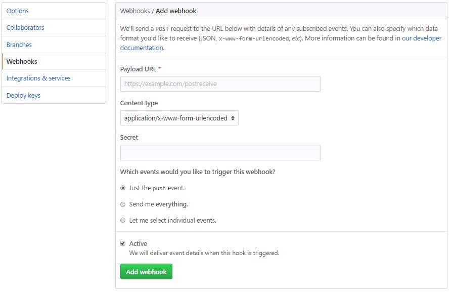

- `Payload URL` ：触发后回调的URL
- `Content type` ：数据格式，两种一般使用json
- `Secret` ：用作给POST的body加密的字符串。采用HMAC算法
- `events` ：触发的事件列表。

| events事件类型 | 描述                       |
| :------------- | :------------------------- |
| push           | 仓库有push时触发。默认事件 |
| create         | 当有分支或标签被创建时触发 |
| delete         | 当有分支或标签被删除时触发 |

> svn也有类似的hook机制，每次提交后会触发post-commit脚本，我们可以在这里写一些post请求

这样我们就可以利用hook的机制去触发客户端的更新，但是当客户端越来越多的时候hook支持的已经不够优雅，另外每次增加客户端都需要改动hook也是不现实的。其实Spring Cloud给了我们更好解决方案，后面文章来介绍。

# springcloud(八)：配置中心服务化和高可用

在前两篇的介绍中，客户端都是直接调用配置中心的server端来获取配置文件信息。这样就存在了一个问题，客户端和服务端的耦合性太高，如果server端要做集群，客户端只能通过原始的方式来路由，server端改变IP地址的时候，客户端也需要修改配置，不符合springcloud服务治理的理念。springcloud提供了这样的解决方案，我们只需要将server端当做一个服务注册到eureka中，client端去eureka中去获取配置中心server端的服务既可。

这篇文章我们基于配置中心git版本的内容来改造

## server端改造

### 1、添加依赖

```
<dependencies>
	<dependency>
		<groupId>org.springframework.cloud</groupId>
		<artifactId>spring-cloud-config-server</artifactId>
	</dependency>
	<dependency>
		<groupId>org.springframework.cloud</groupId>
		<artifactId>spring-cloud-starter-eureka</artifactId>
	</dependency>
</dependencies>
```

需要多引入`spring-cloud-starter-eureka`包，来添加对eureka的支持。

### 2、配置文件

```
server:
server:
  port: 8001
spring:
  application:
    name: spring-cloud-config-server
  cloud:
    config:
      server:
        git:
          uri: https://github.com/ityouknow/spring-cloud-starter/     # 配置git仓库的地址
          search-paths: config-repo                             # git仓库地址下的相对地址，可以配置多个，用,分割。
          username: username                                        # git仓库的账号
          password: password                                    # git仓库的密码
eureka:
  client:
    serviceUrl:
      defaultZone: http://localhost:8000/eureka/   ## 注册中心eurka地址
```

增加了eureka注册中心的配置

### 3、启动类

启动类添加`@EnableDiscoveryClient`激活对注册中心的支持

```
@EnableDiscoveryClient
@EnableConfigServer
@SpringBootApplication
public class ConfigServerApplication {

	public static void main(String[] args) {
		SpringApplication.run(ConfigServerApplication.class, args);
	}
}
```

这样server端的改造就完成了。先启动eureka注册中心，在启动server端，在浏览器中访问：`http://localhost:8000/`就会看到server端已经注册了到注册中心了。


按照上篇的测试步骤对server端进行测试服务正常。

## 客户端改造

### 1、添加依赖

```
<dependencies>
	<dependency>
		<groupId>org.springframework.cloud</groupId>
		<artifactId>spring-cloud-starter-config</artifactId>
	</dependency>
	<dependency>
		<groupId>org.springframework.boot</groupId>
		<artifactId>spring-boot-starter-web</artifactId>
	</dependency>
	<dependency>
		<groupId>org.springframework.cloud</groupId>
		<artifactId>spring-cloud-starter-eureka</artifactId>
	</dependency>
	<dependency>
		<groupId>org.springframework.boot</groupId>
		<artifactId>spring-boot-starter-test</artifactId>
		<scope>test</scope>
	</dependency>
</dependencies>
```

需要多引入`spring-cloud-starter-eureka`包，来添加对eureka的支持。

### 2、配置文件

```
spring.application.name=spring-cloud-config-client
server.port=8002

spring.cloud.config.name=neo-config
spring.cloud.config.profile=dev
spring.cloud.config.label=master
spring.cloud.config.discovery.enabled=true
spring.cloud.config.discovery.serviceId=spring-cloud-config-server

eureka.client.serviceUrl.defaultZone=http://localhost:8000/eureka/
```

主要是去掉了`spring.cloud.config.uri`直接指向server端地址的配置，增加了最后的三个配置：

- `spring.cloud.config.discovery.enabled` ：开启Config服务发现支持
- `spring.cloud.config.discovery.serviceId` ：指定server端的name,也就是server端`spring.application.name`的值
- `eureka.client.serviceUrl.defaultZone` ：指向注册中心的地址

这三个配置文件都需要放到`bootstrap.properties`的配置中

### 3、启动类

启动类添加`@EnableDiscoveryClient`激活对配置中心的支持

```
@EnableDiscoveryClient
@SpringBootApplication
public class ConfigClientApplication {

	public static void main(String[] args) {
		SpringApplication.run(ConfigClientApplication.class, args);
	}
}
```

启动client端，在浏览器中访问：`http://localhost:8000/` 就会看到server端和client端都已经注册了到注册中心了。


## 高可用

为了模拟生产集群环境，我们改动server端的端口为8003，再启动一个server端来做服务的负载，提供高可用的server端支持。


如上图就可发现会有两个server端同时提供配置中心的服务，防止某一台down掉之后影响整个系统的使用。

我们先单独测试服务端，分别访问：`http://localhost:8001/neo-config/dev`、`http://localhost:8003/neo-config/dev`返回信息：

```
{
    "name": "neo-config", 
    "profiles": [
        "dev"
    ], 
    "label": null, 
    "version": null, 
    "state": null, 
    "propertySources": [
        {
            "name": "https://github.com/ityouknow/spring-cloud-starter/config-repo/neo-config-dev.properties", 
            "source": {
                "neo.hello": "hello im dev"
            }
        }
    ]
}
```

说明两个server端都正常读取到了配置信息。

再次访问：`http://localhost:8002/hello`，返回：`hello im dev update`。说明客户端已经读取到了server端的内容，我们随机停掉一台server端的服务，再次访问`http://localhost:8002/hello`，返回：`hello im dev update`，说明达到了高可用的目的。

# springcloud(九)：配置中心和消息总线（配置中心终结版）

我们在[springcloud(七)：配置中心svn示例和refresh](http://www.ityouknow.com/springcloud/2017/05/23/springcloud-config-svn-refresh.html)中讲到，如果需要客户端获取到最新的配置信息需要执行`refresh`，我们可以利用webhook的机制每次提交代码发送请求来刷新客户端，当客户端越来越多的时候，需要每个客户端都执行一遍，这种方案就不太适合了。使用Spring Cloud Bus可以完美解决这一问题。

## Spring Cloud Bus

Spring cloud bus通过轻量消息代理连接各个分布的节点。这会用在广播状态的变化（例如配置变化）或者其他的消息指令。Spring bus的一个核心思想是通过分布式的启动器对spring boot应用进行扩展，也可以用来建立一个多个应用之间的通信频道。目前唯一实现的方式是用AMQP消息代理作为通道，同样特性的设置（有些取决于通道的设置）在更多通道的文档中。

Spring cloud bus被国内很多都翻译为消息总线，也挺形象的。大家可以将它理解为管理和传播所有分布式项目中的消息既可，其实本质是利用了MQ的广播机制在分布式的系统中传播消息，目前常用的有Kafka和RabbitMQ。利用bus的机制可以做很多的事情，其中配置中心客户端刷新就是典型的应用场景之一，我们用一张图来描述bus在配置中心使用的机制。


根据此图我们可以看出利用Spring Cloud Bus做配置更新的步骤:

- 1、提交代码触发post给客户端A发送bus/refresh
- 2、客户端A接收到请求从Server端更新配置并且发送给Spring Cloud Bus
- 3、Spring Cloud bus接到消息并通知给其它客户端
- 4、其它客户端接收到通知，请求Server端获取最新配置
- 5、全部客户端均获取到最新的配置

## 项目示例

我们选择上一篇文章[springcloud(八)：配置中心服务化和高可用](http://www.ityouknow.com/springcloud/2017/05/25/springcloud-config-eureka.html)版本的[示例代码](https://github.com/ityouknow/spring-cloud-starter/tree/master/spring-cloud-config-eureka)来改造,MQ我们使用RabbitMQ来做示例。

**客户端spring-cloud-config-client改造**

### 1、添加依赖

```
<dependency>
    <groupId>org.springframework.cloud</groupId>
    <artifactId>spring-cloud-starter-bus-amqp</artifactId>
</dependency>
```

需要多引入`spring-cloud-starter-bus-amqp`包，增加对消息总线的支持

### 2、配置文件

```
## 刷新时，关闭安全验证
management.security.enabled=false
## 开启消息跟踪
spring.cloud.bus.trace.enabled=true

spring.rabbitmq.host=192.168.9.89
spring.rabbitmq.port=5672
spring.rabbitmq.username=admin
spring.rabbitmq.password=123456
```

配置文件需要增加RebbitMq的相关配置，这样客户端代码就改造完成了。

### 3、测试

依次启动spring-cloud-eureka、spring-cloud-config-server、spring-cloud-config-client项目，在启动spring-cloud-config-client项目的时候我们会发现启动日志会输出这样的一条记录。

```
2017-05-26 17:05:38.568  INFO 21924 --- [           main] o.s.b.a.e.mvc.EndpointHandlerMapping     : Mapped "{[/bus/refresh],methods=[POST]}" onto public void org.springframework.cloud.bus.endpoint.RefreshBusEndpoint.refresh(java.lang.String)
```

说明客户端已经具备了消息总线通知的能力了，为了更好的模拟消息总线的效果，我们更改客户端spring-cloud-config-client项目的端口为8003、8004依次启动，这样测试环境就准备好了。启动后eureka后台效果图如下：


我们先分别测试一下服务端和客户端是否正确运行，访问：`http://localhost:8001/neo-config/dev`，返回信息：

```
{
    "name": "neo-config", 
    "profiles": [
        "dev"
    ], 
    "label": null, 
    "version": null, 
    "state": null, 
    "propertySources": [
        {
            "name": "https://github.com/ityouknow/spring-cloud-starter/config-repo/neo-config-dev.properties", 
            "source": {
                "neo.hello": "hello im dev"
            }
        }
    ]
}
```

说明server端都正常读取到了配置信息。

依次访问：`http://localhost:8002/hello`、`http://localhost:8003/hello`、`http://localhost:8004/hello`，返回：`hello im dev`。说明客户端都已经读取到了server端的内容。

现在我们更新`neo-config-dev.properties` 中`neo.hello`的值为`hello im dev update`并提交到代码库中，访问：`http://localhost:8002/hello` 依然返回`hello im dev`。我们对端口为8002的客户端发送一个`/bus/refresh`的post请求。在win下使用下面命令来模拟webhook.

```
curl -X POST http://localhost:8002/bus/refresh
```

执行完成后，依次访问：`http://localhost:8002/hello`、`http://localhost:8003/hello`、`http://localhost:8004/hello`，返回：`hello im dev update`。说明三个客户端均已经拿到了最新配置文件的信息，这样我们就实现了图一中的示例。

## 改进版本

在上面的流程中，我们已经到达了利用消息总线触发一个客户端`bus/refresh`,而刷新所有客户端的配置的目的。但这种方式并不优雅。原因如下：

- 打破了微服务的职责单一性。微服务本身是业务模块，它本不应该承担配置刷新的职责。
- 破坏了微服务各节点的对等性。
- 有一定的局限性。例如，微服务在迁移时，它的网络地址常常会发生变化，此时如果想要做到自动刷新，那就不得不修改WebHook的配置。

因此我们将上面的架构模式稍微改变一下


这时Spring Cloud Bus做配置更新步骤如下:

- 1、提交代码触发post请求给bus/refresh
- 2、server端接收到请求并发送给Spring Cloud Bus
- 3、Spring Cloud bus接到消息并通知给其它客户端
- 4、其它客户端接收到通知，请求Server端获取最新配置
- 5、全部客户端均获取到最新的配置

这样的话我们在server端的代码做一些改动，来支持`bus/refresh`

### 1、添加依赖

```
<dependencies>
	<dependency>
		<groupId>org.springframework.cloud</groupId>
		<artifactId>spring-cloud-config-server</artifactId>
	</dependency>
	<dependency>
		<groupId>org.springframework.cloud</groupId>
		<artifactId>spring-cloud-starter-bus-amqp</artifactId>
	</dependency>
	<dependency>
		<groupId>org.springframework.cloud</groupId>
		<artifactId>spring-cloud-starter-eureka</artifactId>
	</dependency>
</dependencies>
```

需要多引入`spring-cloud-starter-bus-amqp`包，增加对消息总线的支持

### 2、配置文件

```
server:
  port: 8001
spring:
  application:
    name: spring-cloud-config-server
  cloud:
    config:
      server:
        git:
          uri: https://github.com/ityouknow/spring-cloud-starter/     # 配置git仓库的地址
          search-paths: config-repo                             # git仓库地址下的相对地址，可以配置多个，用,分割。
          username: username                                        # git仓库的账号
          password: password                                    # git仓库的密码
  rabbitmq:
    host: 192.168.0.6
    port: 5672
    username: admin
    password: 123456

eureka:
  client:
    serviceUrl:
      defaultZone: http://localhost:8000/eureka/   ## 注册中心eurka地址


management:
  security:
     enabled: false
```

配置文件增加RebbitMq的相关配置，关闭安全验证。这样server端代码就改造完成了。

### 3、测试

依次启动spring-cloud-eureka、spring-cloud-config-server、spring-cloud-config-client项目，改动spring-cloud-config-client项目端口为8003、8004依次启动。测试环境准备完成。

按照上面的测试方式，访问server端和三个客户端测试均可以正确返回信息。同样修改`neo-config-dev.properties`中`neo.hello`的值为`hello im dev update`并提交到代码库中。在win下使用下面命令来模拟webhook触发server端`bus/refresh`.

```
curl -X POST http://localhost:8001/bus/refresh
```

执行完成后，依次访问：`http://localhost:8002/hello`、`http://localhost:8003/hello`、`http://localhost:8004/hello`，返回：`hello im dev update`。说明三个客户端均已经拿到了最新配置文件的信息，这样我们就实现了上图中的示例。

## 其它

### 局部刷新

某些场景下（例如灰度发布），我们可能只想刷新部分微服务的配置，此时可通过`/bus/refresh`端点的destination参数来定位要刷新的应用程序。

例如：`/bus/refresh?destination=customers:8000`，这样消息总线上的微服务实例就会根据destination参数的值来判断是否需要要刷新。其中，`customers:8000`指的是各个微服务的ApplicationContext ID。

destination参数也可以用来定位特定的微服务。例如：`/bus/refresh?destination=customers:**`，这样就可以触发customers微服务所有实例的配置刷新。

### 跟踪总线事件

一些场景下，我们可能希望知道Spring Cloud Bus事件传播的细节。此时，我们可以跟踪总线事件（RemoteApplicationEvent的子类都是总线事件）。

跟踪总线事件非常简单，只需设置`spring.cloud.bus.trace.enabled=true`，这样在`/bus/refresh`端点被请求后，访问`/trace`端点就可获得类似如下的结果：

```
{
  "timestamp": 1495851419032,
  "info": {
    "signal": "spring.cloud.bus.ack",
    "type": "RefreshRemoteApplicationEvent",
    "id": "c4d374b7-58ea-4928-a312-31984def293b",
    "origin": "stores:8002",
    "destination": "*:**"
  }
  },
  {
  "timestamp": 1495851419033,
  "info": {
    "signal": "spring.cloud.bus.sent",
    "type": "RefreshRemoteApplicationEvent",
    "id": "c4d374b7-58ea-4928-a312-31984def293b",
    "origin": "spring-cloud-config-client:8001",
    "destination": "*:**"
  }
  },
  {
  "timestamp": 1495851422175,
  "info": {
    "signal": "spring.cloud.bus.ack",
    "type": "RefreshRemoteApplicationEvent",
    "id": "c4d374b7-58ea-4928-a312-31984def293b",
    "origin": "customers:8001",
    "destination": "*:**"
  }
}
```

这个日志显示了`customers:8001`发出了RefreshRemoteApplicationEvent事件，广播给所有的服务，被`customers:9000`和`stores:8081`接受到了。想要对接受到的消息自定义自己的处理方式的话，可以添加`@EventListener`注解的AckRemoteApplicationEvent和SentApplicationEvent类型到你自己的应用中。或者到TraceRepository类中，直接处理数据。

这样，我们就可清晰地知道事件的传播细节。

## `/bus/refresh` BUG

`/bus/refresh` 有一个很严重的BUG，一直没有解决：对客户端执行`/bus/refresh`之后，挂到总线的上的客户端都会从Eureka注册中心撤销登记；如果对server端执行`/bus/refresh`,server端也会从Eureka注册中心撤销登记。再用白话解释一下，就是本来人家在Eureka注册中心注册的好好的，只要你对着它执行一次`/bus/refresh`，立刻就会从Euraka中挂掉。

其实这个问题挺严重的，本来你利用`/bus/refresh`给所有的节点来更新配置信息呢，结果把服务从Euraka中给搞掉了，那么如果别人需要调用客户端的服务的时候就直接歇菜了。不知道国内有童鞋公司在生产中用到这个功能没有，用了不就很惨烈。在网上搜索了一下，国内网友和国外网友都遇到过很多次，但是一直没有解决，很幸运就是我在写这篇文章的**前三天**，Netflix修复了这个问题，使用Spring Cloud最新版本的包就可以解决这个问题。由此也可以发现Spring Cloud还在快速的发展中，最新的版本可能也会有一些不稳定性，可见路漫漫而修远兮。

在pom中使用Spring Cloud的版本，解决这个bug.

```
<properties>
	<project.build.sourceEncoding>UTF-8</project.build.sourceEncoding>
	<project.reporting.outputEncoding>UTF-8</project.reporting.outputEncoding>
	<java.version>1.8</java.version>
	<spring-cloud.version>Dalston.SR1</spring-cloud.version>
</properties>
```

主要是这句：`Dalston.SR1` ，详情可以参考本文示例中的代码

BUG的讨论和解决过程可以看github上面这两个issue:

- [/bus/refresh causes instances registered in Eureka Server disappeared #692](https://github.com/spring-cloud/spring-cloud-config/issues/692)
- [Making POST on ‘refresh’ permamently deregisters the service from Eureka #1857](https://github.com/spring-cloud/spring-cloud-netflix/issues/1857)

参考：

[Config Server——使用Spring Cloud Bus自动刷新配置](http://www.itmuch.com/spring-cloud/spring-cloud-bus-auto-refresh-configuration/)

[Spring Cloud构建微服务架构（七）消息总线](http://blog.didispace.com/springcloud7/)

# springcloud(十)：服务网关zuul初级篇

前面的文章我们介绍了，Eureka用于服务的注册于发现，Feign支持服务的调用以及均衡负载，Hystrix处理服务的熔断防止故障扩散，Spring Cloud Config服务集群配置中心，似乎一个微服务框架已经完成了。

我们还是少考虑了一个问题，外部的应用如何来访问内部各种各样的微服务呢？在微服务架构中，后端服务往往不直接开放给调用端，而是通过一个API网关根据请求的url，路由到相应的服务。当添加API网关后，在第三方调用端和服务提供方之间就创建了一面墙，这面墙直接与调用方通信进行权限控制，后将请求均衡分发给后台服务端。

## 为什么需要API Gateway

1、简化客户端调用复杂度

在微服务架构模式下后端服务的实例数一般是动态的，对于客户端而言很难发现动态改变的服务实例的访问地址信息。因此在基于微服务的项目中为了简化前端的调用逻辑，通常会引入API Gateway作为轻量级网关，同时API Gateway中也会实现相关的认证逻辑从而简化内部服务之间相互调用的复杂度。


2、数据裁剪以及聚合

通常而言不同的客户端对于显示时对于数据的需求是不一致的，比如手机端或者Web端又或者在低延迟的网络环境或者高延迟的网络环境。

因此为了优化客户端的使用体验，API Gateway可以对通用性的响应数据进行裁剪以适应不同客户端的使用需求。同时还可以将多个API调用逻辑进行聚合，从而减少客户端的请求数，优化客户端用户体验

3、多渠道支持

当然我们还可以针对不同的渠道和客户端提供不同的API Gateway,对于该模式的使用由另外一个大家熟知的方式叫Backend for front-end, 在Backend for front-end模式当中，我们可以针对不同的客户端分别创建其BFF，进一步了解BFF可以参考这篇文章：[Pattern: Backends For Frontends](http://samnewman.io/patterns/architectural/bff/)


4、遗留系统的微服务化改造

对于系统而言进行微服务改造通常是由于原有的系统存在或多或少的问题，比如技术债务，代码质量，可维护性，可扩展性等等。API Gateway的模式同样适用于这一类遗留系统的改造，通过微服务化的改造逐步实现对原有系统中的问题的修复，从而提升对于原有业务响应力的提升。通过引入抽象层，逐步使用新的实现替换旧的实现。


> 在Spring Cloud体系中， Spring Cloud Zuul就是提供负载均衡、反向代理、权限认证的一个API gateway。

## Spring Cloud Zuul

Spring Cloud Zuul路由是微服务架构的不可或缺的一部分，提供动态路由，监控，弹性，安全等的边缘服务。Zuul是Netflix出品的一个基于JVM路由和服务端的负载均衡器。

下面我们通过代码来了解Zuul是如何工作的

### 简单使用

1、添加依赖

```
<dependency>
	<groupId>org.springframework.cloud</groupId>
	<artifactId>spring-cloud-starter-zuul</artifactId>
</dependency>
```

引入`spring-cloud-starter-zuul`包

2、配置文件

```
spring.application.name=gateway-service-zuul
server.port=8888

#这里的配置表示，访问/it/** 直接重定向到http://www.ityouknow.com/**
zuul.routes.baidu.path=/it/**
zuul.routes.baidu.url=http://www.ityouknow.com/
```

3、启动类

```
@SpringBootApplication
@EnableZuulProxy
public class GatewayServiceZuulApplication {

	public static void main(String[] args) {
		SpringApplication.run(GatewayServiceZuulApplication.class, args);
	}
}
```

启动类添加`@EnableZuulProxy`，支持网关路由。

史上最简单的zuul案例就配置完了

4、测试

启动`gateway-service-zuul-simple`项目，在浏览器中访问：`http://localhost:8888/it/spring-cloud`，看到页面返回了：`http://www.ityouknow.com/spring-cloud` 页面的信息，如下：


我们以前面文章的示例代码`spring-cloud-producer`为例来测试请求的重定向，在配置文件中添加：

```
zuul.routes.hello.path=/hello/**
zuul.routes.hello.url=http://localhost:9000/
```

启动`spring-cloud-producer`，重新启动`gateway-service-zuul-simple`，访问：`http://localhost:8888/hello/hello?name=%E5%B0%8F%E6%98%8E`，返回：`hello 小明，this is first messge`

说明访问`gateway-service-zuul-simple`的请求自动转发到了`spring-cloud-producer`，并且将结果返回。

### 服务化

通过url映射的方式来实现zull的转发有局限性，比如每增加一个服务就需要配置一条内容，另外后端的服务如果是动态来提供，就不能采用这种方案来配置了。实际上在实现微服务架构时，服务名与服务实例地址的关系在eureka server中已经存在了，所以只需要将Zuul注册到eureka server上去发现其他服务，就可以实现对serviceId的映射。

我们结合示例来说明，在上面示例项目`gateway-service-zuul-simple`的基础上来改造。

1、添加依赖

```
<dependency>
    <groupId>org.springframework.cloud</groupId>
    <artifactId>spring-cloud-starter-eureka</artifactId>
</dependency>
```

增加`spring-cloud-starter-eureka`包，添加对eureka的支持。

2、配置文件

配置修改为：

```
spring.application.name=gateway-service-zuul
server.port=8888

zuul.routes.api-a.path=/producer/**
zuul.routes.api-a.serviceId=spring-cloud-producer

eureka.client.serviceUrl.defaultZone=http://localhost:8000/eureka/
```

3、测试

依次启动 `spring-cloud-eureka`、 `spring-cloud-producer`、`gateway-service-zuul-eureka`，访问：`http://localhost:8888/producer/hello?name=%E5%B0%8F%E6%98%8E`，返回：`hello 小明，this is first messge`

说明访问`gateway-service-zuul-eureka`的请求自动转发到了`spring-cloud-producer`，并且将结果返回。

为了更好的模拟服务集群，我们复制`spring-cloud-producer`项目改为`spring-cloud-producer-2`，修改`spring-cloud-producer-2`项目端口为9001，controller代码修改如下：

```
@RestController
public class HelloController {
	
    @RequestMapping("/hello")
    public String index(@RequestParam String name) {
        return "hello "+name+"，this is two messge";
    }
}
```

修改完成后启动`spring-cloud-producer-2`，重启`gateway-service-zuul-eureka`。测试多次访问`http://localhost:8888/producer/hello?name=%E5%B0%8F%E6%98%8E`，依次返回：

```
hello 小明，this is first messge
hello 小明，this is two messge
hello 小明，this is first messge
hello 小明，this is two messge
...
```

说明通过zuul成功调用了producer服务并且做了均衡负载。

**网关的默认路由规则**

但是如果后端服务多达十几个的时候，每一个都这样配置也挺麻烦的，spring cloud zuul已经帮我们做了默认配置。默认情况下，Zuul会代理所有注册到Eureka Server的微服务，并且Zuul的路由规则如下：`http://ZUUL_HOST:ZUUL_PORT/微服务在Eureka上的serviceId/**`会被转发到serviceId对应的微服务。

我们注销掉`gateway-service-zuul-eureka`项目中关于路由的配置：

```
#zuul.routes.api-a.path=/producer/**
#zuul.routes.api-a.serviceId=spring-cloud-producer
```

重新启动后，访问`http://localhost:8888/spring-cloud-producer/hello?name=%E5%B0%8F%E6%98%8E`，测试返回结果和上述示例相同，说明Spring cloud zuul默认已经提供了转发功能。

到此zuul的基本使用我们就介绍完了。关于zuul更高级使用，我们下篇再来介绍。

参考：

[API网关那些儿](http://yunlzheng.github.io/2017/03/14/the-things-about-api-gateway/)

# springcloud(十一)：服务网关Zuul高级篇

时间过的很快，写[springcloud(十)：服务网关zuul初级篇](http://www.ityouknow.com/springcloud/2017/06/01/gateway-service-zuul.html)还在半年前，现在已经是2018年了，我们继续探讨Zuul更高级的使用方式。

上篇文章主要介绍了Zuul网关使用模式，以及自动转发机制，但其实Zuul还有更多的应用场景，比如：鉴权、流量转发、请求统计等等，这些功能都可以使用Zuul来实现。

## Zuul的核心

Filter是Zuul的核心，用来实现对外服务的控制。Filter的生命周期有4个，分别是“PRE”、“ROUTING”、“POST”、“ERROR”，整个生命周期可以用下图来表示。


Zuul大部分功能都是通过过滤器来实现的，这些过滤器类型对应于请求的典型生命周期。

- **PRE：** 这种过滤器在请求被路由之前调用。我们可利用这种过滤器实现身份验证、在集群中选择请求的微服务、记录调试信息等。
- **ROUTING：**这种过滤器将请求路由到微服务。这种过滤器用于构建发送给微服务的请求，并使用Apache HttpClient或Netfilx Ribbon请求微服务。
- **POST：**这种过滤器在路由到微服务以后执行。这种过滤器可用来为响应添加标准的HTTP Header、收集统计信息和指标、将响应从微服务发送给客户端等。
- **ERROR：**在其他阶段发生错误时执行该过滤器。 除了默认的过滤器类型，Zuul还允许我们创建自定义的过滤器类型。例如，我们可以定制一种STATIC类型的过滤器，直接在Zuul中生成响应，而不将请求转发到后端的微服务。

### Zuul中默认实现的Filter

| 类型  | 顺序 | 过滤器                  | 功能                       |
| :---- | :--- | :---------------------- | :------------------------- |
| pre   | -3   | ServletDetectionFilter  | 标记处理Servlet的类型      |
| pre   | -2   | Servlet30WrapperFilter  | 包装HttpServletRequest请求 |
| pre   | -1   | FormBodyWrapperFilter   | 包装请求体                 |
| route | 1    | DebugFilter             | 标记调试标志               |
| route | 5    | PreDecorationFilter     | 处理请求上下文供后续使用   |
| route | 10   | RibbonRoutingFilter     | serviceId请求转发          |
| route | 100  | SimpleHostRoutingFilter | url请求转发                |
| route | 500  | SendForwardFilter       | forward请求转发            |
| post  | 0    | SendErrorFilter         | 处理有错误的请求响应       |
| post  | 1000 | SendResponseFilter      | 处理正常的请求响应         |

**禁用指定的Filter**

可以在application.yml中配置需要禁用的filter，格式：

```
zuul:
	FormBodyWrapperFilter:
		pre:
			disable: true
```

## 自定义Filter

实现自定义Filter，需要继承ZuulFilter的类，并覆盖其中的4个方法。

```
public class MyFilter extends ZuulFilter {
    @Override
    String filterType() {
        return "pre"; //定义filter的类型，有pre、route、post、error四种
    }

    @Override
    int filterOrder() {
        return 10; //定义filter的顺序，数字越小表示顺序越高，越先执行
    }

    @Override
    boolean shouldFilter() {
        return true; //表示是否需要执行该filter，true表示执行，false表示不执行
    }

    @Override
    Object run() {
        return null; //filter需要执行的具体操作
    }
}
```

## 自定义Filter示例

我们假设有这样一个场景，因为服务网关应对的是外部的所有请求，为了避免产生安全隐患，我们需要对请求做一定的限制，比如请求中含有Token便让请求继续往下走，如果请求不带Token就直接返回并给出提示。

首先自定义一个Filter，在run()方法中验证参数是否含有Token。

```
public class TokenFilter extends ZuulFilter {

    private final Logger logger = LoggerFactory.getLogger(TokenFilter.class);

    @Override
    public String filterType() {
        return "pre"; // 可以在请求被路由之前调用
    }

    @Override
    public int filterOrder() {
        return 0; // filter执行顺序，通过数字指定 ,优先级为0，数字越大，优先级越低
    }

    @Override
    public boolean shouldFilter() {
        return true;// 是否执行该过滤器，此处为true，说明需要过滤
    }

    @Override
    public Object run() {
        RequestContext ctx = RequestContext.getCurrentContext();
        HttpServletRequest request = ctx.getRequest();

        logger.info("--->>> TokenFilter {},{}", request.getMethod(), request.getRequestURL().toString());

        String token = request.getParameter("token");// 获取请求的参数

        if (StringUtils.isNotBlank(token)) {
            ctx.setSendZuulResponse(true); //对请求进行路由
            ctx.setResponseStatusCode(200);
            ctx.set("isSuccess", true);
            return null;
        } else {
            ctx.setSendZuulResponse(false); //不对其进行路由
            ctx.setResponseStatusCode(400);
            ctx.setResponseBody("token is empty");
            ctx.set("isSuccess", false);
            return null;
        }
    }

}
```

将TokenFilter加入到请求拦截队列，在启动类中添加以下代码：

```
@Bean
public TokenFilter tokenFilter() {
	return new TokenFilter();
}
```

这样就将我们自定义好的Filter加入到了请求拦截中。

**测试**

我们依次启动示例项目：`spring-cloud-eureka`、`spring-cloud-producer`、`spring-cloud-zuul`，这个三个项目均为上一篇示例项目，`spring-cloud-zuul`稍微进行改造。

访问地址：`http://localhost:8888/spring-cloud-producer/hello?name=neo`，返回：token is empty ，请求被拦截返回。
访问地址：`http://localhost:8888/spring-cloud-producer/hello?name=neo&token=xx`，返回：hello neo，this is first messge，说明请求正常响应。

通过上面这例子我们可以看出，我们可以使用“PRE”类型的Filter做很多的验证工作，在实际使用中我们可以结合shiro、oauth2.0等技术去做鉴权、验证。

## 路由熔断

当我们的后端服务出现异常的时候，我们不希望将异常抛出给最外层，期望服务可以自动进行一降级。Zuul给我们提供了这样的支持。当某个服务出现异常时，直接返回我们预设的信息。

我们通过自定义的fallback方法，并且将其指定给某个route来实现该route访问出问题的熔断处理。主要继承ZuulFallbackProvider接口来实现，ZuulFallbackProvider默认有两个方法，一个用来指明熔断拦截哪个服务，一个定制返回内容。

```
public interface ZuulFallbackProvider {
   /**
	 * The route this fallback will be used for.
	 * @return The route the fallback will be used for.
	 */
	public String getRoute();

	/**
	 * Provides a fallback response.
	 * @return The fallback response.
	 */
	public ClientHttpResponse fallbackResponse();
}
```

实现类通过实现getRoute方法，告诉Zuul它是负责哪个route定义的熔断。而fallbackResponse方法则是告诉 Zuul 断路出现时，它会提供一个什么返回值来处理请求。

后来Spring又扩展了此类，丰富了返回方式，在返回的内容中添加了异常信息，因此最新版本建议直接继承类`FallbackProvider` 。

我们以上面的spring-cloud-producer服务为例，定制它的熔断返回内容。

```
@Component
public class ProducerFallback implements FallbackProvider {
    private final Logger logger = LoggerFactory.getLogger(FallbackProvider.class);

    //指定要处理的 service。
    @Override
    public String getRoute() {
        return "spring-cloud-producer";
    }

    public ClientHttpResponse fallbackResponse() {
        return new ClientHttpResponse() {
            @Override
            public HttpStatus getStatusCode() throws IOException {
                return HttpStatus.OK;
            }

            @Override
            public int getRawStatusCode() throws IOException {
                return 200;
            }

            @Override
            public String getStatusText() throws IOException {
                return "OK";
            }

            @Override
            public void close() {

            }

            @Override
            public InputStream getBody() throws IOException {
                return new ByteArrayInputStream("The service is unavailable.".getBytes());
            }

            @Override
            public HttpHeaders getHeaders() {
                HttpHeaders headers = new HttpHeaders();
                headers.setContentType(MediaType.APPLICATION_JSON);
                return headers;
            }
        };
    }

    @Override
    public ClientHttpResponse fallbackResponse(Throwable cause) {
        if (cause != null && cause.getCause() != null) {
            String reason = cause.getCause().getMessage();
            logger.info("Excption {}",reason);
        }
        return fallbackResponse();
    }
}
```

当服务出现异常时，打印相关异常信息，并返回”The service is unavailable.”。

启动项目spring-cloud-producer-2，这时候服务中心会有两个spring-cloud-producer项目，我们重启Zuul项目。再手动关闭spring-cloud-producer-2项目，多次访问地址：`http://localhost:8888/spring-cloud-producer/hello?name=neo&token=xx`，会交替返回：

```
hello neo，this is first messge
The service is unavailable.
...
```

根据返回结果可以看出：spring-cloud-producer-2项目已经启用了熔断，返回:`The service is unavailable.`

> Zuul 目前只支持服务级别的熔断，不支持具体到某个URL进行熔断。

## 路由重试

有时候因为网络或者其它原因，服务可能会暂时的不可用，这个时候我们希望可以再次对服务进行重试，Zuul也帮我们实现了此功能，需要结合Spring Retry 一起来实现。下面我们以上面的项目为例做演示。

**添加Spring Retry依赖**

首先在spring-cloud-zuul项目中添加Spring Retry依赖。

```
<dependency>
	<groupId>org.springframework.retry</groupId>
	<artifactId>spring-retry</artifactId>
</dependency>
```

**开启Zuul Retry**

再配置文件中配置启用Zuul Retry

```
#是否开启重试功能
zuul.retryable=true
#对当前服务的重试次数
ribbon.MaxAutoRetries=2
#切换相同Server的次数
ribbon.MaxAutoRetriesNextServer=0
```

这样我们就开启了Zuul的重试功能。

**测试**

我们对spring-cloud-producer-2进行改造，在hello方法中添加定时，并且在请求的一开始打印参数。

```
@RequestMapping("/hello")
public String index(@RequestParam String name) {
    logger.info("request two name is "+name);
    try{
        Thread.sleep(1000000);
    }catch ( Exception e){
        logger.error(" hello two error",e);
    }
    return "hello "+name+"，this is two messge";
}
```

重启 spring-cloud-producer-2和spring-cloud-zuul项目。

访问地址：`http://localhost:8888/spring-cloud-producer/hello?name=neo&token=xx`，当页面返回：`The service is unavailable.`时查看项目spring-cloud-producer-2后台日志如下：

```
2018-01-22 19:50:32.401  INFO 19488 --- [io-9001-exec-14] o.s.c.n.z.f.route.FallbackProvider       : request two name is neo
2018-01-22 19:50:33.402  INFO 19488 --- [io-9001-exec-15] o.s.c.n.z.f.route.FallbackProvider       : request two name is neo
2018-01-22 19:50:34.404  INFO 19488 --- [io-9001-exec-16] o.s.c.n.z.f.route.FallbackProvider       : request two name is neo
```

说明进行了三次的请求，也就是进行了两次的重试。这样也就验证了我们的配置信息，完成了Zuul的重试功能。

**注意**

开启重试在某些情况下是有问题的，比如当压力过大，一个实例停止响应时，路由将流量转到另一个实例，很有可能导致最终所有的实例全被压垮。说到底，断路器的其中一个作用就是防止故障或者压力扩散。用了retry，断路器就只有在该服务的所有实例都无法运作的情况下才能起作用。这种时候，断路器的形式更像是提供一种友好的错误信息，或者假装服务正常运行的假象给使用者。

不用retry，仅使用负载均衡和熔断，就必须考虑到是否能够接受单个服务实例关闭和eureka刷新服务列表之间带来的短时间的熔断。如果可以接受，就无需使用retry。

## Zuul高可用


我们实际使用Zuul的方式如上图，不同的客户端使用不同的负载将请求分发到后端的Zuul，Zuul在通过Eureka调用后端服务，最后对外输出。因此为了保证Zuul的高可用性，前端可以同时启动多个Zuul实例进行负载，在Zuul的前端使用Nginx或者F5进行负载转发以达到高可用性。

**[示例代码-github](https://github.com/ityouknow/spring-cloud-examples)**

**[示例代码-码云](https://gitee.com/ityouknow/spring-cloud-examples)**

**参考：**

 [Spring Cloud（七）服务网关 Zuul Filter 使用](http://www.ymq.io/2017/12/11/spring-cloud-zuul-filter/) 
[Spring Cloud技术分析（4）- spring cloud zuul](http://tech.lede.com/2017/05/16/rd/server/SpringCloudZuul/) 
[Zuul 路由使用](https://xli1224.github.io/2017/09/09/use-zuul/) 

# springcloud(十二)：使用Spring Cloud Sleuth和Zipkin进行分布式链路跟踪

随着业务发展，系统拆分导致系统调用链路愈发复杂一个前端请求可能最终需要调用很多次后端服务才能完成，当整个请求变慢或不可用时，我们是无法得知该请求是由某个或某些后端服务引起的，这时就需要解决如何快读定位服务故障点，以对症下药。于是就有了分布式系统调用跟踪的诞生。

现今业界分布式服务跟踪的理论基础主要来自于 Google 的一篇论文[《Dapper, a Large-Scale Distributed Systems Tracing Infrastructure》](https://research.google.com/pubs/pub36356.html)，使用最为广泛的开源实现是 Twitter 的 Zipkin，为了实现平台无关、厂商无关的分布式服务跟踪，CNCF 发布了布式服务跟踪标准 Open Tracing。国内，淘宝的“鹰眼”、京东的“Hydra”、大众点评的“CAT”、新浪的“Watchman”、唯品会的“Microscope”、窝窝网的“Tracing”都是这样的系统。

## Spring Cloud Sleuth

一般的，一个分布式服务跟踪系统，主要有三部分：数据收集、数据存储和数据展示。根据系统大小不同，每一部分的结构又有一定变化。譬如，对于大规模分布式系统，数据存储可分为实时数据和全量数据两部分，实时数据用于故障排查（troubleshooting），全量数据用于系统优化；数据收集除了支持平台无关和开发语言无关系统的数据收集，还包括异步数据收集（需要跟踪队列中的消息，保证调用的连贯性），以及确保更小的侵入性；数据展示又涉及到数据挖掘和分析。虽然每一部分都可能变得很复杂，但基本原理都类似。


服务追踪的追踪单元是从客户发起请求（request）抵达被追踪系统的边界开始，到被追踪系统向客户返回响应（response）为止的过程，称为一个“trace”。每个 trace 中会调用若干个服务，为了记录调用了哪些服务，以及每次调用的消耗时间等信息，在每次调用服务时，埋入一个调用记录，称为一个“span”。这样，若干个有序的 span 就组成了一个 trace。在系统向外界提供服务的过程中，会不断地有请求和响应发生，也就会不断生成 trace，把这些带有span 的 trace 记录下来，就可以描绘出一幅系统的服务拓扑图。附带上 span 中的响应时间，以及请求成功与否等信息，就可以在发生问题的时候，找到异常的服务；根据历史数据，还可以从系统整体层面分析出哪里性能差，定位性能优化的目标。

Spring Cloud Sleuth为服务之间调用提供链路追踪。通过Sleuth可以很清楚的了解到一个服务请求经过了哪些服务，每个服务处理花费了多长。从而让我们可以很方便的理清各微服务间的调用关系。此外Sleuth可以帮助我们：

- 耗时分析: 通过Sleuth可以很方便的了解到每个采样请求的耗时，从而分析出哪些服务调用比较耗时;
- 可视化错误: 对于程序未捕捉的异常，可以通过集成Zipkin服务界面上看到;
- 链路优化: 对于调用比较频繁的服务，可以针对这些服务实施一些优化措施。

spring cloud sleuth可以结合zipkin，将信息发送到zipkin，利用zipkin的存储来存储信息，利用zipkin ui来展示数据。

这是Spring Cloud Sleuth的概念图：


## ZipKin

Zipkin 是一个开放源代码分布式的跟踪系统，由Twitter公司开源，它致力于收集服务的定时数据，以解决微服务架构中的延迟问题，包括数据的收集、存储、查找和展现。

每个服务向zipkin报告计时数据，zipkin会根据调用关系通过Zipkin UI生成依赖关系图，显示了多少跟踪请求通过每个服务，该系统让开发者可通过一个 Web 前端轻松的收集和分析数据，例如用户每次请求服务的处理时间等，可方便的监测系统中存在的瓶颈。

Zipkin提供了可插拔数据存储方式：In-Memory、MySql、Cassandra以及Elasticsearch。接下来的测试为方便直接采用In-Memory方式进行存储，生产推荐Elasticsearch。

## 快速上手

### 创建zipkin-server项目

**项目依赖**

```
<dependencies>
    <dependency>
        <groupId>org.springframework.cloud</groupId>
        <artifactId>spring-cloud-starter-eureka</artifactId>
    </dependency>
    <dependency>
        <groupId>io.zipkin.java</groupId>
        <artifactId>zipkin-server</artifactId>
    </dependency>
    <dependency>
        <groupId>io.zipkin.java</groupId>
        <artifactId>zipkin-autoconfigure-ui</artifactId>
    </dependency>
</dependencies>
```

**启动类**

```
@SpringBootApplication
@EnableEurekaClient
@EnableZipkinServer
public class ZipkinApplication {

    public static void main(String[] args) {
        SpringApplication.run(ZipkinApplication.class, args);
    }

}
```

使用了`@EnableZipkinServer`注解，启用Zipkin服务。

**配置文件**

```
eureka:
  client:
    serviceUrl:
      defaultZone: http://localhost:8761/eureka/
server:
  port: 9000
spring:
  application:
    name: zipkin-server
```

配置完成后依次启动示例项目：`spring-cloud-eureka`、`zipkin-server`项目。刚问地址:`http://localhost:9000/zipkin/`可以看到Zipkin后台页面

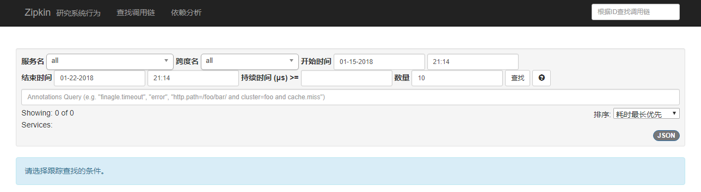

### 项目添加zipkin支持

在项目`spring-cloud-producer`和`spring-cloud-zuul`中添加zipkin的支持。

```
<dependency>
    <groupId>org.springframework.cloud</groupId>
    <artifactId>spring-cloud-starter-zipkin</artifactId>
</dependency>
```

Spring应用在监测到Java依赖包中有sleuth和zipkin后，会自动在RestTemplate的调用过程中向HTTP请求注入追踪信息，并向Zipkin Server发送这些信息。

同时配置文件中添加如下代码：

```
spring:
  zipkin:
    base-url: http://localhost:9000
  sleuth:
    sampler:
      percentage: 1.0
```

spring.zipkin.base-url指定了Zipkin服务器的地址，spring.sleuth.sampler.percentage将采样比例设置为1.0，也就是全部都需要。

Spring Cloud Sleuth有一个Sampler策略，可以通过这个实现类来控制采样算法。采样器不会阻碍span相关id的产生，但是会对导出以及附加事件标签的相关操作造成影响。 Sleuth默认采样算法的实现是Reservoir sampling，具体的实现类是PercentageBasedSampler，默认的采样比例为: 0.1(即10%)。不过我们可以通过spring.sleuth.sampler.percentage来设置，所设置的值介于0.0到1.0之间，1.0则表示全部采集。

这两个项目添加zipkin之后，依次进行启动。

### 进行验证

这样我们就模拟了这样一个场景，通过外部请求访问Zuul网关，Zuul网关去调用`spring-cloud-producer`对外提供的服务。

四个项目均启动后，在浏览器中访问地址：`http://localhost:8888/producer/hello?name=neo` 两次，然后再打开地址：`http://localhost:9000/zipkin/`点击对应按钮进行查看。

点击查找看到有两条记录

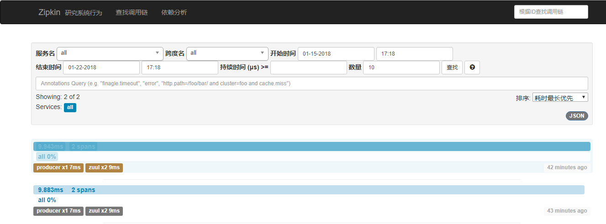

点击记录进去页面，可以看到每一个服务所耗费的时间和顺序


点击依赖分析，可以看到项目之间的调用关系


**[示例代码-github](https://github.com/ityouknow/spring-cloud-examples)**

**[示例代码-码云](https://gitee.com/ityouknow/spring-cloud-examples)**

**参考：**

[分布式服务跟踪及Spring Cloud的实现](http://daixiaoyu.com/distributed-tracing.html)

# springcloud(十三)：注册中心 Consul 使用详解

在上个月我们知道 Eureka 2.X 遇到困难停止开发了，但其实对国内的用户影响甚小，一方面国内大都使用的是 Eureka 1.X 系列，另一方面 Spring Cloud 支持很多服务发现的软件，Eureka 只是其中之一，下面是 Spring Cloud 支持的服务发现软件以及特性对比：

| Feature              | euerka                       | Consul                 | zookeeper             | etcd              |
| :------------------- | :--------------------------- | :--------------------- | :-------------------- | :---------------- |
| 服务健康检查         | 可配支持                     | 服务状态，内存，硬盘等 | (弱)长连接，keepalive | 连接心跳          |
| 多数据中心           | —                            | 支持                   | —                     | —                 |
| kv 存储服务          | —                            | 支持                   | 支持                  | 支持              |
| 一致性               | —                            | raft                   | paxos                 | raft              |
| cap                  | ap                           | cp                     | cp                    | cp                |
| 使用接口(多语言能力) | http（sidecar）              | 支持 http 和 dns       | 客户端                | http/grpc         |
| watch 支持           | 支持 long polling/大部分增量 | 全量/支持long polling  | 支持                  | 支持 long polling |
| 自身监控             | metrics                      | metrics                | —                     | metrics           |
| 安全                 | —                            | acl /https             | acl                   | https 支持（弱）  |
| spring cloud 集成    | 已支持                       | 已支持                 | 已支持                | 已支持            |

在以上服务发现的软件中，Euerka 和 Consul 使用最为广泛。如果大家对注册中心的概念和 Euerka 不太了解的话， 可以参考我前期的文章：[springcloud(二)：注册中心Eureka ](http://www.ityouknow.com/springcloud/2017/05/10/springcloud-eureka.html)，本篇文章主要给大家介绍 Spring Cloud Consul 的使用。

## Consul 介绍

Consul 是 HashiCorp 公司推出的开源工具，用于实现分布式系统的服务发现与配置。与其它分布式服务注册与发现的方案，Consul 的方案更“一站式”，内置了服务注册与发现框 架、分布一致性协议实现、健康检查、Key/Value 存储、多数据中心方案，不再需要依赖其它工具（比如 ZooKeeper 等）。使用起来也较 为简单。Consul 使用 Go 语言编写，因此具有天然可移植性(支持Linux、windows和Mac OS X)；安装包仅包含一个可执行文件，方便部署，与 Docker 等轻量级容器可无缝配合。

**Consul 的优势：**

- 使用 Raft 算法来保证一致性, 比复杂的 Paxos 算法更直接. 相比较而言, zookeeper 采用的是 Paxos, 而 etcd 使用的则是 Raft。
- 支持多数据中心，内外网的服务采用不同的端口进行监听。 多数据中心集群可以避免单数据中心的单点故障,而其部署则需要考虑网络延迟, 分片等情况等。 zookeeper 和 etcd 均不提供多数据中心功能的支持。
- 支持健康检查。 etcd 不提供此功能。
- 支持 http 和 dns 协议接口。 zookeeper 的集成较为复杂, etcd 只支持 http 协议。
- 官方提供 web 管理界面, etcd 无此功能。
- 综合比较, Consul 作为服务注册和配置管理的新星, 比较值得关注和研究。

**特性：**

- 服务发现
- 健康检查
- Key/Value 存储
- 多数据中心

**Consul 角色**

- client: 客户端, 无状态, 将 HTTP 和 DNS 接口请求转发给局域网内的服务端集群。
- server: 服务端, 保存配置信息, 高可用集群, 在局域网内与本地客户端通讯, 通过广域网与其它数据中心通讯。 每个数据中心的 server 数量推荐为 3 个或是 5 个。

Consul 客户端、服务端还支持夸中心的使用，更加提高了它的高可用性。


**Consul 工作原理：**


- 1、当 Producer 启动的时候，会向 Consul 发送一个 post 请求，告诉 Consul 自己的 IP 和 Port
- 2、Consul 接收到 Producer 的注册后，每隔10s（默认）会向 Producer 发送一个健康检查的请求，检验Producer是否健康
- 3、当 Consumer 发送 GET 方式请求 /api/address 到 Producer 时，会先从 Consul 中拿到一个存储服务 IP 和 Port 的临时表，从表中拿到 Producer 的 IP 和 Port 后再发送 GET 方式请求 /api/address
- 4、该临时表每隔10s会更新，只包含有通过了健康检查的 Producer

Spring Cloud Consul 项目是针对 Consul 的服务治理实现。Consul 是一个分布式高可用的系统，它包含多个组件，但是作为一个整体，在微服务架构中为我们的基础设施提供服务发现和服务配置的工具。

## Consul VS Eureka

Eureka 是一个服务发现工具。该体系结构主要是客户端/服务器，每个数据中心有一组 Eureka 服务器，通常每个可用区域一个。通常 Eureka 的客户使用嵌入式 SDK 来注册和发现服务。对于非本地集成的客户，官方提供的 Eureka 一些 REST 操作 API，其它语言可以使用这些 API 来实现对 Eureka Server 的操作从而实现一个非 jvm 语言的 Eureka Client。

Eureka 提供了一个弱一致的服务视图，尽可能的提供服务可用性。当客户端向服务器注册时，该服务器将尝试复制到其它服务器，但不提供保证复制完成。服务注册的生存时间（TTL）较短，要求客户端对服务器心跳检测。不健康的服务或节点停止心跳，导致它们超时并从注册表中删除。服务发现可以路由到注册的任何服务，由于心跳检测机制有时间间隔，可能会导致部分服务不可用。这个简化的模型允许简单的群集管理和高可扩展性。

Consul 提供了一些列特性，包括更丰富的健康检查，键值对存储以及多数据中心。Consul 需要每个数据中心都有一套服务，以及每个客户端的 agent，类似于使用像 Ribbon 这样的服务。Consul agent 允许大多数应用程序成为 Consul 不知情者，通过配置文件执行服务注册并通过 DNS 或负载平衡器 sidecars 发现。

Consul 提供强大的一致性保证，因为服务器使用 Raft 协议复制状态 。Consul 支持丰富的健康检查，包括 TCP，HTTP，Nagios / Sensu 兼容脚本或基于 Eureka 的 TTL。客户端节点参与基于 Gossip 协议的健康检查，该检查分发健康检查工作，而不像集中式心跳检测那样成为可扩展性挑战。发现请求被路由到选举出来的 leader，这使他们默认情况下强一致性。允许客户端过时读取取使任何服务器处理他们的请求，从而实现像 Eureka 这样的线性可伸缩性。

Consul 强烈的一致性意味着它可以作为领导选举和集群协调的锁定服务。Eureka 不提供类似的保证，并且通常需要为需要执行协调或具有更强一致性需求的服务运行 ZooKeeper。

Consul 提供了支持面向服务的体系结构所需的一系列功能。这包括服务发现，还包括丰富的运行状况检查，锁定，密钥/值，多数据中心联合，事件系统和 ACL。Consul 和 consul-template 和 envconsul 等工具生态系统都试图尽量减少集成所需的应用程序更改，以避免需要通过 SDK 进行本地集成。Eureka 是一个更大的 Netflix OSS 套件的一部分，该套件预计应用程序相对均匀且紧密集成。因此 Eureka 只解决了一小部分问题，可以和 ZooKeeper 等其它工具可以一起使用。

Consul 强一致性(C)带来的是：

服务注册相比 Eureka 会稍慢一些。因为 Consul 的 raft 协议要求必须过半数的节点都写入成功才认为注册成功 Leader 挂掉时，重新选举期间整个 Consul 不可用。保证了强一致性但牺牲了可用性。

Eureka 保证高可用(A)和最终一致性：

服务注册相对要快，因为不需要等注册信息 replicate 到其它节点，也不保证注册信息是否 replicate 成功 当数据出现不一致时，虽然 A, B 上的注册信息不完全相同，但每个 Eureka 节点依然能够正常对外提供服务，这会出现查询服务信息时如果请求 A 查不到，但请求 B 就能查到。如此保证了可用性但牺牲了一致性。

其它方面，eureka 就是个 servlet 程序，跑在 servlet 容器中; Consul 则是 go 编写而成。

## Consul 安装

Consul 不同于 Eureka 需要单独安装，访问[Consul 官网](https://www.consul.io/downloads.html)下载 Consul 的最新版本，我这里是 consul_1.2.1。

根据不同的系统类型选择不同的安装包，从下图也可以看出 Consul 支持所有主流系统。


我这里以 Windows 为例，下载下来是一个 consul_1.2.1_windows_amd64.zip 的压缩包，解压是是一个 consul.exe 的执行文件。


cd 到对应的目录下，使用 cmd 启动 Consul

```
cd D:\Common Files\consul
#cmd启动：
consul agent -dev        # -dev表示开发模式运行，另外还有-server表示服务模式运行
```

为了方便期间，可以在同级目录下创建一个 run.bat 脚本来启动，脚本内容如下：

```
consul agent -dev
pause
```

启动结果如下：


启动成功之后访问：`http://localhost:8500`，可以看到 Consul 的管理界面


这样就意味着我们的 Consul 服务启动成功了。

## Consul 服务端

接下来我们开发 Consul 的服务端，我们创建一个 spring-cloud-consul-producer 项目

### 添加依赖包

依赖包如下：

```
<dependencies>
	<dependency>
		<groupId>org.springframework.boot</groupId>
		<artifactId>spring-boot-starter-actuator</artifactId>
	</dependency>
	<dependency>
		<groupId>org.springframework.cloud</groupId>
		<artifactId>spring-cloud-starter-consul-discovery</artifactId>
	</dependency>
	<dependency>
		<groupId>org.springframework.boot</groupId>
		<artifactId>spring-boot-starter-web</artifactId>
	</dependency>
	<dependency>
		<groupId>org.springframework.boot</groupId>
		<artifactId>spring-boot-starter-test</artifactId>
		<scope>test</scope>
	</dependency>
</dependencies>
```

- `spring-boot-starter-actuator` 健康检查依赖于此包。
- `spring-cloud-starter-consul-discovery` Spring Cloud Consul 的支持。

Spring Boot 版本使用的是 2.0.3.RELEASE，Spring Cloud 最新版本是 Finchley.RELEASE 依赖于 Spring Boot 2.x.

```
<parent>
	<groupId>org.springframework.boot</groupId>
	<artifactId>spring-boot-starter-parent</artifactId>
	<version>2.0.3.RELEASE</version>
	<relativePath/> <!-- lookup parent from repository -->
</parent>

<dependencyManagement>
	<dependencies>
		<dependency>
			<groupId>org.springframework.cloud</groupId>
			<artifactId>spring-cloud-dependencies</artifactId>
			<version>${spring-cloud.version}</version>
			<type>pom</type>
			<scope>import</scope>
		</dependency>
	</dependencies>
</dependencyManagement>
```

完整的 pom.xml 文件大家可以参考示例源码。

### 配置文件

配置文件内容如下

```
spring.application.name=spring-cloud-consul-producer
server.port=8501
spring.cloud.consul.host=localhost
spring.cloud.consul.port=8500
#注册到consul的服务名称
spring.cloud.consul.discovery.serviceName=service-producer
```

Consul 的地址和端口号默认是 localhost:8500 ，如果不是这个地址可以自行配置。`spring.cloud.consul.discovery.serviceName` 是指注册到 Consul 的服务名称，后期客户端会根据这个名称来进行服务调用。

### 启动类

```
@SpringBootApplication
@EnableDiscoveryClient
public class ConsulProducerApplication {

	public static void main(String[] args) {
		SpringApplication.run(ConsulProducerApplication.class, args);
	}
}
```

添加了 `@EnableDiscoveryClient` 注解表示支持服务发现。

### 提供服务

我们在创建一个 Controller，推文提供 hello 的服务。

```
@RestController
public class HelloController {

    @RequestMapping("/hello")
    public String hello() {
        return "hello consul";
    }
}
```

为了模拟注册均衡负载复制一份上面的项目重命名为 spring-cloud-consul-producer-2 ,修改对应的端口为 8502，修改 hello 方法的返回值为：”hello consul two”，修改完成后依次启动两个项目。

这时候我们再次在浏览器访问地址：http://localhost:8500，显示如下：

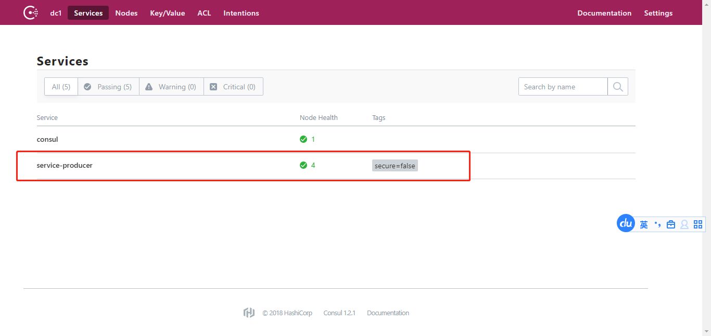

我们发现页面多了 service-producer 服务，点击进去后页面显示有两个服务提供者：


这样服务提供者就准备好了。

## Consul 消费端

我们创建一个 spring-cloud-consul-consumer 项目，pom 文件和上面示例保持一致。

### 配置文件

配置文件内容如下

```
spring.application.name=spring-cloud-consul-consumer
server.port=8503
spring.cloud.consul.host=127.0.0.1
spring.cloud.consul.port=8500
#设置不需要注册到 consul 中
spring.cloud.consul.discovery.register=false
```

客户端可以设置注册到 Consul 中，也可以不注册到 Consul 注册中心中，根据我们的业务来选择，只需要在使用服务时通过 Consul 对外提供的接口获取服务信息即可。

### 启动类

```
@SpringBootApplication
public class ConsulConsumerApplication {

	public static void main(String[] args) {
		SpringApplication.run(ConsulConsumerApplication.class, args);
	}
}
```

### 进行测试

我们先来创建一个 ServiceController ,试试如果去获取 Consul 中的服务。

```
@RestController
public class ServiceController {

    @Autowired
    private LoadBalancerClient loadBalancer;
    @Autowired
    private DiscoveryClient discoveryClient;

   /**
     * 获取所有服务
     */
    @RequestMapping("/services")
    public Object services() {
        return discoveryClient.getInstances("service-producer");
    }

    /**
     * 从所有服务中选择一个服务（轮询）
     */
    @RequestMapping("/discover")
    public Object discover() {
        return loadBalancer.choose("service-producer").getUri().toString();
    }
}
```

Controller 中有俩个方法，一个是获取所有服务名为`service-producer`的服务信息并返回到页面，一个是随机从服务名为`service-producer`的服务中获取一个并返回到页面。

添加完 ServiceController 之后我们启动项目，访问地址：`http://localhost:8503/services`，返回：

```
[{"serviceId":"service-producer","host":"windows10.microdone.cn","port":8501,"secure":false,"metadata":{"secure":"false"},"uri":"http://windows10.microdone.cn:8501","scheme":null},{"serviceId":"service-producer","host":"windows10.microdone.cn","port":8502,"secure":false,"metadata":{"secure":"false"},"uri":"http://windows10.microdone.cn:8502","scheme":null}]
```

发现我们刚才创建的端口为 8501 和 8502 的两个服务端都存在。

多次访问地址：`http://localhost:8503/discover`，页面会交替返回下面信息：

```
http://windows10.microdone.cn:8501
http://windows10.microdone.cn:8502
...
```

说明 8501 和 8502 的两个服务会交替出现，从而实现了获取服务端地址的均衡负载。

大多数情况下我们希望使用均衡负载的形式去获取服务端提供的服务，因此使用第二种方法来模拟调用服务端提供的 hello 方法。

创建 CallHelloController ：

```java
@RestController
public class CallHelloController {

    @Autowired
    private LoadBalancerClient loadBalancer;

    @RequestMapping("/call")
    public String call() {
        ServiceInstance serviceInstance = loadBalancer.choose("service-producer");
        System.out.println("服务地址：" + serviceInstance.getUri());
        System.out.println("服务名称：" + serviceInstance.getServiceId());

        String callServiceResult = new RestTemplate().getForObject(serviceInstance.getUri().toString() + "/hello", String.class);
        System.out.println(callServiceResult);
        return callServiceResult;
    }

}
```

使用 RestTemplate 进行远程调用。添加完之后重启 spring-cloud-consul-consumer 项目。在浏览器中访问地址：`http://localhost:8503/call`，依次返回结果如下：

```
hello consul
hello consul two
...
```

说明我们已经成功的调用了 Consul 服务端提供的服务，并且

实现了服务端的均衡负载功能。通过今天的实践我们发现 Consul 提供的服务发现易用、强大。

# springcloud(十四)：Spring Cloud 开源软件都有哪些？

学习一门新的技术如果有优秀的开源项目，对初学者的学习将会是事半功倍，通过研究和学习优秀的开源项目，可以快速的了解此技术的相关应用场景和应用示例，参考优秀开源项目会降低将此技术引入到项目中的成本。为此抽了一些时间为大家寻找了一些非常优秀的 Spring Cloud 开源软件供大家学习参考。

上次写了一篇文章[Spring Boot 2 (三)：Spring Boot 开源软件都有哪些](http://www.ityouknow.com/springboot/2018/03/05/spring-boot-open-source.html) 给大家介绍优秀的 Spring Boot 开源项目，本篇文章给介绍 Spring Cloud 的优秀开源项目。Spring Cloud 开源项目主要集中在 Github/码云 ，本文所有项目地址也均来自于这两个网站。

## 1、 [awesome-spring-cloud](https://github.com/ityouknow/awesome-spring-cloud)

首先给大家介绍的就是 Spring Cloud 中文索引，这是一个专门收集 Spring Cloud 相关资料的开源项目，也有对应的导航页面。

**产品主页**

http://springcloud.fun/

**项目主页**

https://github.com/ityouknow/awesome-spring-cloud

**产品截图**

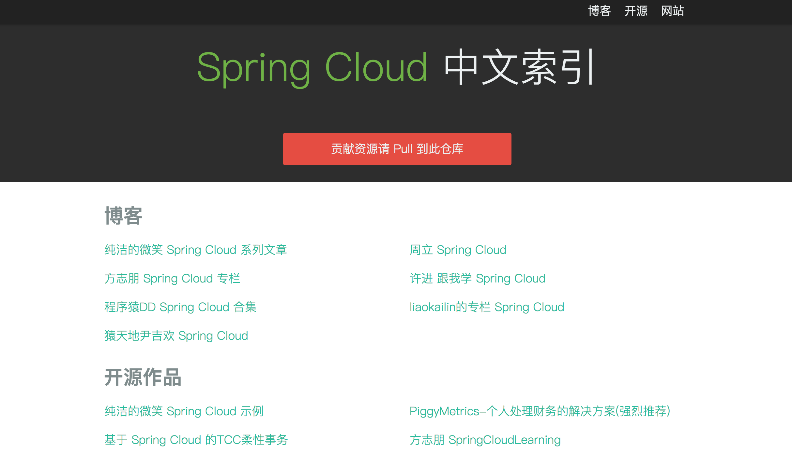

## 2、 [PiggyMetrics](https://github.com/sqshq/PiggyMetrics)

一个简单的个人财务系统，基于 Spring Boot，Spring Cloud 和 Docker 简单演示了微服务的架构模式，整个项目几乎包含了 Spring Cloud 的所有特性包括 配置中心、Gateway zuul API 网关、Eureka 服务发现、Hystrix、Turbine仪 表盘应用健康监控等等。

PiggyMetrics 被分解为三个核心微服务。这些服务都是围绕某些业务能力组织的可独立部署的应用程序。


PiggyMetrics 的项目架构图

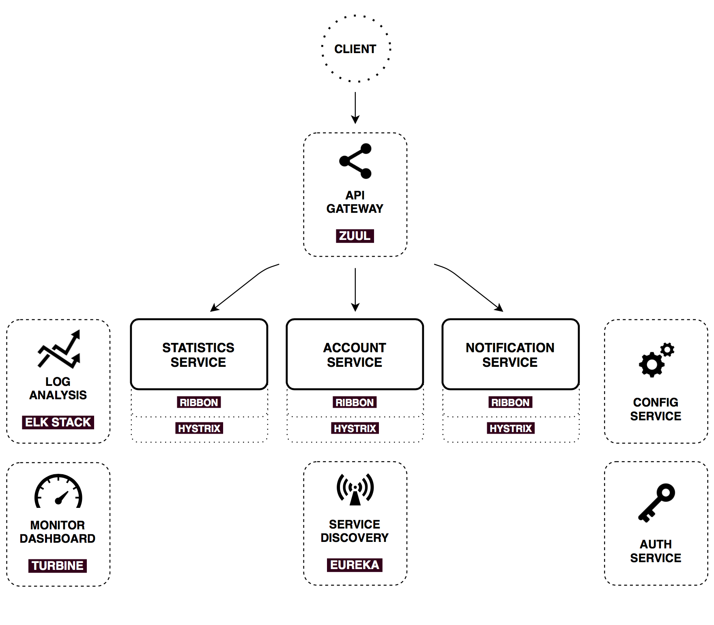

**项目主页**

https://github.com/sqshq/PiggyMetrics

**产品截图**


## 3、 [spaascloud-master](https://github.com/paascloud/paascloud-master)

spring cloud + vue 全家桶实战，模拟商城，完整的购物流程、后端运营平台，可以实现快速搭建企业级微服务项目。

功能点： 模拟商城，完整的购物流程、后端运营平台对前端业务的支撑，和对项目的运维，有各项的监控指标和运维指标。

技术点： 核心技术为springcloud+vue两个全家桶实现，采取了取自开源用于开源的目标，所以能用开源绝不用收费框架，整体技术栈只有 阿里云短信服务是收费的，都是目前java前瞻性的框架，可以为中小企业解决微服务架构难题，可以帮助企业快速建站。由于服务 器成本较高，尽量降低开发成本的原则，本项目由10个后端项目和3个前端项目共同组成。真正实现了基于RBAC、jwt和oauth2的 无状态统一权限认证的解决方案，实现了异常和日志的统一管理，实现了MQ落地保证100%到达的解决方案。

**产品主页**

http://mall.paascloud.net/index

**项目主页**

https://github.com/paascloud/paascloud-master

**产品截图**


## 4、 [Cloud-Admin](https://gitee.com/minull/ace-security)

Cloud-Admin是国内首个基于Spring Cloud微服务化开发平台，核心技术采用Spring Boot2以及Spring Cloud Gateway相关核心组件，前端采用vue-element-admin组件。具有统一授权、认证后台管理系统，其中包含具备用户管理、资源权限管理、网关API管理等多个模块，支持多业务系统并行开发，可以作为后端服务的开发脚手架。代码简洁，架构清晰，适合学习和直接项目中使用。

**项目主页**

https://gitee.com/minull/ace-security

**项目架构**


## 5、 [spring-cloud-rest-tcc](https://github.com/prontera/spring-cloud-rest-tcc)

基于Spring Cloud Netflix的TCC柔性事务和EDA事件驱动示例，结合Spring Cloud Sleuth进行会话追踪和Spring Boot Admin的健康监控，并辅以Hystrix Dashboard提供近实时的熔断监控.

**项目主页**

https://github.com/prontera/spring-cloud-rest-tcc

**项目架构**

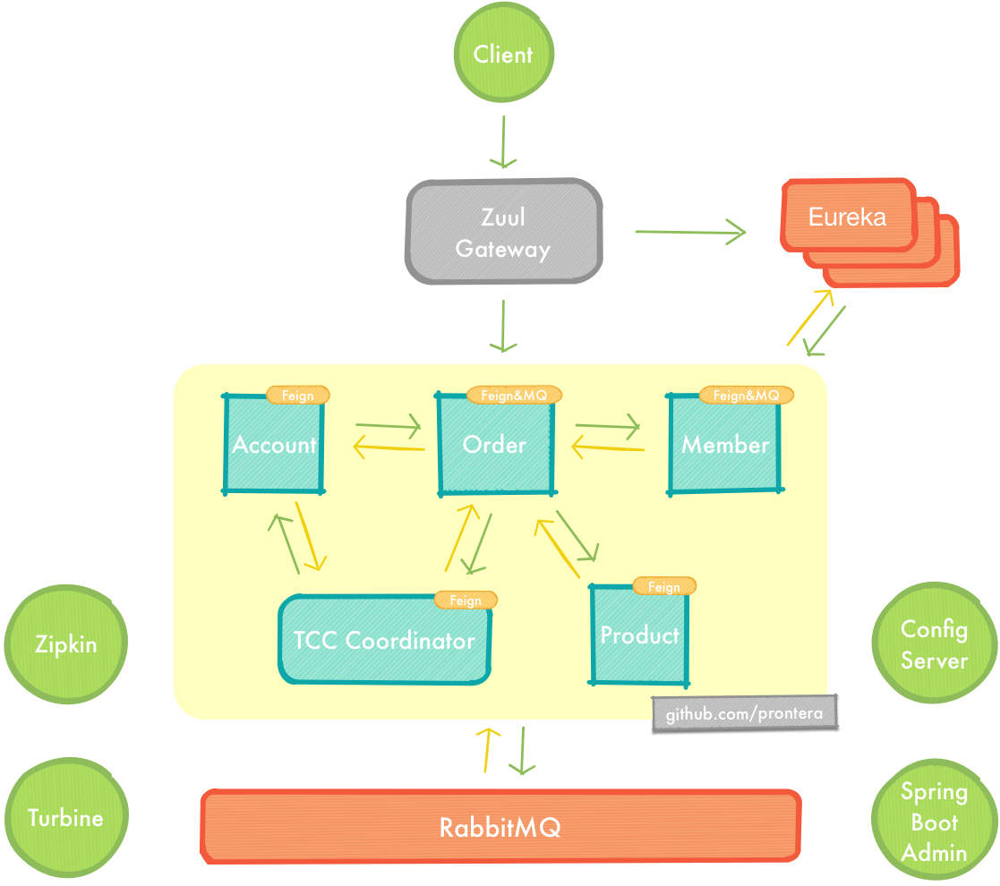

## 6、 [pig](https://gitee.com/log4j/pig)

基于Spring Cloud、oAuth2.0开发，基于Vue前后分离的开发平台，支持账号、短信、SSO等多种登录

**产品主页**

https://www.pig4cloud.com/

**项目主页**

https://gitee.com/log4j/pig

**产品截图**


## 7、 [xxpay-master](https://gitee.com/jmdhappy/xxpay-master)

XxPay聚合支付使用Java开发，包括spring-cloud、dubbo、spring-boot三个架构版本，已接入微信、支付宝等主流支付渠道，可直接用于生产环境。

**产品主页**

http://www.xxpay.org/

**项目主页**

https://gitee.com/jmdhappy/xxpay-master

**产品截图**


## 8、 [spring-boot-cloud](https://github.com/zhangxd1989/spring-boot-cloud)

基于 Spring Boot、Spring Cloud、Spring Oauth2 和 Spring Cloud Netflix 等框架构建的微服务项目

**项目主页**

https://github.com/zhangxd1989/spring-boot-cloud

**项目架构**


## 9、 [FCat](https://gitee.com/xfdm/FCat)

FCat项目基于 Angular 4 + Spring Cloud 的企业级基础功能框架。

**项目主页**

https://gitee.com/xfdm/FCat

**项目架构**


## 10、 [spring-cloud-examples](https://github.com/ityouknow/spring-cloud-examples)

Spring Cloud 技术栈示例代码，快速简单上手教程，一个帮助大家学习 Spring Cloud 的开源示例项目，每个 Spring Cloud 组件都有独立的示例供大家参考学习。

**项目主页**

https://github.com/ityouknow/spring-cloud-examples

**项目截图**

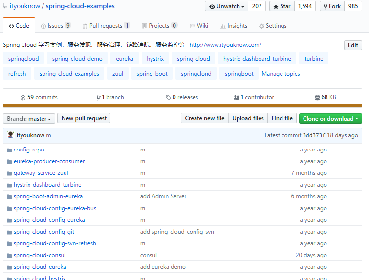

> 应该还有更多优秀的 Spring Cloud 开源项目，目前仅发现这些，也希望大家多反馈一些优秀的 Spring Cloud 开源项目，统一将这些项目收集到 awesome-spring-cloud 中，方便后续大家学习查找。

## 参考

[Spring Cloud 中文索引](http://springcloud.fun/)

# springcloud(十五)：服务网关 Spring Cloud GateWay 入门

Spring 官方最终还是按捺不住推出了自己的网关组件：Spring Cloud Gateway ，相比之前我们使用的 Zuul（1.x） 它有哪些优势呢？Zuul（1.x） 基于 Servlet，使用阻塞 API，它不支持任何长连接，如 WebSockets，Spring Cloud Gateway 使用非阻塞 API，支持 WebSockets，支持限流等新特性。

## Spring Cloud Gateway

Spring Cloud Gateway 是 Spring Cloud 的一个全新项目，该项目是基于 Spring 5.0，Spring Boot 2.0 和 Project Reactor 等技术开发的网关，它旨在为微服务架构提供一种简单有效的统一的 API 路由管理方式。

Spring Cloud Gateway 作为 Spring Cloud 生态系统中的网关，目标是替代 Netflix Zuul，其不仅提供统一的路由方式，并且基于 Filter 链的方式提供了网关基本的功能，例如：安全，监控/指标，和限流。

**相关概念:**

- Route（路由）：这是网关的基本构建块。它由一个 ID，一个目标 URI，一组断言和一组过滤器定义。如果断言为真，则路由匹配。
- Predicate（断言）：这是一个 Java 8 的 Predicate。输入类型是一个 ServerWebExchange。我们可以使用它来匹配来自 HTTP 请求的任何内容，例如 headers 或参数。
- Filter（过滤器）：这是`org.springframework.cloud.gateway.filter.GatewayFilter`的实例，我们可以使用它修改请求和响应。

**工作流程：**


客户端向 Spring Cloud Gateway 发出请求。如果 Gateway Handler Mapping 中找到与请求相匹配的路由，将其发送到 Gateway Web Handler。Handler 再通过指定的过滤器链来将请求发送到我们实际的服务执行业务逻辑，然后返回。 过滤器之间用虚线分开是因为过滤器可能会在发送代理请求之前（“pre”）或之后（“post”）执行业务逻辑。

Spring Cloud Gateway 的特征：

- 基于 Spring Framework 5，Project Reactor 和 Spring Boot 2.0
- 动态路由
- Predicates 和 Filters 作用于特定路由
- 集成 Hystrix 断路器
- 集成 Spring Cloud DiscoveryClient
- 易于编写的 Predicates 和 Filters
- 限流
- 路径重写

## 快速上手

Spring Cloud Gateway 网关路由有两种配置方式：

- 在配置文件 yml 中配置
- 通过`@Bean`自定义 RouteLocator，在启动主类 Application 中配置

这两种方式是等价的，建议使用 yml 方式进配置。

使用 Spring Cloud Finchley 版本，Finchley 版本依赖于 Spring Boot 2.0.6.RELEASE。

```
<parent>
	<groupId>org.springframework.boot</groupId>
	<artifactId>spring-boot-starter-parent</artifactId>
	<version>2.0.6.RELEASE</version>
	<relativePath/> <!-- lookup parent from repository -->
</parent>

<dependencyManagement>
	<dependencies>
		<dependency>
			<groupId>org.springframework.cloud</groupId>
			<artifactId>spring-cloud-dependencies</artifactId>
			<version>Finchley.SR2</version>
			<type>pom</type>
			<scope>import</scope>
		</dependency>
	</dependencies>
</dependencyManagement>
```

> 经测试 Finchley.RELEASE 有 bug 多次请求会报空指针异常，SR2 是 Spring Cloud 的最新版本。

添加项目需要使用的依赖包

```
<dependency>
	<groupId>org.springframework.cloud</groupId>
	<artifactId>spring-cloud-starter-gateway</artifactId>
</dependency>
```

Spring Cloud Gateway 是使用 netty+webflux 实现因此不需要再引入 web 模块。

我们先来测试一个最简单的请求转发。

```
server:
  port: 8080
spring:
  cloud:
    gateway:
      routes:
      - id: neo_route
        uri: http://www.ityouknow.com
        predicates:
        - Path=/spring-cloud
```

各字段含义如下：

- id：我们自定义的路由 ID，保持唯一
- uri：目标服务地址
- predicates：路由条件，Predicate 接受一个输入参数，返回一个布尔值结果。该接口包含多种默认方法来将 Predicate 组合成其他复杂的逻辑（比如：与，或，非）。
- filters：过滤规则，本示例暂时没用。

上面这段配置的意思是，配置了一个 id 为 neo_route 的路由规则，当访问地址 `http://localhost:8080/spring-cloud`时会自动转发到地址：`http://www.ityouknow.com/spring-cloud`。配置完成启动项目即可在浏览器访问进行测试，当我们访问地址`http://localhost:8080/spring-cloud` 时会展示页面展示如下：


证明页面转发成功。

转发功能同样可以通过代码来实现，我们可以在启动类 GateWayApplication 中添加方法 `customRouteLocator()` 来定制转发规则。

```
@SpringBootApplication
public class GateWayApplication {

	public static void main(String[] args) {
		SpringApplication.run(GateWayApplication.class, args);
	}

	@Bean
	public RouteLocator customRouteLocator(RouteLocatorBuilder builder) {
		return builder.routes()
				.route("path_route", r -> r.path("/about")
						.uri("http://ityouknow.com"))
				.build();
	}

}
```

上面配置了一个 id 为 path_route 的路由，当访问地址`http://localhost:8080/about`时会自动转发到地址：`http://www.ityouknow.com/about`和上面的转发效果一样，只是这里转发的是以`项目地址/about`格式的请求地址。

上面两个示例中 uri 都是指向了我的个人网站，在实际项目使用中可以将 uri 指向对外提供服务的项目地址，统一对外输出接口。

以上便是 Spring Cloud Gateway 最简单的两个请求示例，Spring Cloud Gateway 还有更多实用的功能接下来我们一一介绍。

## 路由规则

Spring Cloud Gateway 的功能很强大，我们仅仅通过 Predicates 的设计就可以看出来，前面我们只是使用了 predicates 进行了简单的条件匹配，其实 Spring Cloud Gataway 帮我们内置了很多 Predicates 功能。

Spring Cloud Gateway 是通过 Spring WebFlux 的 `HandlerMapping` 做为底层支持来匹配到转发路由，Spring Cloud Gateway 内置了很多 Predicates 工厂，这些 Predicates 工厂通过不同的 HTTP 请求参数来匹配，多个 Predicates 工厂可以组合使用。

### Predicate 介绍

Predicate 来源于 Java 8，是 Java 8 中引入的一个函数，Predicate 接受一个输入参数，返回一个布尔值结果。该接口包含多种默认方法来将 Predicate 组合成其他复杂的逻辑（比如：与，或，非）。可以用于接口请求参数校验、判断新老数据是否有变化需要进行更新操作。

在 Spring Cloud Gateway 中 Spring 利用 Predicate 的特性实现了各种路由匹配规则，有通过 Header、请求参数等不同的条件来进行作为条件匹配到对应的路由。网上有一张图总结了 Spring Cloud 内置的几种 Predicate 的实现。


说白了 Predicate 就是为了实现一组匹配规则，方便让请求过来找到对应的 Route 进行处理，接下来我们接下 Spring Cloud GateWay 内置几种 Predicate 的使用。

### 通过时间匹配

Predicate 支持设置一个时间，在请求进行转发的时候，可以通过判断在这个时间之前或者之后进行转发。比如我们现在设置只有在2019年1月1日才会转发到我的网站，在这之前不进行转发，我就可以这样配置：

```
spring:
  cloud:
    gateway:
      routes:
       - id: time_route
        uri: http://ityouknow.com
        predicates:
         - After=2018-01-20T06:06:06+08:00[Asia/Shanghai]
```

Spring 是通过 ZonedDateTime 来对时间进行的对比，ZonedDateTime 是 Java 8 中日期时间功能里，用于表示带时区的日期与时间信息的类，ZonedDateTime 支持通过时区来设置时间，中国的时区是：`Asia/Shanghai`。

After Route Predicate 是指在这个时间之后的请求都转发到目标地址。上面的示例是指，请求时间在 2018年1月20日6点6分6秒之后的所有请求都转发到地址`http://ityouknow.com`。`+08:00`是指时间和UTC时间相差八个小时，时间地区为`Asia/Shanghai`。

添加完路由规则之后，访问地址`http://localhost:8080`会自动转发到`http://ityouknow.com`。

Before Route Predicate 刚好相反，在某个时间之前的请求的请求都进行转发。我们把上面路由规则中的 After 改为 Before，如下：

```
spring:
  cloud:
    gateway:
      routes:
       - id: after_route
        uri: http://ityouknow.com
        predicates:
         - Before=2018-01-20T06:06:06+08:00[Asia/Shanghai]
```

就表示在这个时间之前可以进行路由，在这时间之后停止路由，修改完之后重启项目再次访问地址`http://localhost:8080`，页面会报 404 没有找到地址。

除过在时间之前或者之后外，Gateway 还支持限制路由请求在某一个时间段范围内，可以使用 Between Route Predicate 来实现。

```
spring:
  cloud:
    gateway:
      routes:
       - id: after_route
        uri: http://ityouknow.com
        predicates:
         - Between=2018-01-20T06:06:06+08:00[Asia/Shanghai], 2019-01-20T06:06:06+08:00[Asia/Shanghai]
```

这样设置就意味着在这个时间段内可以匹配到此路由，超过这个时间段范围则不会进行匹配。通过时间匹配路由的功能很酷，可以用在限时抢购的一些场景中。

### 通过 Cookie 匹配

Cookie Route Predicate 可以接收两个参数，一个是 Cookie name ,一个是正则表达式，路由规则会通过获取对应的 Cookie name 值和正则表达式去匹配，如果匹配上就会执行路由，如果没有匹配上则不执行。

```
spring:
  cloud:
    gateway:
      routes:
       - id: cookie_route
         uri: http://ityouknow.com
         predicates:
         - Cookie=ityouknow, kee.e
```

使用 curl 测试，命令行输入:

```
curl http://localhost:8080 --cookie "ityouknow=kee.e"
```

则会返回页面代码，如果去掉`--cookie "ityouknow=kee.e"`，后台汇报 404 错误。

### 通过 Header 属性匹配

Header Route Predicate 和 Cookie Route Predicate 一样，也是接收 2 个参数，一个 header 中属性名称和一个正则表达式，这个属性值和正则表达式匹配则执行。

```
spring:
  cloud:
    gateway:
      routes:
      - id: header_route
        uri: http://ityouknow.com
        predicates:
        - Header=X-Request-Id, \d+
```

使用 curl 测试，命令行输入:

```
curl http://localhost:8080  -H "X-Request-Id:666666" 
```

则返回页面代码证明匹配成功。将参数`-H "X-Request-Id:666666"`改为`-H "X-Request-Id:neo"`再次执行时返回404证明没有匹配。

### 通过 Host 匹配

Host Route Predicate 接收一组参数，一组匹配的域名列表，这个模板是一个 ant 分隔的模板，用`.`号作为分隔符。它通过参数中的主机地址作为匹配规则。

```
spring:
  cloud:
    gateway:
      routes:
      - id: host_route
        uri: http://ityouknow.com
        predicates:
        - Host=**.ityouknow.com
```

使用 curl 测试，命令行输入:

```
curl http://localhost:8080  -H "Host: www.ityouknow.com" 
curl http://localhost:8080  -H "Host: md.ityouknow.com" 
```

经测试以上两种 host 均可匹配到 host_route 路由，去掉 host 参数则会报 404 错误。

### 通过请求方式匹配

可以通过是 POST、GET、PUT、DELETE 等不同的请求方式来进行路由。

```
spring:
  cloud:
    gateway:
      routes:
      - id: method_route
        uri: http://ityouknow.com
        predicates:
        - Method=GET
```

使用 curl 测试，命令行输入:

```
# curl 默认是以 GET 的方式去请求
curl http://localhost:8080
```

测试返回页面代码，证明匹配到路由，我们再以 POST 的方式请求测试。

```
# curl 默认是以 GET 的方式去请求
curl -X POST http://localhost:8080
```

返回 404 没有找到，证明没有匹配上路由

### 通过请求路径匹配

Path Route Predicate 接收一个匹配路径的参数来判断是否走路由。

```
spring:
  cloud:
    gateway:
      routes:
      - id: host_route
        uri: http://ityouknow.com
        predicates:
        - Path=/foo/{segment}
```

如果请求路径符合要求，则此路由将匹配，例如：/foo/1 或者 /foo/bar。

使用 curl 测试，命令行输入:

```
curl http://localhost:8080/foo/1
curl http://localhost:8080/foo/xx
curl http://localhost:8080/boo/xx
```

经过测试第一和第二条命令可以正常获取到页面返回值，最后一个命令报404，证明路由是通过指定路由来匹配。

### 通过请求参数匹配

Query Route Predicate 支持传入两个参数，一个是属性名一个为属性值，属性值可以是正则表达式。

```
spring:
  cloud:
    gateway:
      routes:
      - id: query_route
        uri: http://ityouknow.com
        predicates:
        - Query=smile
```

这样配置，只要请求中包含 smile 属性的参数即可匹配路由。

使用 curl 测试，命令行输入:

```
curl localhost:8080?smile=x&id=2
```

经过测试发现只要请求汇总带有 smile 参数即会匹配路由，不带 smile 参数则不会匹配。

还可以将 Query 的值以键值对的方式进行配置，这样在请求过来时会对属性值和正则进行匹配，匹配上才会走路由。

```
spring:
  cloud:
    gateway:
      routes:
      - id: query_route
        uri: http://ityouknow.com
        predicates:
        - Query=keep, pu.
```

这样只要当请求中包含 keep 属性并且参数值是以 pu 开头的长度为三位的字符串才会进行匹配和路由。

使用 curl 测试，命令行输入:

```
curl localhost:8080?keep=pub
```

测试可以返回页面代码，将 keep 的属性值改为 pubx 再次访问就会报 404,证明路由需要匹配正则表达式才会进行路由。

### 通过请求 ip 地址进行匹配

Predicate 也支持通过设置某个 ip 区间号段的请求才会路由，RemoteAddr Route Predicate 接受 cidr 符号(IPv4 或 IPv6 )字符串的列表(最小大小为1)，例如 192.168.0.1/16 (其中 192.168.0.1 是 IP 地址，16 是子网掩码)。

```
spring:
  cloud:
    gateway:
      routes:
      - id: remoteaddr_route
        uri: http://ityouknow.com
        predicates:
        - RemoteAddr=192.168.1.1/24
```

可以将此地址设置为本机的 ip 地址进行测试。

```
curl localhost:8080
```

果请求的远程地址是 192.168.1.10，则此路由将匹配。

### 组合使用

上面为了演示各个 Predicate 的使用，我们是单个单个进行配置测试，其实可以将各种 Predicate 组合起来一起使用。

例如：

```
spring:
  cloud:
    gateway:
      routes:
       - id: host_foo_path_headers_to_httpbin
        uri: http://ityouknow.com
        predicates:
        - Host=**.foo.org
        - Path=/headers
        - Method=GET
        - Header=X-Request-Id, \d+
        - Query=foo, ba.
        - Query=baz
        - Cookie=chocolate, ch.p
        - After=2018-01-20T06:06:06+08:00[Asia/Shanghai]
```

各种 Predicates 同时存在于同一个路由时，请求必须同时满足所有的条件才被这个路由匹配。

> 一个请求满足多个路由的谓词条件时，请求只会被首个成功匹配的路由转发

## 总结

通过今天的学习发现 Spring Cloud Gateway 使用非常的灵活，可以根据不同的情况来进行路由分发，在实际项目中可以自由组合使用。同时 Spring Cloud Gateway 还有更多很酷的功能，比如 Filter 、熔断和限流等，下次我们继续学习 Spring Cloud Gateway 的高级功能。

**[示例代码-github](https://github.com/ityouknow/spring-cloud-examples)**

**[示例代码-码云](https://gitee.com/ityouknow/spring-cloud-examples)**

## 参考

[Spring Cloud Gateway](http://cloud.spring.io/spring-cloud-gateway/single/spring-cloud-gateway.html)
[Spring Cloud Gateway（路由）](https://windmt.com/2018/05/07/spring-cloud-13-spring-cloud-gateway-router/)

# springcloud(十六)：服务网关 Spring Cloud GateWay 服务化和过滤器

上一篇文章[服务网关 Spring Cloud GateWay 初级篇](http://www.ityouknow.com/springcloud/2018/12/12/spring-cloud-gateway-start.html)，介绍了 Spring Cloud Gateway 的相关术语、技术原理，以及如何快速使用 Spring Cloud Gateway。这篇文章我们继续学习 Spring Cloud Gateway 的高级使用方式，比如如何配置服务中心来使用，如何使用熔断、限流等高级功能。

## 注册中心

上篇主要讲解了网关代理单个服务的使用语法，在实际的工作中，服务的相互调用都是依赖于服务中心提供的入口来使用，服务中心往往注册了很多服务，如果每个服务都需要单独配置的话，这将是一份很枯燥的工作。Spring Cloud Gateway 提供了一种默认转发的能力，只要将 Spring Cloud Gateway 注册到服务中心，Spring Cloud Gateway 默认就会代理服务中心的所有服务，下面用代码演示。

### 准备服务和注册中心

在介绍[服务网关 zuul 的使用](http://www.ityouknow.com/springcloud/2017/06/01/gateway-service-zuul.html)时，提供了 spring-cloud-eureka 、spring-cloud-producer 项目示例，本次演示我们将两个项目版本升级到 `Finchley.SR2` 后继续演示使用。

spring-cloud-eureka(Eureka Server) 的 pom 文件更改，其它依赖包不变。

升级前：

```
<dependency>
    <groupId>org.springframework.cloud</groupId>
    <artifactId>spring-cloud-starter-eureka-server</artifactId>
</dependency>
```

升级后：

```
<dependency>
    <groupId>org.springframework.cloud</groupId>
    <artifactId>spring-cloud-starter-netflix-eureka-server</artifactId>
</dependency>
```

spring-cloud-producer(Eureka Client)的 pom 文件更改。因为配置中心需要作为服务注册到注册中心，所以需要升级 Eureka Client，其他依赖没有变动。

升级前：

```
<dependency>
    <groupId>org.springframework.cloud</groupId>
    <artifactId>spring-cloud-starter-eureka</artifactId>
</dependency>
```

升级后：

```
<dependency>
    <groupId>org.springframework.cloud</groupId>
    <artifactId>spring-cloud-starter-netflix-eureka-client</artifactId>
</dependency>
```

两个项目升级完依赖包后依次重启，访问注册中心地址 `http://localhost:8000/` 即可看到名为 `SPRING-CLOUD-PRODUCER`的服务。

### 服务网关注册到注册中心

复制上一节的示例项目 [cloud-gateway](http://www.ityouknow.com/springcloud/2018/12/12/spring-cloud-gateway-start.html) 重新命名为 cloud-gateway-eureka，添加 eureka 的客户端依赖包。

```
<dependency>
    <groupId>org.springframework.cloud</groupId>
    <artifactId>spring-cloud-starter-netflix-eureka-client</artifactId>
</dependency>
```

修改 application.yml 配置文件内容如下

```
server:
  port: 8888
spring:
  application:
    name: cloud-gateway-eureka
  cloud:
    gateway:
     discovery:
        locator:
         enabled: true
eureka:
  client:
    service-url:
      defaultZone: http://localhost:8000/eureka/
logging:
  level:
    org.springframework.cloud.gateway: debug
```

配置说明：

- `spring.cloud.gateway.discovery.locator.enabled`：是否与服务注册于发现组件进行结合，通过 serviceId 转发到具体的服务实例。默认为 false，设为 true 便开启通过服务中心的自动根据 serviceId 创建路由的功能。
- `eureka.client.service-url.defaultZone`指定注册中心的地址，以便使用服务发现功能
- `logging.level.org.springframework.cloud.gateway` 调整相 gateway 包的 log 级别，以便排查问题

修改完成后启动 cloud-gateway-eureka 项目，访问注册中心地址 `http://localhost:8000/` 即可看到名为 `CLOUD-GATEWAY-EUREKA`的服务。

### 测试

将 Spring Cloud Gateway 注册到服务中心之后，网关会自动代理所有的在注册中心的服务，访问这些服务的语法为：

```
http://网关地址：端口/服务中心注册 serviceId/具体的url
```

比如我们的 spring-cloud-producer 项目有一个 `/hello` 的服务，访问此服务的时候会返回：hello world。

比如访问地址：`http://localhost:9000/hello`，页面返回：hello world!

按照上面的语法我们通过网关来访问，浏览器输入：`http://localhost:8888/SPRING-CLOUD-PRODUCER/hello` 同样返回：hello world!证明服务网关转发成功。

我们将项目 spring-cloud-producer 复制一份为 spring-cloud-producer-1，将`/hello`服务的返回值修改为 hello world smile !，修改端口号为 9001 ，修完完成后重启，这时候访问注册中心后台会发现有两个名为 `SPRING-CLOUD-PRODUCER`的服务。

在浏览器多次访问地址：`http://localhost:8888/SPRING-CLOUD-PRODUCER/hello`，页面交替返回以下信息：

```
hello world!
hello world smile!
```

说明后端服务自动进行了均衡负载。

## 基于 Filter(过滤器) 实现的高级功能

在[服务网关Zuul高级篇](http://www.ityouknow.com/springcloud/2018/01/20/spring-cloud-zuul.html)中大概介绍过 Filter 的概念。

Spring Cloud Gateway 的 Filter 的生命周期不像 Zuul 的那么丰富，它只有两个：“pre” 和 “post”。

- **PRE**： 这种过滤器在请求被路由之前调用。我们可利用这种过滤器实现身份验证、在集群中选择请求的微服务、记录调试信息等。
- **POST**：这种过滤器在路由到微服务以后执行。这种过滤器可用来为响应添加标准的 HTTP Header、收集统计信息和指标、将响应从微服务发送给客户端等。

Spring Cloud Gateway 的 Filter 分为两种：GatewayFilter 与 GlobalFilter。GlobalFilter 会应用到所有的路由上，而 GatewayFilter 将应用到单个路由或者一个分组的路由上。

Spring Cloud Gateway 内置了9种 GlobalFilter，比如 Netty Routing Filter、LoadBalancerClient Filter、Websocket Routing Filter 等，根据名字即可猜测出这些 Filter 的作者，具体大家可以参考官网内容：[Global Filters](http://cloud.spring.io/spring-cloud-gateway/single/spring-cloud-gateway.html#_global_filters)

利用 GatewayFilter 可以修改请求的 Http 的请求或者响应，或者根据请求或者响应做一些特殊的限制。 更多时候我们会利用 GatewayFilter 做一些具体的路由配置，下面我们做一些简单的介绍。

### 快速上手 Filter 使用

我们以 AddRequestParameter GatewayFilter 来演示一下，如何在项目中使用 GatewayFilter，AddRequestParameter GatewayFilter 可以在请求中添加指定参数。

**application.yml配置示例**

```
spring:
  cloud:
    gateway:
      routes:
      - id: add_request_parameter_route
        uri: http://example.org
        filters:
        - AddRequestParameter=foo, bar
```

这样就会给匹配的每个请求添加上`foo=bar`的参数和值。

我们将以上配置融入到 cloud-gateway-eureka 项目中，完整的 `application.yml` 文件配置信息如下：

```
server:
  port: 8888
spring:
  application:
    name: cloud-gateway-eureka
  cloud:
    gateway:
     discovery:
        locator:
         enabled: true
     routes:
     - id: add_request_parameter_route
       uri: http://localhost:9000
       filters:
       - AddRequestParameter=foo, bar
       predicates:
         - Method=GET
eureka:
  client:
    service-url:
      defaultZone: http://localhost:8000/eureka/
logging:
  level:
    org.springframework.cloud.gateway: debug
```

这里的 routes 手动指定了服务的转发地址，设置所有的 GET 方法都会自动添加`foo=bar`，`http://localhost:9000` 是 spring-cloud-producer 项目，我们在此项目中添加一个 foo() 方法，用来接收转发中添加的参数 foo。

```
@RequestMapping("/foo")
public String foo(String foo) {
    return "hello "+foo+"!";
}
```

修改完成后重启 cloud-gateway-eureka、spring-cloud-producer 项目。访问地址`http://localhost:9000/foo`页面返回：hello null!，说明并没有接受到参数 foo；通过网关来调用此服务，浏览器访问地址`http://localhost:8888/foo`页面返回：hello bar!，说明成功接收到参数 foo 参数的值 bar ,证明网关在转发的过程中已经通过 filter 添加了设置的参数和值。

### 服务化路由转发

上面我们使用 uri 指定了一个服务转发地址，单个服务这样使用问题不大，但是我们在注册中心往往会使用多个服务来共同支撑整个服务的使用，这个时候我们就期望可以将 Filter 作用到每个应用的实例上，spring cloud gateway 工了这样的功能，只需要简单配置即可。

为了测试两个服务提供者是否都被调用，我们在 spring-cloud-producer-1 项目中也同样添加 foo() 方法。

```
@RequestMapping("/foo")
public String foo(String foo) {
    return "hello "+foo+"!!";
}
```

为了和 spring-cloud-producer 中 foo() 方法有所区别，这里使用了两个感叹号。同时将 cloud-gateway-eureka 项目配置文件中的 uri 内容修改如下：

```
#格式为：lb://应用注册服务名
uri: lb://spring-cloud-producer
```

修改完之后，重新启动项目 cloud-gateway-eureka、spring-cloud-producer-1，浏览器访问地址:`http://localhost:8888/foo`页面交替出现：

```
hello bar!
hello bar!!
```

证明请求依据均匀转发到后端服务，并且后端服务均接收到了 filter 增加的参数 foo 值。

这里其实默认使用了全局过滤器 LoadBalancerClient ，当路由配置中 uri 所用的协议为 lb 时（以uri: lb://spring-cloud-producer为例），gateway 将使用 LoadBalancerClient 把 spring-cloud-producer 通过 eureka 解析为实际的主机和端口，并进行负载均衡。

下篇再给大家介绍集中比较常用的 Filter 功能。

**[示例代码-github](https://github.com/ityouknow/spring-cloud-examples)**

**[示例代码-码云](https://gitee.com/ityouknow/spring-cloud-examples)**

## 参考

[Spring Cloud（十四）：Spring Cloud Gateway（过滤器）](https://windmt.com/2018/05/08/spring-cloud-14-spring-cloud-gateway-filter/)
[spring cloud gateway 2 深入了解 - filter](https://www.jianshu.com/p/5e40bbc95eb9)

# springcloud(十七)：服务网关 Spring Cloud GateWay 熔断、限流、重试

上篇文章介绍了 Gataway 和注册中心的使用，以及 Gataway 中 Filter 的基本使用，这篇文章我们将继续介绍 Filter 的一些常用功能。

## 修改请求路径的过滤器

**StripPrefix Filter**

StripPrefix Filter 是一个请求路径截取的功能，我们可以利用这个功能来做特殊业务的转发。

application.yml 配置如下：

```
spring:
  cloud:
    gateway:
      routes:
      - id: nameRoot
        uri: http://nameservice
        predicates:
        - Path=/name/**
        filters:
        - StripPrefix=2
```

上面这个配置的例子表示，当请求路径匹配到`/name/**`会将包含name和后边的字符串接去掉转发， `StripPrefix=2`就代表截取路径的个数，这样配置后当请求`/name/bar/foo`后端匹配到的请求路径就会变成`http://nameservice/foo`。

我们还是在 cloud-gateway-eureka 项目中进行测试，修改 application.yml 如下：

```
spring:
  cloud:
     routes:
     - id: nameRoot
       uri: lb://spring-cloud-producer
       predicates:
       - Path=/name/**
       filters:
       - StripPrefix=2
```

配置完后重启 cloud-gateway-eureka 项目，访问地址：`http://localhost:8888/name/foo/hello`页面会交替显示：

```
hello world!
hello world smile!
```

和直接访问地址 `http://localhost:8888/hello`展示的效果一致，说明请求路径中的 `name/foo/` 已经被截取。

**PrefixPath Filter**

PrefixPath Filter 的作用和 StripPrefix 正相反，是在 URL 路径前面添加一部分的前缀

```
spring:
  cloud:
    gateway:
      routes:
      - id: prefixpath_route
        uri: http://example.org
        filters:
        - PrefixPath=/mypath
```

大家可以下来去测试，这里不在演示。

## 限速路由器

限速在高并发场景中比较常用的手段之一，可以有效的保障服务的整体稳定性，Spring Cloud Gateway 提供了基于 Redis 的限流方案。所以我们首先需要添加对应的依赖包`spring-boot-starter-data-redis-reactive`

```
<dependency>
  <groupId>org.springframework.cloud</groupId>
  <artifactId>spring-boot-starter-data-redis-reactive</artifactId>
</dependency>
```

配置文件中需要添加 Redis 地址和限流的相关配置

```
spring:
  application:
    name: cloud-gateway-eureka
  redis:
    host: localhost
    password:
    port: 6379
  cloud:
    gateway:
     discovery:
        locator:
         enabled: true
     routes:
     - id: requestratelimiter_route
       uri: http://example.org
       filters:
       - name: RequestRateLimiter
         args:
           redis-rate-limiter.replenishRate: 10
           redis-rate-limiter.burstCapacity: 20
           key-resolver: "#{@userKeyResolver}"
       predicates:
         - Method=GET
```

- filter 名称必须是 RequestRateLimiter
- redis-rate-limiter.replenishRate：允许用户每秒处理多少个请求
- redis-rate-limiter.burstCapacity：令牌桶的容量，允许在一秒钟内完成的最大请求数
- key-resolver：使用 SpEL 按名称引用 bean

项目中设置限流的策略，创建 Config 类。

```
public class Config {

    @Bean
    KeyResolver userKeyResolver() {
        return exchange -> Mono.just(exchange.getRequest().getQueryParams().getFirst("user"));
    }
}
```

根据请求参数中的 user 字段来限流，也可以设置根据请求 IP 地址来限流，设置如下:

```
@Bean
public KeyResolver ipKeyResolver() {
    return exchange -> Mono.just(exchange.getRequest().getRemoteAddress().getHostName());
}
```

这样网关就可以根据不同策略来对请求进行限流了。

## 熔断路由器

在之前的 Spring Cloud 系列文章中，大家对熔断应该有了一定的了解，如过不了解可以先读这篇文章：[熔断器 Hystrix](http://www.ityouknow.com/springcloud/2017/05/16/springcloud-hystrix.html)

Spring Cloud Gateway 也可以利用 Hystrix 的熔断特性，在流量过大时进行服务降级，同样我们还是首先给项目添加上依赖。

```
<dependency>
  <groupId>org.springframework.cloud</groupId>
  <artifactId>spring-cloud-starter-netflix-hystrix</artifactId>
</dependency>
```

配置示例

```
spring:
  cloud:
    gateway:
      routes:
      - id: hystrix_route
        uri: http://example.org
        filters:
        - Hystrix=myCommandName
```

配置后，gateway 将使用 myCommandName 作为名称生成 HystrixCommand 对象来进行熔断管理。如果想添加熔断后的回调内容，需要在添加一些配置。

```
spring:
  cloud:
    gateway:
      routes:
      - id: hystrix_route
        uri: lb://spring-cloud-producer
        predicates:
        - Path=/consumingserviceendpoint
        filters:
        - name: Hystrix
          args:
            name: fallbackcmd
            fallbackUri: forward:/incaseoffailureusethis
```

`fallbackUri: forward:/incaseoffailureusethis`配置了 fallback 时要会调的路径，当调用 Hystrix 的 fallback 被调用时，请求将转发到`/incaseoffailureuset`这个 URI。

## 重试路由器

RetryGatewayFilter 是 Spring Cloud Gateway 对请求重试提供的一个 GatewayFilter Factory

配置示例：

```
spring:
  cloud:
    gateway:
      routes:
      - id: retry_test
        uri: lb://spring-cloud-producer
        predicates:
        - Path=/retry
        filters:
        - name: Retry
          args:
            retries: 3
            statuses: BAD_GATEWAY
```

Retry GatewayFilter 通过这四个参数来控制重试机制： retries, statuses, methods, 和 series。

- retries：重试次数，默认值是 3 次
- statuses：HTTP 的状态返回码，取值请参考：`org.springframework.http.HttpStatus`
- methods：指定哪些方法的请求需要进行重试逻辑，默认值是 GET 方法，取值参考：`org.springframework.http.HttpMethod`
- series：一些列的状态码配置，取值参考：`org.springframework.http.HttpStatus.Series`。符合的某段状态码才会进行重试逻辑，默认值是 SERVER_ERROR，值是 5，也就是 5XX(5 开头的状态码)，共有5 个值。

以上便是项目中常用的一些网关操作，更多关于 Spring Cloud GateWay 的使用请参考官网。

**[示例代码-github](https://github.com/ityouknow/spring-cloud-examples)**

**[示例代码-码云](https://gitee.com/ityouknow/spring-cloud-examples)**

## 参考

[Spring Cloud Gateway](http://cloud.spring.io/spring-cloud-gateway/single/spring-cloud-gateway.html)

[Spring Cloud（十六）：Spring Cloud Gateway（续）](https://windmt.com/2018/05/11/spring-cloud-16-spring-cloud-gateway-others/)