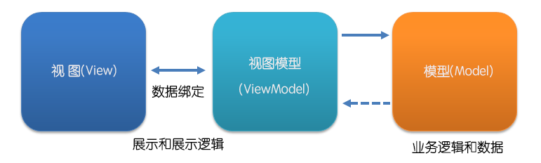

# Vue

官网：http://doc.vue-js.com

## 起步

### 什么是Vue

Vue.js（读音 /vjuː/, 类似于 **view**） 是一套构建用户界面的 **渐进式框架**。与其他重量级框架不同的是，Vue 采用自底向上增量开发的设计。Vue 的核心库只关注视图层，并且非常容易学习，非常容易与其它库或已有项目整合。另一方面，Vue 完全有能力驱动采用[单文件组件](http://doc.vue-js.com/v2/guide/single-file-components.html)和[Vue生态系统支持的库](http://github.com/vuejs/awesome-vue#libraries--plugins)开发的复杂单页应用。

Vue.js 的目标是通过尽可能简单的 API 实现**响应的数据绑定**和**组合的视图组件**。

### 引入

```html
<script src="https://unpkg.com/vue/dist/vue.js">
```

或者

```html
<script src='http://cdnjs.cloudflare.com/ajax/libs/vue/1.0.26/vue.min.js'></script>
```

也可以本地引入

### 声明式渲染

 Vue.js 的核心是一个允许你采用简洁的模板语法来声明式的将数据渲染进 DOM 的系统： 

```html
<div id="app">
    {{ message }}
</div>
```

```javascript
var app = new vue({
    el:'#app',
    data:{
        message:'hello vue'
    }
})
```

### 数据绑定

vm.message的值会随着用户在input中输入的值得变化而变化，而无需我们手动去获取DOM元素的值再同步到js中

```html
<div id='app'>
    {{ username }}
	<input type="text" v-model="username" />
</div>
```

```html
<script>
    var data = '{"username":"123","password":"password"}';
    var vm = new Vue({
        el: '#app',
        data: JSON.parse(data)
    })
</script>
```

### 组件化

```html
<div id='app'>
    <message content="hello world"></message>
</div>
```

```html
<script>
    var Message = Vue.extend({
        props:['content'],
        template: '<h1>{{content}}</h1>'
    })
    Vue.component('message',Message);
    var vm = new Vue({
        el: '#app'
    })
</script>
```

## 基础特性

从以前的例子可以看出，Vue.js 的使用都是通过构造函数 Vue({option}) 创建一个 Vue 的实例：var vm = new Vue({})。一个 Vue 实例相当于一个 MVVM 模式中的 ViewModel



在实例化的时候，我们可以传入一个选项对象，包含数据、模块、挂载方法、生命周期钩子等选项。

### 模板

选项中主要影响模板或DOM的选项有el和template，属性replace和template需要一起使用。

`el`：类型为字符串，DMO元素或函数。其作用是为实例提供挂载元素。一般来说我们会使用css选择符，或者原生的DOM元素。例如el:'#app'。在初始项中指定了el，实例将立即进入编译过程。

`template`：类型为字符串。默认会将template值替换为挂载元素（即el值对应的元素），并和并挂载元素和模板根元素的属性（如果属性具有唯一性，类似id，即以模板根节点为准）。

```html
<script id="tpl" type="x-template">
	<div class='wrapper'>
    	<div class='tpl'>
			　　　…
   		</div>
        <div class='tpl'>
			　　　…
    	</div>
    </div>
</script>
```

### 数据

Vue.js实例可以通过data属性定义数据，这些数据可以在实例对应的模板中进行绑定并使用。需要注意的是，如果传入data的是一个对象，Vue实例会代理起data对象里的所有属性，而不会对传入的对象进行深拷贝。另外，我们也可以引用Vue实例vm中的$data来获取声明的数据。

```javascript
var data = { a: 1 }
var vm = new Vue({
　data: data
})
vm.$data === data // -> true
vm.a === data.a // -> true
// 设置属性也会影响到原始数据
vm.a = 2
data.a // -> 2
// 反之亦然
data.a = 3
vm.a // -> 3
```

然后在模板中使用 {{a}} 就会输出 vm.a 的值，并且修改 vm.a 的值，模板中的值会随之改变，我们也会称这个数据为响应式（responsive）数据（具体的用法和特性会在第 2.2 节的数据绑定中说明）。需要注意的是，只有初始化时传入的对象才是响应式的，即在声明完实例后，再加上一句 vm.$data.b = '2'，并在模板中使用 {{b}}，这时是不会输出字符串 '2' 的。


引入公共css文件

在全局main.js中配置

```js
import Vue from 'vue'
import ElementUI from 'element-ui'
import App from './App'
/*引入公路由配置*/
import router from './router'
import mavonEditor from 'mavon-editor'
/*引入公共样式*/
import 'element-ui/lib/theme-chalk/index.css'
import 'mavon-editor/dist/css/index.css'
import 'echarts/theme/macarons.js'
import store from './store'

```


# [在vue中使用swiper](https://www.cnblogs.com/taokele/p/10430914.html)

1、使用npm下载vue-awesome-swiper 

```shell
npm install vue-awesome-swiper --save
```

2、在main.js中引用

```javascript
import VueAwesomeSwiper from 'vue-awesome-swiper'
Vue.use(VueAwesomeSwiper)
import 'swiper/dist/css/swiper.css'（css需要单独引用）
```

3、在组件中使用

```javascript
import { swiper, swiperSlide } from 'vue-awesome-swiper'
 
export default {
  components: {
    swiper,
    swiperSlide
  }
}
```

html代码：

```html
<swiper :options="swiperOption">
    <swiper-slide>1</swiper-slide>
    <swiper-slide>1</swiper-slide>
    <swiper-slide>1</swiper-slide>
    <div class="swiper-pagination swiper-pagination-bullets"></div>
</swiper>
```

javascript代码：

```javascript
export default {
  name: '',
  data () {
    return {
      swiperOption:{
        slidesPerView: 'auto',
        centeredSlides:true,
        spaceBetween: 10,
        loop:true,
        speed:600, //config参数同swiper4,与官网一致
        pagination: '.swiper-pagination',
      }
    }
  },
  components: {
    swiper,
    swiperSlide
  }
}
```