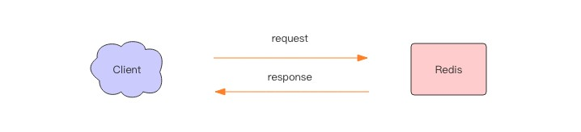
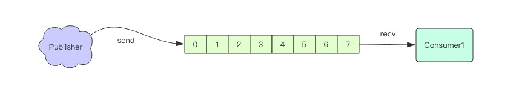

# Redis

## 开篇

### 定义：

是一种开源的、基于内存的、可持久化的、高性能的Key-value数据存储系统。Redis全称为：Remote Dictionary Server(远程数据服务)，该软件使用c语言编写，典型的NoSQL数据库服务器，Redis是一个key-value存储系统，它支持丰富的数据类型，如：string、list、set、zset(sorted set)、hash。遵循BSD协议

### 特点：

- 高性能（内存存储，仅在需要时持久化到硬盘）

- 数据类型丰富（String、Hash、List、Set、SortedSet）

- **支持事务处理**：事务是一个单独的隔离操作，事务中的所有命令都会序列化、按顺序地执行，事务在执行的过程中，不会被其他客户端发送来的命令请求所打断。事务是一个原子操作，要么全部执行，要么全不执行。

- **批量操作（pipeline机制）**：一次请求/响应服务器能实时处理新的请求即使旧的请求还未被响应，这个就可以将多个命令发送到服务器，而不用等待回复，最后在一个步骤中读取该答复，这就是管道（pipeline）

- 支持设置Key有效期

- **支持主从复制（Master-Slave）和故障自动迁移**：为了使在部分节点失败或者大部分节点无法通信的情况下集群仍然可以使用，所以集群使用了主从复制模型。每个节点都会有N-1复制品

- 支持大规模集群部署

- 支持Pub/Sub消息通讯机制

- 支持Lua脚本实现复杂的数据库操作

### Redis可以做什么

持久化存储、高速缓存、消息中间件

具体实现：

1. 记录帖子的点赞数、评论数和点击数 (hash)。
2. 记录用户的帖子 ID 列表 (排序)，便于快速显示用户的帖子列表 (zset)。
3. 记录帖子的标题、摘要、作者和封面信息，用于列表页展示 (hash)。
4. 记录帖子的点赞用户 ID 列表，评论 ID 列表，用于显示和去重计数
(zset)。
5. 缓存近期热帖内容 (帖子内容空间占用比较大)，减少数据库压力 (hash)。
6. 记录帖子的相关文章 ID，根据内容推荐相关帖子 (list)。
7. 如果帖子 ID 是整数自增的，可以使用 Redis 来分配帖子 ID(计数器)。
8. 收藏集和帖子之间的关系 (zset)。
9. 记录热榜帖子 ID 列表，总热榜和分类热榜 (zset)。
10. 缓存用户行为历史，进行恶意行为过滤 (zset,hash)。

## Redis数据结构

Redis底层采用c语言编写

#### 字符串

采用与C语言类似的SDS字符串

SDS与C语言字符串的区别：

| C                                  | SDS                                                          |
| ---------------------------------- | ------------------------------------------------------------ |
| 缓冲区溢出                         | 避免缓冲区溢出（插入数据前判断是否会溢出，如果会溢出则动态扩容） |
| 获取字符串长度的时间复杂度为O（n） | 获取字符串长度的时间复杂度为O(1)                             |
| 插入n的字符的时间复杂度为O(n)      | 插入n的字符的时间复杂度最多为O(n)                            |
| 全部C字符串库函数                  | 部分C字符串库函数                                            |
|                                    |                                                              |
Redis的key均采用字符串作为名称，不同的数据结构区别在于value的数据结构不同。


Redis字符串是动态字符串，是可以修改的字符串，内部结构实现上类似于Java的ArrayList，采用预分配冗余空间的方式来减少内存的的频繁分配。内部为当前字符串实际分配的空间capacity一般要高于实际字符串长度Len。当字符串长度小于1M时，扩容都是加倍现有的空间，如果超过1M，扩容时一次只会多扩1M空间。需要注意的是字符串的最长长度为512M。

**批量键值对**
可以批量对多个字符串进行读写，节省网络耗时开销。

```shell
> set name1 codehole
OK
> set name2 holycoder
OK
> mget name1 name2 name3 # 返回一个列表
1) "codehole"
2) "holycoder"
3) (nil)
> mset name1 boy name2 girl name3 unknown
> mget name1 name2 name3
1) "boy"
2) "girl"
3) "unknown"
```

**过期和 set 命令扩展**

```shell
> set name codehole
> get name
"codehole"
> expire name 5 # 5s 后过期
... # wait for 5s
> get name
(nil)
> setex name 5 codehole # 5s 后过期，等价于 set+expire
> get name
"codehole"
... # wait for 5s
> get name
(nil)
> setnx name codehole # 如果 name 不存在就执行 set 创建
(integer) 1
> get name
"codehole"
> setnx name holycoder
(integer) 0 # 因为 name 已经存在，所以 set 创建不成功
> get name
"codehole" # 没有改变
```

**计数**

```shell
> set age 30
OK
> incr age
(integer) 31
> incrby age 5
(integer) 36
> incrby age -5
(integer) 31
> set codehole 9223372036854775807 # Long.Max
OK
> incr codehole
(error) ERR increment or decrement would overflow
```

字符串是由多个字节组成，每个字节又是由8个Bit组成，如此便可以将一个字符串看成很多bit的组合，这便是bitmao[位图]数据结构。

#### list（列表）

Redis的列表相当于Java语言里面的LinkedList，注意它是链表不是数组。这以为着list的插入和删除操作非常快，时间复杂度O（1），但是索引定位很慢，时间复杂度O（n）。

当列表弹出了最后一个元素之后，该数据结构自动被删除，内存被回收。

Redis的列表结构常用来做异步队列使用。将需要延后处理的任务结构体序列化成字符串塞进Redis的列表，另一个线程从这个列表中轮训数据进行处理。

**右边进左边出：队列**

```shell
> rpush books python java golang
(integer) 3
> llen books
(integer) 3
> lpop books
"python"
> lpop books
"java"
> lpop books
"golang"
> lpop books
(nil)
```

**右边进右边出：栈**

```shell
> rpush books python java golang
(integer) 3
> rpop books
"golang"
> rpop books
"java"
> rpop books
"python"
> rpop books
(nil)
```

**慢操作**

lindex相当于Java链表的get(int index)方法，他需要对链表进行遍历，性能随着参数index增大而变差。

ltrim和字面上的含义不太一样，个人觉得它叫lretain(保留)更合适，因为ltrim跟的两个参数start_index和end_index定义了一个区间，在这个区间内的值，ltrim要保留，区间之外统统砍掉，我们可以通过ltrim来实现一个定长的链表。

index可以为负数，index=-1表示倒数第一个元素，同样index=-2表示倒数第二个元素。

```shell
> rpush books python java golang
(integer) 3
> lindex books 1 # O(n) 慎用
"java"
> lrange books 0 -1 # 获取所有元素，O(n) 慎用
1) "python"
2) "java"
3) "golang"
> ltrim books 1 -1 # O(n) 慎用
OK
> lrange books 0 -1
1) "java"
2) "golang"
> ltrim books 1 0 # 这其实是清空了整个列表，因为区间范围长度为负
OK
> llen books
(integer) 0
```

**快速列表**


Redis底层存储的不是一个简单的linkedlist，而是称之为快速链表quicklist的结构。

首先在列表元素较少的情况下会使用一块连续的内存存储，这个结构是ziplist ，也即是压缩列表。它将所有的元素紧挨着一起存储，分配的是一块连续的内存。当数据量比较多的时候才会改成 quicklist 。因为普通的链表需要的附加指针空间太大，会比较浪费空间，而且会加重内存的碎片化。比如这个列表里存的只是 int 类型的数据，结构上还需要两个额外的指针 prev 和 next。所以 Redis 将链表和 ziplist 结合起来组成了 quicklist 。也就是将多个ziplist 使用双向指针串起来使用。这样既满足了快速的插入删除性能，又不会出现太大的空间冗余。

#### hash（字典）


## 应用

### 分布式锁

  

分布式应用进行逻辑处理时经常会遇到并发问题。

比如一个操作要修改用户的状态，修改状态需要先读出用户的状态，在内存里进行修改，改完了再存回去。如果这样的操作同时进行了，就会出现并发问题，因为读取和保存状态这两个操作不是原子的。

> Wiki 解释：所谓原子操作是指不会被线程调度机制打断的操作；这种操作一旦开始，就一直运行到结束，中间不会有任何 context switch 线程切换。

#### Redis分布式锁

使用setnx(set if not exists)指令，只允许被一个客户端占用，先来先占，用完了，再调用del指令释放。

Redis2.8版本中加入了set指令的扩展参数，使得setnx和expire指令可以一起执行。

```shell
> set lock:codehole true ex 5 nx
OK
... do something critical ...
> del lock:codehole
```

#### 超时问题

Redis 的分布式锁不能解决超时问题，如果在加锁和释放锁之间的逻辑执行的太长，以至于超出了锁的超时限制，就会出现问题。因为这时候锁过期了，第二个线程重新持有了这把锁，但是紧接着第一个线程执行完了业务逻辑，就把锁给释放了，第三个线程就会在第二个线程逻辑执行完之间拿到了锁。为了避免这个问题，Redis 分布式锁不要用于较长时间的任务。如果真的偶尔出现了，数据出现的小波错乱可能需要人工介入解决。

有一个更加安全的方案是为 set 指令的 value 参数设置为一个随机数，释放锁时先匹配随机数是否一致，然后再删除 key。但是匹配 value 和删除 key 不是一个原子操作，Redis 也没有提供类似于 delifequals 这样的指令，这就需要使用Lua 脚本来处理了，因为 Lua 脚本可以保证连续多个指令的原子性执行。

```lua
# delifequals
if redis.call("get",KEYS[1]) == ARGV[1] then
return redis.call("del",KEYS[1])
else
return 0
end
```

#### 可重入性

可重入性是指线程在持有锁的情况下再次请求加锁，如果一个锁支持同一个线程的多次加锁，那么这个锁就是可重入的。比如 Java 语言里有个 ReentrantLock就是可重入锁。Redis 分布式锁如果要支持可重入，需要对客户端的 set 方法进行包装，使用线程的 Threadlocal 变量存储当前持有锁的计数。

Java可重入锁：

```java
public class RedisWithReentrantLock {
    private ThreadLocal<Map<String, Integer>> lockers = new ThreadLocal<>();
    private Jedis jedis;
    public RedisWithReentrantLock(Jedis jedis) {
        this.jedis = jedis;
    }
    private boolean _lock(String key) {
        return jedis.set(key, "", "nx", "ex", 5L) != null;
    }
    private void _unlock(String key) {
        jedis.del(key);
    }
    private Map<String, Integer> currentLockers() {
        Map<String, Integer> refs = lockers.get();
        if (refs != null) {return refs;
        }
        lockers.set(new HashMap<>());
        return lockers.get();
    }
    public boolean lock(String key) {
        Map<String, Integer> refs = currentLockers();
        Integer refCnt = refs.get(key);
        if (refCnt != null) {
            refs.put(key, refCnt + 1);
            return true;
        }
        boolean ok = this._lock(key);
        if (!ok) {
            return false;
        }
        refs.put(key, 1);
        return true;
    }
    public boolean unlock(String key) {
        Map<String, Integer> refs = currentLockers();
        Integer refCnt = refs.get(key);
        if (refCnt == null) {
            return false;
        }
        refCnt -= 1;
        if (refCnt > 0) {
            refs.put(key, refCnt);
        } else {
            refs.remove(key);
            this._unlock(key);
        }
        return true;
    }
    public static void main(String[] args) {
        Jedis jedis = new Jedis();
        RedisWithReentrantLock redis = new RedisWithReentrantLock(jedis);
        System.out.println(redis.lock("codehole"));
        System.out.println(redis.lock("codehole"));
        System.out.println(redis.unlock("codehole"));
        System.out.println(redis.unlock("codehole"));
    }
}
```

### 延时队列

Rabbit和Kafka用作消息队列比较复杂，发消息之前要创建Exchange，再创建Queue，还要讲Queue和Exchange通过某种规则绑定起来，发消息的时候要指定routing-key，还要控制头部信息。

Redis可以用作简单的消息队列，但是没有高级特性，没有ack保证。

#### 异步消息队列

Redis的list（列表）常用来作为异步消息队列，使用**rpush/lpush**来操作入队列，使用**lpop/rpop**来操作出队列。

  

#### 如果队列空了怎么办

客户端是通过队列的pop操作来消息，然后进行处理。如果完了再接着获取消息，再进行处理。如此循环往复，这便是作为队列消费者的客户端的生命周期。

可是如果队列空了，客户端就会陷入pop死循环，不停pop，没有数据，接着再pop，又没有数据。这就是浪费生命的空轮训。空轮训不但拉高了客户端的CPU，redis的QPS也会被拉高，如果这样空轮询的客户端有十几个，Redis的慢查询可能会显著增多。

通常我们使用sleep来解决这个问题，让线程睡一会儿。

```java
Thread.sleep();
```

  

#### 队列延迟

采用blpop/brpop，这两个指令的前缀字符b代表的是blocking，也就是阻塞读。

阻塞度在队列没有数据的时候，会立即进入休眠状态，一旦数据到来，则立刻醒过来。消息的延迟几乎为零。

#### 空闲连接自动断开

如果线程 一直阻塞在那里，redis的客户端连接就成了闲置连接，限制过久，服务器一般会主动断开连接，减少限制资源占用。这个时候blpop/brpop会抛出异常，要注意捕获异常。

#### 锁冲突处理

3种策略处理加锁失败：

1. 直接抛出异常，通知用户稍后重试；

这种方式比较适合由用户直接发起的请求，用户看到错误对话框后，会先阅读对话框的内容，再点击重试，这样就可以起到人工延时的效果。如果考虑到用户体验，可以由前端的代码替代用户来进行延时重试效果，它本质上是对当前请求的放弃，由用户决定是否重新发起新的请求。

2. sleep一会再重试；

sleep会阻塞当前的消息处理线程，会导致队列的后续消息处理出现延迟。如果碰撞的比较频繁或者队列里消息比较多，sleep可能并不合适。如果因为个别死锁的key导致加锁不成功，线程会彻底堵死，导致后续消息永远得不到及时处理。

3. 将请求转移至延时队列，过一会再试；

这种方式比较适合异步消息处理，将当前冲突的请求扔到另一个队列延迟后处理以避开冲突。

#### 延时队列的实现

延时队列可以通过Redis的`zset`（有序列表）来实现。我们将消息序列化成一个字符串作为zset的`value`，这个消息的到期处理时间作为`score`，然后用多个线程轮训zset获取到期的任务进行处理，多个线程是为了保障可用性，万一挂了一个线程还要其他线程可以继续处理。因为有多个线程，所以需要考虑并发争抢任务，确保任务不能被多次执行。

Redis的`zrem`方法是多线程多进程抢任务的关键，它的返回值决定了当前实例有没有抢到任务，因为loop方法可能会被多个线程、多个进程调用，同一个任务可能会被多个进程线程抢到，通过`zrem`来决定唯一的属主。

同时，我们要注意一定要对handle_msg进行异常捕获，避免因为个别任务处理问题导致循环异常退出。

java版本延时队列：

```xml
<dependency>
    <groupId>redis.clients</groupId>
    <artifactId>jedis</artifactId>
    <version>3.1.0</version>
</dependency>
```

```java
public class RedisDelayingQueue<T> {
    static class TaskItem<T> {
        String id;
        T msg;
    }

    //fastjson序列化对象存在generic类型时，需要使用TypeReference
    private Type TaskType = new TypeReference<TaskItem<T>>() {
    }.getType();

    private Jedis jedis;
    private String queueKey;

    public RedisDelayingQueue(Jedis jedis, String queueKey) {
        this.jedis = jedis;
        this.queueKey = queueKey;
    }

    public void delay(T msg) {
        TaskItem<T> task = new TaskItem<T>();
        //分配唯一的uuid
        task.id = UUID.randomUUID().toString();
        task.msg = msg;
        //fastjson序列化
        String s = JSON.toJSONString(task);
        //塞入延时队列，5s后再试
        jedis.zadd(queueKey, System.currentTimeMillis() + 5000, s);
    }

    public void loop() {
        while (!Thread.interrupted()) {
            //只取一条
            Set<String> values = jedis.zrangeByScore(queueKey, 0, System.currentTimeMillis());
            if (values.isEmpty()) {
                try {
                    Thread.sleep(500);
                } catch (InterruptedException e) {
                    e.printStackTrace();
                    break;
                }
                continue;
            }
            String s = values.iterator().next();
            //抢到了
            if (jedis.zrem(queueKey, s) > 0) {
                //fastjson反序列化
                TaskItem<T> task = JSON.parseObject(s, TaskType);
                this.handleMsg(task.msg);
            }
        }
    }

    public void handleMsg(T msg) {
        System.out.println(msg);
    }

    public static void main(String[] args) {
        Jedis jedis = new Jedis("127.0.0.1",6379);
        jedis.auth("12345");
        final RedisDelayingQueue<String> queue = new RedisDelayingQueue<String>(jedis, "q-demo");
        Thread producer = new Thread() {
            @Override
            public void run() {
                for (int i = 0; i < 10; i++) {
                    queue.delay("codehole" + i);
                }
            }
        };
        Thread consumer = new Thread() {
            @Override
            public void run() {
                queue.loop();
            }
        };
        producer.start();
        consumer.start();

        try {
            producer.join();
            Thread.sleep(6000);
            consumer.interrupt();
            consumer.join();
        } catch (InterruptedException e) {
            e.printStackTrace();
        }
    }

}
```

#### 进一步优化

上面的算法中同一个任务可能会被多个进程取到之后再使用zrem进行争抢，那些没抢到的进程都是白取了一次任务，可以考虑使用lua scripting来优化这个逻辑，将zrangebyscore和zrem一同挪到服务器进行原子化操作，这样多个进程之间的争抢任务时就不会出现这种浪费了。

### 位图

在我们平时开发中，会有一些bool型数据需要存取，比如用户一年的签到记录，签了是1，没签是0，要记录365天。如果使用key/value，每个用户要记录365个，当用户上亿时，存储量惊人。

为了

位图不是他叔的数据结构，它的内容其实就是普通的字符串，也就是byte数组。我们可以使用普通的get/set直接获取和设置整个位图的内容，也可以使用位图操作getbit/setbit等将byte数组看成`位数组`来处理。

#### 基本使用

Redis的位数组是自动扩展，如果设置了某个偏移位置超出了现有的内容范围，就会自动将位数组进行零扩充。

位数组的顺序和字符的位顺序是相反的。

### HyperLogLog

统计网站每个页面每天的UV数据

### 统计和查找

Redis提供了位图统计指令bitcount和位图查找指令bitpos，bitcount用来统计指定位置范围内1的个数，bitpos用来查找指定范围内出现的第一个0或1。

比如我们可以通过 bitcount 统计用户一共签到了多少天，通过 bitpos 指令查找用户从哪一天开始第一次签到。如果指定了范围参数 [start, end] ，就可以统计在某个时间范围内用户签到了多少天，用户自某天以后的哪天开始签到。

遗憾的是， start 和 end 参数是字节索引，也就是说指定的位范围必须是 8 的倍数，而不能任意指定。这很奇怪，我表示不是很能理解 Antirez 为什么要这样设计。因为这个设计，我们无法直接计算某个月内用户签到了多少天，而必须要将这个月所覆盖的字节内容全部取出来 (getrange 可以取出字符串的子串) 然后在内存里进行统计，这个非常繁琐。


## 原理

### 线程IO模型

#### **`Redis是单线程程序！`**

除了Redis之外，Node.js、Ngnix也是单线程，但他们都是服务器高性能的典范。

#### Redis单线程为什么还能这么快

因为它所有的数据都在内存中，所有的运算都是内存级别的运算。正因为Redis是单线程，所以要小心使用Redis指令，对于那些时间复杂度为O(n)级别的指定，要谨慎使用，一不小心就可能会导致Redis卡顿。

#### Redis单线程如何处理这么多的并发客户端连接

**`多路复用`**，select系列的时间轮回API，非阻塞IO

##### 非阻塞IO

当我们调用套接字的读写方法，默认他们是阻塞的，比如`read`方法要传递进去一个参数`n`，表示读取这么多字节后再返回，如果没有读够线程就会卡在那里，直到新的数据带来或者连接关闭了，`read`方法才可以返回，线程才能继续处理。而`write`方法一般来说不会阻塞，除非内核为嵌套字分配的写缓冲区已经满了，`write`方法就会阻塞，直到缓冲区中有空间空间挪出来了。

 非阻塞IO在套接字对象上提供了一个选项`Non_Blocking`，当这个选项打开时，读写方法不会阻塞，而是能读多少读多少，能写多少写多少。能读多少取决于内核为套接字分配的读缓冲区内部的数据字节数，能写多少取决于内核为套接字分配的写缓冲区的空闲字节数。读方法和写方法都会通过返回值来告知程序实际读写了多少字节。

##### 事件轮询（多路复用）

非阻塞IO有个问题，那就是线程要读数据，结果读了一部分就返回了，线程如何知道何时才应该继续读。也就是当数据到来时，线程如何得到通知。写也是一样，如果缓冲区满了，写不完，剩下的数据何时才应该继续写，线程也应该的得到通知。


事件轮训API就是用来解决这个问题的，最简单的事件轮训API是`select`函数，它是操作系统提供给用户程序的API。输入是读写描述符列表`read_fds&write_fds`，输出是与之对应的可读可写时间。同时还提供了一个`timeout`参数，如果没有任何时间到来，那么就最多等待`timeout`时间，线程处于阻塞状态。一旦期间有任何事件到来，就可以立即返回。时间过了之后还是没有任何事件到来，也会立即返回。拿到事件后，线程就可以继续挨个处理相应的时间。处理完了继续过来轮询。于是线程就进入了一个死循环，我们把这个死循环称为事件循环，一个循环为一个周期。

每个客户端套接字`socket`都有对应的读写文件描述符。

```python
read_events, write_events = select(read_fds, write_fds, timeout)
for event in read_events:
	handle_read(event.fd)
for event in write_events:
	handle_write(event.fd)
handle_others() # 处理其它事情，如定时任务等
```

因为我们通过`select`系统调用同时处理多个通道描述符的读写事件，因此我们将这类系统调用称为多路复用API。因此我们将这类系统调用称为多路复用API。现代操作系统的多路复用API已经不再使用`select`系统调用，而改用`epoll(linux)`和`kqueue(freebsh&macosx)`，因为select系统调用的性能在描述符特别多时性能会非常差，他们使用起来可能再形式上略有差别，但是本质上都是差不多的，都可以使用上面的伪代码逻辑进行理解。

服务器套接字`serversocket`对象的读操作是指调用`accept`接受客户端新连接。何时有新连接到来，也是`select`系统调用的读时间来得到通知的。

> 事件轮询API就是Java里面的NIO技术

#### 指令队列

Redis会将每个客户端套接字都关联一个指令队列。客户端的指令通过队列来排队进行顺序处理，先到先服务。

#### 响应队列

Redis同样也会为每个客户端套接字关联一个响应队列。Redis服务器通过响应队列来讲指令的返回结果回复给客户端。如果队列为空，那么意味着连接暂时处于空闲状态，不需要去获取写事件，也就是可以将当前的客户端描述符从`write_fds`里面移出来，等队列有数据了，再将描述符放进去。避免`select`系统调用立即返回写事件，结果发现没什么数据可以写，出现这种情况的线程会飙高CPU。

#### 定时任务

服务器处理要想用IO事件外，还要处理其他事情。比如定时任务。如果线程阻塞再select系统调用上，定时任务将无法得到准时调度，那Redis是如何解决？

Redis的定时任务会记录在一个称为`最小堆`的数据结构中。这个堆中，最快要执行的任务排在堆的最上方。在每个循环周期，Redis都会将最小堆里面已经到点的任务立即进行处理。处理完毕后，将最快要执行的任务还需要的时间记录来，这个时间就是`select`系统调用的`timeout`参数。因为Redis知道未来`timeout`时间内，没有其他定时任务需要处理，所以可以安心睡眠`timeout`的时间。

> Ngnix和Node的事件处理原理和Redis也是一样。

### 通信协议

Redis的作者认为数据库系统的瓶颈一般不在于网络流量，而是数据库自身内部逻辑处理上。所以即使Redis使用了浪费流浪的文本协议，依然可以取得极高的访问性能。Redis将所有数据都放在内存，用一个单线程对外提供服务，单个节点在跑满一个 CPU核心的情况下可以达到10w/s的超高QPS。

#### RESP（Redis Serialication Protocol）

RESP是Redis序列化协议的简写，是一种直观的文本协议，优势在于实现异常简单，解析性能极好。

Redis协议将传输的数据结构分为5中最小单元类型，单元结束时统一加上回车换行符号`\r\n`。

##### 基本类型

1. 单行字符串以`+`符号开头     `+helloworld\r\n`
2. 多行字符串以`$`符号开头，后跟字符串长度     ` $11\r\nhello world\r\n`
3. 整数值以`:`符号开头，后跟整数的字符串形式     `:1024\r\n`
4. 错误信息以`-`符号开头   ` -WRONGTYPE Operation against a key holding the wrong kind of value`
5. 数组以`*`号开头，后跟数组的长度    `*3\r\n:1\r\n:2\r\n:3\r\n`

##### 特殊情况

1. NULL用多行字符串表示，不过长度要写成-1    ` $-1\r\n`
2. 空串用多行字符串表示，长度填0    `$0\r\n\r\n`这里两个`\r\n`之间隔得是空串

#### 客户端->服务器

客户端向服务器发送的指令只有一种格式，多行字符串数组。比如一个简单的set指令`set author codehole`会被序列化成下面的字符串。

`*3`\r\n`$3`\r\nset\r\n`$6`\r\nauthor\r\n`$8`\r\ncodehole\r\n

#### 服务器->客户端

服务器向客户端回复的响应要支持多种数据结构，所以消息响应在结构上要复杂不少，不过再复杂的响应消息也是以上5种基本类型的组合

#### 小结

Redis协议里有大量冗余的回车换行符，但是不影响它成为互联网技术领域非常受欢迎的一个文本协议。很多开元项目使用RESP作为它的通讯协议，在技术领域性能并不总是一切，还有简单性、易理解性和易实现性，这些都需要进行适当权衡。


### 持久化

Redis的数据全部在内存里，如果突然宕机，数据就会全部丢失，因此必须有一种机制来保证Redis的数据不会因为故障而丢失，这种机制就是Redis的持久化机制。

Redis的持久化机制有两种，第一种是快照，第二种是AOF日志。快照是一次全量备份，AOF日志是连续的增量备份。快照是内存数据的二进制序列化形式，在存储上非常紧凑，而AOF日志记录的是内存数据修改的指令记录文本。AOF日志在长期的运行过程中会变得无比庞大，数据库重启时需要加载AOF日志进行指令重放，这个时间无比漫长，所以要定期进行AOF重写，给AOF日志进行瘦身。


#### 快照原理

Redis是单线程程序，这个线程要同时复杂多个客户端套接字的并发读写操作和内存数据结构的逻辑读写。

在服务线上请求的同时，Redis还需要进行内存快照，内存快照要求Redis必须进行文件IO操作，可文件IO操作不能使用多路复用API。这意味着单线程同时在服务器上的请求还要进行文件IO操作，文件IO操作会严重拖垮服务器请求的性能，还有个重要问题是`为了不阻塞线上的业务，就需要边持久化边响应客户端请求`。持久化的同时，内存数据结构还在改变，比如一个大型的hash字典正在持久化，结果一个请求过来就把它给删掉了，可能还没持久化完。

解决办法：Redis使用操作系统的多进程`COW`（Copy On Write）机制来实现快照持久化。

#### fork多进程

Redis在持久化时会调用`gilbc`的函数`fork`产生一个子进程，快照持久化完成交给子进程来处理，父进程继续处理客户端请求。子进程刚刚产生时，它和父进程共享内存里面的代码段和数据段。这是Linux操作系统的机制，为了节约内存资源，所以尽可能让他们共享，在进程分离的一瞬间，内存的增长几乎没有明显变化。

子进程做数据持久化，它不会修改现有的内存数据结构，它只是对数据结构进行遍历读取，然后序列化写到磁盘中，但是父进程不一样，它必持续服务客户端请求，然后对内存数据结构进行不间断的修改。

这个时候就会使用操作系统的COW机制来进行数据段页面的分离。数据段是由很多操作系统的页面组合而成，当父进程对其中一个页面的数据进行修改时，会将被共享的页面复制一份分离出来，然后对这个复制的页面进行修改。这时子进程相应的页面是没有变化的，还是进程产生时那一瞬间的数据。


随着父进程修改操作的持续进程，越来越多的共享页面被分离出来，内存就会持续增长，但也不会超过原有数据内存的2倍大小。另外一个Redis实例里冷数据占得比例往往是最高的，所以很少会出现所有页面都会被分离，被分离的往往只是其中一部分页面。每个页面的大小只有4k，一个Redis实例里面一般会有成千上万的页面。子进程因为数据没有变化，它能看到内存里的数据在进程产生的一瞬间就凝固了，再也不会改变，这也是为什么Redis的持久化叫[]

#### AOF原理

AOF日志存储的是Redis服务器的顺序指令序列，AOF日志只记录对内存进行修改的指令记录。

假设AOF记录记录了自Redis实例创建以来所有的修改性指令序列，那么就可以通过对一个空的Redis实例顺序执行所有的指令，也就是`重复`，来恢复Redis当前实例的内存数据结构的状态。

Redis会在收到客户端修改指令后，先进行参数校验，如果没问题，就立即将该指令文件存储到AOF日志中，也就是先存到磁盘，然后再执行指令。这样即使遇到突然宕机，已经存储到AOF日志的指令进行重放一下就可以恢复到宕机钱的状态。

Redis在长期运行的过程中，AOF的日志会越来越常。如果实例宕机重启，重放整个AOF日志会非常耗时，导致长时间Redis无法对外提供服务，所有需要对AOF日志瘦身。

#### AOF重写

Redis提供了bgrewriteaof指令用于对AOF日志进行瘦身。其原理就是开辟一个子线程对内存进行遍历转化成一系列Redis的操作指令，序列化到一个新的AOF日志文件中。序列化完毕后再讲操作期间发生的增量AOF日志追加到这个新的AOF日志文件中，追加完毕后就立即代替旧的AOF日志文件了，瘦身工作就完成了。

#### fsync

AOF日志是以文件的形式存在的，当程序对AOF日志文件进行写操作时，实际上是将内容写到了内核为文件描述符分配的一个内存缓存中，然后内核会异步将脏数据刷回磁盘的。

这就意味着如果机器突然宕机，AOF日志内容可能还没有来得及完全刷到磁盘中，这个时候就会出现日志丢失，那该怎么办？

Linux的`glibc`提供了`fsync(int fd)`函数可以将指定文件的内容强制从内核缓存刷到磁盘。只要Redis进程实时调用fsync函数就可以保证aof日志不丢失。但是fsync是一个磁盘IO操作，很慢。如果Redis执行一条指令就要fsync一次，那么Redis高性能的地位就不保了。

所以在生产环境的服务器中，Redis通常是每隔1s左右执行一次fsync操作，周期1s是可以配置的。这是在数据安全性和性能之间做了一个折中，在包吃高性能的同时，尽可能使得数据少丢失。

Redis同样也提供了另外两种策略，一个是永不fsync，另一个是来一个指令就fsync一次，但是在生产环境基本不会使用。

#### 运维

快照是通过开启子进程的方式进行的，它是一个比较耗资源的操作。

1. 遍历整个内存，大块写磁盘会加重系统负载
2. AOF的fsync是一个耗时的IO操作，它会降低Redis性能，同时也会增加系统IO负担

所以通常Redis的主节点是不会进行持久化操作，持久化操作主要在从节点进行。从节点是备份节点，没有来自客户端请求的压力，它的操作系统资源往往比较充沛。但是如果出现网络分区，从节点长期连不上主节点，就会出现数据不一致的问题，特别是网络分区出现的情况下又不小心主节点宕机了，那么数据就会丢失，所以在生产环境要做好实时监控工作，保证网络畅通或者能快速修复。另外还应该再增加一个从节点以降低网络分区的概率，只要有一个从节点数据同步正常，数据也就不会轻易丢失。

#### Redis4.0混合持久化

重启Redis时，我们很少使用rdb来恢复内存状态，因为会丢失大量数据。我们通常使用AOF日志重放，但是重放AOF日志性能相对rdb来说要慢很多，这样在Redis实例很大的情况下，启动需要花费很长的时间。

Redis4.0为了解决这个问题，带来了一个新的持久化选项--混合持久化。将rdb文件的内容和增量AOF日志文件存在一起，这里的AOF日志不再是全量的日志，而是自持久化结束的这段时间发生的增量AOF日志，通常这部分AOF日志很小。


于是在Redis重启的时候，可以先加载rdb的内容，然后再重放增量AOF日志就可以完全代替之前的AOF全量文件重放，重启效率因此大幅得到提升。

#### 有人说 Redis 只适合用来做缓存，当数据库来用并不合适，你怎么看？

Redis是目前公认的速度最快的基于内存的键值对数据库，但Redis仅提供最基本的Hash、set、list、sorted等基本数据类型，不分表，没有schema，没有索引，没有外键，缺少int/date等基本数据类型，多条件查询需要通过集合内联（sinter、zinterstore）和连接间接状态，操作不便，开发效率低，可维护性不佳，因此一般不将其视为完整的数据库单独使用，很多网站将redis作为高速缓存和session状态存储层，然后再与其他数据库搭配使用。

### 管道

实际上Redis管道`Pipeline`不是Redis服务器提供的特别的技术，而是客户端提供的，跟服务器没有什么直接的关系。

#### Redis的消息交互

当我们使用客户端对Redis进行一次操作时，如下图所示，客户端将请求传送给服务器，服务器处理完毕后，再将响应回复给客户端，这要花费一个网络数据包来回的时间。



如果连续执行多条指令，那就会花费多个网络数据包来回的时间。


回到客户端代码层面，客户端是经历了读-写-读-写四个操作才完整地执行了两条指令。


现在如果我们调整读写顺序，改成写-写-读-读，这两个指令同样可以正常完成。


两个连续的写操作和两个连续的读操作总共只会花费一次网络来回，就好比连续的write操作合并了，连续的read操作也合并了一样。


这便是管道操作的本质，服务器根本没有任何区别对待，还是收到一条消息，执行一条消息，回复一条消息的正常的流程。客户端通过对管道中的指令列表改变读写顺序就可以大幅节省IO时间。管道中指令越多，效果越好。

#### 管道压力测试

Redis 自带了一个压力测试工具 redis-benchmark ，使用这个工具就可以进行管道测试。

```shell
> redis-benchmark -t set -q
SET: 51975.05 requests per second
```

提高管道选项-p参数可以提高QPS，但是到达上限就无法提高，那个时候CPU处理能力已经达到了瓶颈，Redis的单线程CPU已经飙到了100%，所以无法再继续提升了。

#### 深入理解管道本质

接下来我们深入分析一个请求交互的流程，真实的情况是它很复杂，因为要经过网络协议栈，这个就得深入内核了。


上图就是一个完整的请求交互流程图，用文字描述一遍：

1. 客户端进行调用`write`将消息写到操作系统内核为套接字分配的发送缓冲`send buffer`
2. 客户端操作系统内核将发送缓冲的内容发送到网卡，网卡硬件将数据通过`网际路由`送到服务器的网卡
3. 服务器操作系统内核将网卡的数据放到内核为套接字分配的接受缓冲`recv buffer`
4. 服务器进程调用`read`从接受缓冲中取出消息进行处理
5. 服务器进程调用`write`将响应消息写到内核为套接字分配的发送缓冲`send buffer`
6. 服务器操作系统内核将发送缓冲的内容发送到网卡，网卡硬件将数据通过`网际路由`送到客户端的网卡
7. 客户端操作系统内核将网卡的数据放到内核为套接字分配的接受缓冲`recv buffer`
8. 客户端进程调用`read`从接受缓冲中取出消息返回给上层业务逻辑进行处理
9. 结束

我们开始以为`write`操作是要等到对方收到消息才会返回，但实际上不是这样的。`write`操作只负责将数据写到本地操作系统内核的发送缓冲然后就但会了。剩下的事交给操作系统内核异步将数据收到目标及其，但是如果发送缓冲满了，那么就等到缓冲空出空闲空间来，这个就是写操作IO操作的真正耗时。

我们开始以为 read 操作是从目标机器拉取数据，但实际上不是这样的。 `read`操作只负责将数据从本地操作系统内核的接收缓冲中取出来就完事了。但是如果缓冲是空的，那么就需要等待数据到来，这个就是读操作 IO 操作的真正耗时。

所以对于 `value = redis.get(key) `这样一个简单的请求来说， `write` 操作几乎没有耗时，直接写到发送缓冲就返回，而 `read` 就会比较耗时了，因为它要等待消息经过网络路由到目标机器处理后的响应消息，再回送到当前的内核读缓冲才可以返回。**这才是一个网络来回的真正开销。**

而对于管道来说，连续的`write`操作根本就没有耗时，之后第一个`read`操作会等待一个网络的来回开销，然后所有的响应消息就都已经回送到内核的读缓冲了，后续的`read`操作直接就可以从缓冲拿到结构，瞬间就返回了。

> 这就是通道的本质，它并不是什么服务器的特性，而是客户端通过改变了读写的顺序带来的性能的巨大提升。

### 事务

> **就算有命令失败，队列中的其他命令也会被执行。**

#### 为什么Redis事务不支持回滚

Redis命令在事务中可能会执行失败，但是Redis事务不会回滚，而是继续回执行余下的命令。在关系型数据库中这种情况下是会回滚的。

Redis这样做，主要是因为：

1. 只有当发生语法错误（这个问题在命令队列时无法检测到）了，Redis命令才会执行失败，或对keys赋予了一个类型错误的数据：这意味着这些都是程序性错误，这类错误在开发的过程中就能够发现并解决掉，几乎不会出现在生产环境。
2. 由于不需要回滚，这使得Redis内部更加简单，而且运行速度更快。

### RubSub

Redis消息队列的不足之处，就是**不支持消息的多播机制**。


#### 消息多播

消息多播允许生产者生产一次消息，中间件负责将消息复制到多个消息队列，每个消息队列由相应的消费组进行消费。他是分布式系统常用的一种解耦方式，用于将多个消费组的逻辑进行拆分。支持了消息多播，多个消费组的逻辑就可以放到不同的子系统中。

如果是普通的消息队列，就得将多个不同的消费组逻辑串接起来放在一个子系统中，进行连续消费。



#### PubSub

为了支持消息多播，Redis不再依赖于5种基本数据类型，单独使用了PubSub这个模块，也就是`PublisherSubscriber`，发布者订阅者模式。


### 小对象压缩


### 主从同步


## 集群

### Sentinel（哨兵机制）


我们可以将Redis Sentinel集群看成是一个ZooKeeper集群，它是集群高可用的心脏，它一般是由3-5个节点组成，这样挂了别的节点集群还可以正常运转。

它负责持续监控主从节点的监控，当主节点挂掉时，自动选择一个最优的从节点切换为主节点。客户端来连接集群时，会首先连接sentinel，通过sentinel来查询主节点的地址，然后再去连接主节点进行数据交互。当主节点发生故障时，客户端会重新向sentinel要地址，sentinel会将最新的主节点地址告诉客户端，如此程序就无需重启即可自动完成节点切换，比如上图的主节点挂掉后，集群将可能自动调整为下图所示结构。


从这样图中我们能看到主节点挂掉了，原先的主从复制也断开了，客户端和损坏的主节点也断开了。从节点被提升为新的主节点，其他从节点开始和新的主节点建立复制关系。客户端通过新的主节点继续进行交互。Sentinel会持续监控已经挂掉的主节点，待它恢复后，集群会调整为下面这张图：


此时原先挂掉的主节点现在变成了从节点，从新的主节点那里建立复制关系。

#### 消息丢失

Redis主从采用异步复制，意味着当主节点挂掉时，从节点可能没有收到全部的同步消息，这部分未同步的消息就丢失了。如果主从延迟特别大，那么丢失的数据就可能会特别多。Sentinel无法保证消息完全不丢失，但是也尽可能保证消息少丢失，它有两个选项可以限制主从延迟过大。

```
min-slaves-to-write 1
min-slaves-max-log 10
```

第一个参数表示主节点必须至少有一个从节点在进行正常复制，否则就定制对外写服务，丧失可用性。

何为正常复制，何为异常复制？这个就是由第二个参数控制的，他的单位是秒，表示如果10s没有收到从节点的反馈，就意味着从节点同步不正常，要么网络断开了，要么一直没有给反馈。

#### Sentinel基本使用

```python
>>> from redis.sentinel import Sentinel
>>> sentinel = Sentinel([('localhost', 26379)], socket_timeout=0.1)
>>> sentinel.discover_master('mymaster')
('127.0.0.1', 6379)
>>> sentinel.discover_slaves('mymaster')
[('127.0.0.1', 6380)]
```

sentinel的默认端口是26379，不同于Redis的默认端口6379，通过sentinel对象的discover_xxx方法可以发现主从地址，主地址只要一个，从地址可以有多个。

```python
>>> master = sentinel.master_for('mymaster', socket_timeout=0.1)
>>> slave = sentinel.slave_for('mymaster', socket_timeout=0.1)
>>> master.set('foo', 'bar')
>>> slave.get('foo')
'bar'
```

通过 xxx_for 方法可以从连接池中拿出一个连接来使用，因为从地址有多个，redis 客户端对从地址采用轮询方案，也就是 `RoundRobin` 轮着来。
有个问题是，但 sentinel 进行主从切换时，客户端如何知道地址变更了 ? 通过分析源码，我发现`redis-py ` 在建立连接的时候进行了主库地址变更判断。连接池建立新连接时，会去查询主库地址，然后跟内存中的主库地址进行比对，如果变更了，就断开所有连接，重新使用新地址建立新连接。如果是旧的主库挂掉了，那么所有正在使用的连接都会被关闭，然后在重连时就会用上新地址。
但是这样还不够，如果是 sentinel 主动进行主从切换，主库并没有挂掉，而之前的主库连接已经建立了在使用了，没有新连接需要建立，那这个连接是不是一致切换不了？

继续深入研究源码，我发现redis-py在另外一个点也做了控制。那就是在处理命令的时候捕获了一个特殊的异常`ReadOnlyError`，在这个异常里将所有的就连接全部关闭了，后续指令就会进行重连。

主从切换后，之前的主库被降级到从库，所有的修改性的指令都会抛出`ReadOnlyError`。如果没有修改性指令，虽然连接不会得到切换，但是数据不会被破坏，所以即使不切换也没有关系。

### Codis

在大数据高并发场景下，单个Redis实例往往会显得捉襟见肘。首先体现在内存上，单个Redis的内存不宜过大，内存过大导致rdb文件多大，进一步导致主从同步时全量同步时间过长，在实例重启恢复时也会耗时很长的数据加载时间，特别是在云环境下，单个实例内存往往都是受限的。其次体现在CPU的利用率是哪个，单个Redis实例只能利用单个核心，这单个核心要完成海量数据的存取和管理工作压力会非常大。

正是在这样的大数据高并发的需求下，Redis集群方案应运而生。`它可以将众多小内存的Redis实例综合起来，将分布在多台机器上的众多CPU核心的计算能力聚集到一起，完成海量数据存储和高并发读写操作。`


Codis是Redis集群方案之一，它是中国人开发并开源的，来自前豌豆荚中间件团队。


Codis使用Go语言开发，它是一个代理中间件，它和Redis一样也使用Redis协议对外提供服务，当客户端向Codis发送指令时，Codis负责将指令转发到后面的Redis实例来执行，并将返回结果再转回给客户端。

Codis上挂接的所有Redis实例构成一个Redis集群，当集群空间不足时，可以通过动态增加Redis实例来实现扩容需求。

客户端操作Codis同操作Redis几乎没有区别，还是可以使用相同的客户端SDK，不需要任何变化。

因为Codis是无状态的，它只是一个转发代理中间件，这意味着我们可以启动多个Codis实例，供


#### Codis分片原理

Codis要负责将特定的key转发到特定的Redis实例，那么这种对应关系Codis是如何管理的

Codis将所有的Key默认划分为1024个槽位（slot），它首先将客户端传过来的key进行crc32运算计算哈希值，再讲hash后的整数值对1024这个整数进行取模得到一个余数，这个余数就是对应的key的槽位。


### Cluster

RedisCluster是作者自己提供的Redis集群化方案。相对于Codis的不同，它是去中心化的，如图所示，该集群有三个Redis节点组成，每个节点负责整个集群的一部分数据，每个节点负责的数据多少可能不一样。这三个节点相互连接组成一个对等的集群，他们之间通过一种特殊的二进制协议相互交互集群信息。


## 扩展

### Stream


### Info指令


### 再谈分布式锁


### 过期策略


### LRU


### 懒惰删除


### 优雅的使用Jedis


### 保护Redis


### Redis安全通道


## 源码


### Redis与其他key-value缓存产品有一下三个特点

- Redis支持数据的持久化，可以将内存中的数据保存在磁盘中，重启的时候再次加载进行使用
- Redis不仅仅支持简单的Key-value类型的数据，同时还提供list、set、zset、hash等数据结构的存储
- Redis支持数据的备份，即master-slave模式的数据备份

### Redis优势

- 性能极高—Redis能读的速度是110000次/s，写的速度是81000次/s
- 丰富的数据类型
- 原子—Redis的所有操作都是原子性的，同时Redis还支持对几个操作全并后的原子性执行
- 丰富的特性—Redis还支持publish/subscribe，通知，Key过期等等特性

- Redis的主要缺点是数据库容量受到物理内存的限制，不能用作海量数据的高性能读写，因此Redis适合的场景主要局限在较小数据量的高性能操作和运算上

### Redis与其他key-value存储有什么不同？

- Redis有着更为复杂的数据结构并且提供对他们的原子性操作，这是一个不同于其他数据库的进化路径。Redis的数据类型都是基于基本数据结构的同时对程序员透明，无需进行额外的抽象。
- Redis运行在内存中但是可以持久化到磁盘，所以在对不同数据集进行高速读写时需要权衡内存，应为数据量不能大于硬件内存。在内存数据库方面的另一个优点是， 相比在磁盘上相同的复杂的数据结构，在内存中操作起来非常简单，这样Redis可以做很多内部复杂性很强的事情。 同时，在磁盘格式方面他们是紧凑的以追加的方式产生的，因为他们并不需要进行随机访问。

### Redis最适合的场景有哪些

#### 会话缓存（Session Cache）

最常用一种使用Redis的情景，用Redis缓存会话会比其他存储（如Memache）的优势在于：Redis提供持久化。当维护一个不是严格要求一致性的缓存时，例如购物车

#### 全页缓存（FPC）

除基本的会话token之外，Redis还提供很简单的FPC平台。回到一致性问题，即使重启了Redis实例，因为有磁盘的持久化，用户也不会看到页面加载速度的下降，这是一个极大改进， 类似PHP本地FPC

#### 队列

Redis在内存存储引擎领域的一大优点是提供List和set操作，这使得Redis能作为一个很好的消息队列平台来使用。Redis作为队列使用的操作，就类似于本地程序语言（如Python）对List的push/pop操作

#### 排行榜/计数器

Redis在内存中对数字进行递增或递减操作实现的非常好。集合（Set）和有序集合（SortedSet）也使得我们在执行这些操作的时候变得非常简单。

#### 发布/订阅

甚至可以用Redis的发布/订阅功能来建立聊天系统

### 穿透查询

- 客户端查询数据，先去缓存层中查看数据是否存在，如果存在直接返回，减轻了存储层的压力。如果不存在，再去存储层查询，就是“穿透”查询。讲查询的信息写到缓存层，以供一下查询，就是“回种”，回种完成之后将数据返回给客户端，完成一次请求操作。

### Redis支持的Java客户端都有哪些

Redisson、Jedis、Lettuce等等，官方推荐使用Redisson

Redisson是一个高级的分布式协调Redis客户端，能帮助用户在分布式环境轻松实现一些Java的对象

### 安装Redis

[下载地址](https://github.com/MicrosoftArchive/redis/releases)Windows版本

下载.zip版本，更加灵活

1. 切换目录到解压文件目录 cd C:\Users\AlmostLover\Desktop\学习资料\Redis-x64-3.2.100
2. 安装 redis-server.exe --service-install

```shell
C:\Users\AlmostLover>cd C:\Users\AlmostLover\Desktop\学习资料\Redis-x64-3.2.100

C:\Users\AlmostLover\Desktop\学习资料\Redis-x64-3.2.100>redis-server.exe --service-install
```

> 安装时没有指定端口，使用默认端口（6379），没有指定名称，默认Redis
>
> 安装时需要指定名称，因为会安装多个实例

```shell
redis-server.exe --service-install --service-name redis001 --port 6380 --requirepass 12345
```

3. 安装成功


4. 启动服务并进入数据库

```shell
redis-cli.exe -h localhost -p 6380 -a 12345
```

> -h端口号 -p端口号


5.  keys * 查看所有数据


6. 卸载

```shell
redis-server.exe --service-uninstall --service-name Redis
```

#### Ubuntu

```shell
apt install redis-server#安装
redis-server#启动服务端
redis-cli#启动客户端
```


### Redis常用命令

| Server命令                                                   | Key命令                                                      | 数据类型操作命令    |
| ------------------------------------------------------------ | ------------------------------------------------------------ | ------------------- |
| select（选择某个库（0-15），默认在0下操作）                  | keys（获取所有key）                                          | String(字符串)      |
| dbsize（当前库下有多少条书库）                               | del                                                          | Hash(哈希表)        |
| flushdb（清空当前库的数据）\|flushall（清空所有库的数据）    | exists(查看key是否存在。存在1，不存在0)                      | List(列表)          |
| save（将数据从内存中保存的硬盘上，主线程保存数据）\|dbsave（生成子进程保存数据，不会阻塞） | rename                                                       | Set(集合)           |
| config get                                                   | type                                                         | SortedSet(有序集合) |
| config set（可以修改配置文件的信息，但是不会修改配置文件，保存在内存中，实例重启就会恢复） | expire(设定数据的生命周期)\|persist\|ttl(查看存活时间还有多久) |                     |
| config rewrite（将修改的信息，从内存中保存到配置文件）       | move\|migrate                                                |                     |
| shutdown                                                     |                                                              |                     |

ttl(查看存活时间还有多久)   -1表示没有生命周期的限制 -2表示已经不存在

persist已经设置生命周期，打算取消

move （安装的redis001表示一个实例，一个实例有多个库，默认情况下一个实例16个库）表示一个库移动到另一个库

### Jedis连接Redis

1. 下载jedis.jar文件
2. 编写java类（对字符串的操作）

```java
public static void main(String[] args){
    //连接数据库
    Jedis jedis = new Jedis("localhost",6380);
    jedis.auth("12345");//输入密码
    
    jedis.select(10);
    jedis.flushDB();
    
    jedis.set("country","china");
    System.out.println(jedis.exists("country"));
    System.out.println(jedis.strlen("country"));//获取value的长度
    
    jedis.append("country","is great!");//在字符串值上添加一部分字符串
    System.out.println(jedis.get("country"));
    
    jedis.setrange("country",9,"amazing!");//修改Value的一部分
    System.out.println(jedis.get("country"));
    
    jedis.getrange("country",6,7);//取得value的一部分
    
    jedis.set("age","100");
    jedis.incr("age");//增加1
    jedis.incrBy("age",10);//每次增加10
    jedis.decr("age");//减少1
    jedis.decrBy("age",10);
    
    jedis.mset("name","zhangsan","age","40","sex","male");//批量添加
    
    jedis.close();//关闭
}
```

3. 对hash类型的操作

```java
public static void main(String[] args){
     //连接数据库
    Jedis jedis = new Jedis("localhost",6380);
    jedis.auth("12345");//输入密码
    
    HashMap<String,String> hp = new HashMap<>();
    hp.put("name","zhangsan");
    hp.put("age","40");
    
    jedis.hmset("hpcomputer",hp);//向redis中存入一个Hash类型数据
    System.out.println(jedis.hlen("hpcomputer"));//得到hash类型元素的个数
    
    jedis.hset("hpcomputer","madein","China");//向hash类型中添加一个元素
    Map<String,String> all = jedis.hgetAll("hpcomputer");//返回元素集合
    for(String k:all.keySet()){
        Syetem.out.println(k + ":" + all.get(k));
    }
    jedis.hget("hpcomputer","price");//price:500
    Set<String> keys = jedis.hkeys("hpcomputer");//得到全部key
}
```

4. 对list类型的操作

```java
public static void main(String[] args){
     //连接数据库
    Jedis jedis = new Jedis("localhost",6380);
    jedis.auth("12345");//输入密码
    
    jedis.lpush("list-1","aa","bb","cc");//左边添加
    jedis.rpush("list-1","dd","ee","ff");//右边添加
    jedis.lpop("list-1");//左边取走
    jedis.rpop("list-1");//右边取走
    
    jedis.llen("list-1");//查询类型元素个数
    jedis.lindex("list",2);//查询列表某个位置上的元素
    
    List<String> lv = jedis.lrange("list-1",2,4);
    for(String s:lv){
        System.out.println(s);
    }
}
```

5. 对Set集合类型的操作

```java
public static void main(String[] args){
     //连接数据库
    Jedis jedis = new Jedis("localhost",6380);
    jedis.auth("12345");//输入密码
    
    jedis.sadd("set1","tom","jim","peter");
    jedis.scard("set1");//查询元素个数
    jedis.srem("set1","tom");//移除元素
    Set<String> ss = jedis.smembers("set1");//获取set中所有成员
    for(String s:ss){
        System.out.println(s);
    }
    Set<String> sin = jedis.sinter("set1","set2");//取多个集合的交集
    jedis.sinterstore("set3","set1","set2");//将set1,set2的交集放入set3中
    
}
```


### String存储

最基本的数据类型，二进制安全

#### key设计注意事项

一般以业务功能模块，比如购物车key:cart:001,表示1号用户的购物车

简短，明了为主，节约内存

#### 简短字符串缓存

set key value

get key

#### 结构体或对象的存储

- set user:1 value //value为xml或json格式
- mset user:1:name deer user:1:age 18
- mget user:1:name user:1:age

#### 常见应用场景

##### 计数功能（文章编号001）

INCR article:001

GET article:001

##### 各类场景下（单机或分布式）的标识号

incrby serialN0 1000

> 用redis生成主键、序列号（性能高）

##### 集群环境下的session共享

使用spring session与resdis完成session共享

### Hash

String元素组成的字典，适合用于存储对象

#### 淘宝购物车

HINCRBY cart:001 prod:01 1(商品数量增加)

hgetall cart:001(获取所有商品)

优点：简单直观，使用合理可减少内存空间消耗

缺点：要控制zipList和hashTable之间的转化，hashTable更消耗内存

### List

列表，按照String元素插入顺序排序

面试题目：

如何利用List实现栈、队列

1. 先进后出：栈 = LPUSH + LPOP ->FILO
2. 先进先出：队列 = LPUSH + RPOP

什么是阻塞队列？

Blocking MQ(阻塞队列) = LPUSH + BRPOP

使用场景：

公众号推送


### Set应用场景

String元素组成的无序集合，通过哈希表实现，不允许重复

sadd key member1 member2

微信抽奖活动，活动ID为001，如何实现微信抽奖工鞥能，基于Redis设计活动

1. 当lison点击参数抽奖时，数据放入set集合

sadd act:001 004

2. 开始抽奖2名中奖者

srandmember act:001 2或spop act:001 2

3. 查看有多少用户参加了本次抽奖

smembers act:001

### Sorted Set

通过分数来为集合中的成员进行从小到大的排序


## 面试

### 为什么要用Redis/为什么要用缓存

#### 高性能

假如用户第一次访问数据库中的

#### 高并发


### 缓存中间件—Memcache和Redis的区别

#### Memache：

- 简单易用，代码层次类似Hash
- 支持简单数据类型
- 不支持数据持久化存储（如果数据库宕机则数据丢失）
- 不支持主从同步
- 不支持分片（将大数据打碎分配到多个物理结点的方案）

#### Redis:

- 数据类型丰富
- 支持数据磁盘持久化存储
- 支持主从同步（和MySQL一样）
- 支持分片

> Redis的速度比Memache要快很多，因为memache多线程模型引入了缓存一致性和锁，加锁带来了性能损耗  

### 为什么Redis能这么快（100000+QPS）

- 完全基于内存，绝大部分请求是纯粹的内存操作，执行效率高
- 数据结构简单，对数据操作也简单
- 采用单线程，单线程也能处理高并发（并发只由一个处理单元来处理来自多个客户端的流请求）请求，想多核也可启动多实例（避免频繁的上下文切换和锁竞争，使得效率更高）

> 单线程只是处理网络请求时采用单线程，进行持久化时根据情况采用子线程

- 使用多路I/O复用模型，非阻塞IO

#### 多路I/O复用模型

FD：File Descriptor，文件描述符

一个打开的文件通过唯一的描述符进行引用，该描述符是打开文件的元数据到文件本身的映射

##### Select系统调用

Redis采用的I/O多路复用函数：epoll/kqueue/evport/select?

有限选择时间复杂度为O(1)的I/O多路复用函数作为底层实现

以时间复杂度为O(n)的select作为保底

基于react设计模式监听I/O事件（文件事件处理器采用I/O多路复用，同时监听多个FD，但set,read,write,close时间产生时，文件事件处理器就会回调FD绑定的事件处理器，虽然整个文件处理器是在单线程模式上运行的，但是通过I/O多路模块的使用实现了同时对多个FD读写的监控，提高了网络通信模型的性能，同时可以保证整个redis服务实现的简单）

### MySQL里有2000w数据，Redis中只有20w数据，如果保证redis中的数据都是热点数据eB

redis内存数据集大小上升到一定大小的时候，就会实行数据淘汰策略。

### Redis常见的性能问题和解决方案

1. master最好不要做持久化工作，如RDB内存快照和AOF日志文件
2. 如果数据比较重要，某个slave开启AOF备份，策略设置成每秒同步一次
3. 为了主从复制的速度和连接的稳定性，master和slave最好在同一个局域网内
4. 尽量避免在压力大的主库上增加从库
5. 主从复制不要采用网状结构，尽量使用线性结构：Master<–Slave1<–Sleave2

### 说说你用过的Redis的数据类型

1. String：最基本的数据类型，二进制安全

2. Hash：String元素组成的字典，适合用于存储对象

3. List：列表，按照String元素插入顺序排序

4. Set：String元素组成的无序集合，通过哈希表实现，不允许重复

5. SortedSet：通过分数来为集合中的成员进行从小到大的排序

6. 用于技术的HyperLogLog，用于支持存储物理位置信息的Geo

   #### 底层数据类型基础

   1. 简单动态字符串
   2. 链表
   3. 字典
   4. 跳跃表
   5. 整数集合
   6. 压缩列表
   7. 对象

### 从海量key里查询出某一固定前缀的Key

scan

keys pattern：查询所有符合给定模式pattern的key

### 缓存一致性的策略

1. 删除缓存
2. 实时更新-low
3. 定时任务的办法
4. 架构层次的办法-消息机制MQ===触发第三方服务来更新数据
5. 缓存失效机制


## 应用

### 缓存主页

首先，缓存主页的目的并不是提高性能，而是减少[数据库](https://www.2cto.com/database/)访问压力，有效推迟数据库I/O瓶颈的到来。实现主页缓存的方法有很多，但是鉴于项目中使用了Redis对数据库读写做了缓存，因此把顺便也就把主页也缓存了吧。

## 实现思路

编写一个过滤器，在过滤器中拦截对主页的访问请求。此时向Redis服务器查询主页html的缓存，如果有则直接返回给客户端，如果没有，则在过滤器中截获JSP的渲染结果，放到Redis缓存中，以供下次使用。我们设定缓存过期时间为10分钟。

## 实现

实现需要注意的地方有两点：

如何在Servlet过虑器中使用Spring容器 如何截获JSP渲染结果

对于问题一，在Servlet Filter中使用Spring容器

对于问题二，我们可以继承`HttpServletResponseWrapper`类来巧妙实现：

```java
public class ResponseWrapper extends HttpServletResponseWrapper {
    private PrintWriter cachedWriter;
    private CharArrayWriter bufferedWriter;
 
    public ResponseWrapper(HttpServletResponse response) {
        super(response);
        // 这个是我们保存返回结果的地方
        bufferedWriter = new CharArrayWriter();
        // 这个是包装PrintWriter的，让所有结果通过这个PrintWriter写入到bufferedWriter中
        cachedWriter = new PrintWriter(bufferedWriter);
    }
 
    @Override
    public PrintWriter getWriter() {
        return cachedWriter;
    }
 
    /**
     * 获取原始的HTML页面内容。
     *
     * @return
     */
    public String getResult() {
        return bufferedWriter.toString();
    }
}
```

然后在过滤器中使用该类：

```java
public class CacheFilter implements Filter, ApplicationContextAware {
    private static final Logger log = LoggerFactory.getLogger(CacheFilter.class);
 
    private static ApplicationContext ctx;
 
    @Override
    public void init(FilterConfig config) throws ServletException {
    }
 
    @Override
    public void doFilter(ServletRequest servletRequest, ServletResponse servletResponse, FilterChain filterChain) throws IOException, ServletException {
        HttpServletResponse resp = (HttpServletResponse) servletResponse;
        HttpServletRequest req = (HttpServletRequest) servletRequest;
 
        // 如果不是访问主页，放行
        if (false == req.getRequestURI().equals("/")) {
            filterChain.doFilter(servletRequest, resp);
            return;
        }
 
 
        // 访问的是主页
        // 从缓存中得到主页html
        String html = getHtmlFromCache();
        if (null == html) {
            // 缓存中没有
            // 截取生成的html并放入缓存
            log.info("缓存不存在，生成缓存");
            ResponseWrapper wrapper = new ResponseWrapper(resp);
            // ***** 以上代码在请求被处理之前执行 *****
 
            filterChain.doFilter(servletRequest, wrapper);
 
            // ***** 以下代码在请求被处理后前执行 *****
 
            // 放入缓存
            html = wrapper.getResult();
            putIntoCache(html);
 
        }
 
        // 返回响应
        resp.setContentType("text/html; charset=utf-8");
        resp.getWriter().print(html);
    }
 
    @Override
    public void destroy() {
 
    }
 
    @Override
    public void setApplicationContext(ApplicationContext applicationContext) throws BeansException {
        this.ctx = applicationContext;
    }
 
    private String getHtmlFromCache() {
        StringRedisTemplate redis = (StringRedisTemplate)ctx.getBean("redisTemplate");
        return redis.opsForValue().get("home");
    }
 
    private void putIntoCache(String html) {
        StringRedisTemplate redis = (StringRedisTemplate)ctx.getBean("redisTemplate");
        redis.opsForValue().set("home", html, TimeUnit.MINUTES.toSeconds(10)); // 10分钟
    }
}
```

按照这个逻辑，当客户的`GET`请求为`/`时，`CacheFilter`会首先向`Redis`发起请求获取主页的html代码，如果成功，则直接返回给客户端，失败，则通过刚刚写好的`ResponseWrapper`截获主页JSP的渲染结果，放入`Redis`，并设置过期时间为10分钟。这样下次请求时就可以直接从缓存中读取，而不需要经过 `Controller` -> `Service` -> `Dao` -> `Database`这么费事的流程了。

