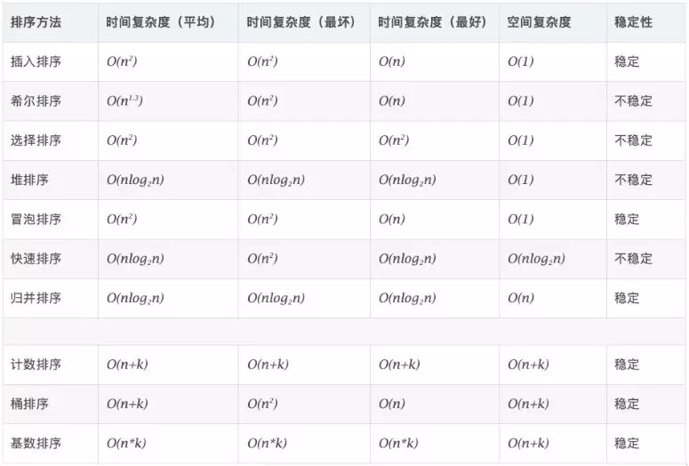

# 排序算法

参考博客： https://mp.weixin.qq.com/s?__biz=MzI0MjQxNjAyOQ==&mid=2247486026&idx=4&sn=ebc6018dc2c3ee5bf103e55b71cf95be&chksm=e97deab8de0a63ae6c7861eeb89929f842c27772a37ea7d59d884996161af430b3eddd1875c3&mpshare=1&scene=23&srcid=1123rheyJtfYO6o0wZJi6Ux9&sharer_sharetime=1574518810397&sharer_shareid=87db472902b201c4b33f695d378e1476#rd 

  


排序算法可以分为两大类：

1、非线性时间比较类排序：通过比较来决定元素间的相对次序，由于其时间复杂度不能突破O(nlogn)，因此称为非线性时间比较类排序。

2、线性时间非比较类排序：不通过比较来决定元素间的相对次序，它可以突破基于比较排序的时间下界，以线性时间运行，因此称为线性时间非比较类排序。




相关概念

- 稳定：如果a原本在b前面，而a=b，排序之后a仍然在b的前面。
- 不稳定：如果a原本在b的前面，而a=b，排序之后 a 可能会出现在 b 的后面。
- 时间复杂度：对排序数据的总的操作次数。反映当n变化时，操作次数呈现什么规律。
- 空间复杂度：是指算法在计算机内执行时所需存储空间的度量，它也是数据规模n的函数。

## 插入排序

### 直接插入排序

插入排序的基本操作就是将一个数据插入到已经排好序的有序数据中，从而得到一个新的、个数加一的有数据，算法适用于少量数据的排序，时间复杂度为0（n^2），是稳定的排序方法。

算法思路：

1. 设置监视哨temp，将待插入记录的值赋值为temp；
2. 设置开始查找的位置j；
3. 在数组arr中进行搜索，搜索中将第j个记录后移，直到temp>=arr[j]为止；
4. 将temp插入arr[j+1]的位置上

```java
public static int[] insertSort(int[] arr) {
        //外层循环确定待比较数值
        //必须从1开始，因为第一次是第二个数与第一个数比较
        for (int i = 0; i < arr.length; i++) {
            //待比较的数值
            int temp = arr[i];
            int j = i - 1;
            //内层循环为待比较数值确定其最终位置
            //待比较数值比前面的小就往前插一位
            for (; j > 0 && arr[j] > temp; j--) {
                //将大于temp的值整体后移一位
                arr[j + 1] = arr[j];
            }
            //待比较的数值比前面的大，最终位置无误
            arr[j + 1] = temp;
        }
        return arr;
    }
```

### 希尔排序

希尔排序（Shell's Sort）是插入排序的一种，又称`缩小增量排序`（Diminishing Increment Sort），是直接插入排序算法的一种更高效的改进版本。希尔排序是非稳定排序算法。

算法思路：

1. 把数组下标的一定增量分组；
2. 对每组使用直接插入排序算法排序；
3. 随着增量逐渐减少，每组包含的值越来越多，当增量减至1时，整个文件被分为一组，算法便终止。

```java
public static int[] shellSort(int[] arr) {
        int d = arr.length;
        while (d >= 1) {
            d = d / 2;
            for (int x = 0; x < d; x++) {
                //按小标的一定增量分组然后进行排序
                for (int i = x + d; i < arr.length; i = i + d) {
                    int temp = arr[i];
                    int j;
                    for (j = i - d; j >= 0 && arr[j] > temp; j = j - d) {
                        arr[j + d] = arr[j];
                    }
                    arr[j + d] = temp;
                }
            }
        }
        return arr;
    }
```

## 交换排序

### 冒泡排序

在一组数据中，相邻元素依次比较大小，最大的放后面，最小的冒上来。

算法思路：

1. 比较相邻的元素，如果第一个比第二个大，就交换
2. 对每一对相邻元素做相同的工作，从开始第一对到结尾的最后一对。
3. 针对所有元素重复以上步骤，除了最后一个
4. 未排好序的元素再次进行冒泡

```java
private static int[] bubbleSort(int[] array) {
        if (array.length == 0) {
            return array;
        }
        for (int i = 0; i < array.length; i++) {
            for (int j = 0; j < array.length - 1 - i; j++) {
                if (array[j + 1] < array[j]) {
                    int temp = array[j + 1];
                    array[j + 1] = array[j];
                    array[j] = temp;
                }
            }
        }
        return array;
    }
```

### 快速排序

快速排序（QuickSort）是对冒泡排序的一种改进。

通过一次排序将数组分成两个子数组，其中一个数字的值都比另外一个数组的值小，然后再对这两子数组分别进行快速排序，整个排序过程可以递归进行，依次达到整个数据变成有序序列。

算法思路`分治法`：

1. 定义i=0，j = A.length-1，i为第一个数的下标，j为最后一个数下标
2. 从数组的最后一个数Aj从右往左找，找到第一个小于key的数，记为Aj
3. 从数组的第一个数Ai从左往右找，找到第一个大于key的数，记为Ai
4. 交换Ai和Aj
5. 重复这个过程，直到i=j
6. 调整key的位置，把A[i]和key交换

```java
 public static void quickSort(int[] a, int left, int right) {
        if (left > right)
            return;
        int pivot = a[left];//定义基准值为数组第一个数
        int i = left;
        int j = right;

        while (i < j) {
            while (pivot <= a[j] && i < j)//从右往左找比基准值小的数
                j--;
            while (pivot >= a[i] && i < j)//从左往右找比基准值大的数
                i++;
            if (i < j)                     //如果i<j，交换它们
            {
                int temp = a[i];
                a[i] = a[j];
                a[j] = temp;
            }
        }
        a[left] = a[i];
        a[i] = pivot;//把基准值放到合适的位置
        quickSort(a, left, i - 1);//对左边的子数组进行快速排序
        quickSort(a, i + 1, right);//对右边的子数组进行快速排序
    }
```

## 选择排序

### 简单选择排序

选择排序`selection-sort`是一种简单直观的排序算法。它的工作原理：首先在未排序序列中找到最小（大）元素，存档在排序序列的起始位置，然后，再从剩余未排序元素中继续寻找最小（大）元素，然后放到已排序序列的末尾，以此类推，直到所有元素均排序完毕。

算法思路：

1. 首先在未排序序列中找到最小（大）元素，存放到排序序列的起始位置
2. 再从剩余未排序元素中继续寻找最小（大）元素，然后放到已排序序列的末尾
3. 以此类推，直到所有元素均排序完毕

```java
  private static void selectSort(int[] arr) {
        int minIndex = 0;
        int temp;
        for (int i=0;i<arr.length;i++){
            minIndex = i;
            for (int j = i+1;j<arr.length;j++){
                //找到当前循环最小值索引
                if(arr[j]<arr[minIndex]){
                    minIndex = j;
                }
            }
            temp = arr[i];
            //交换当前循环起点值和最小值索引位置的值
            arr[i] = arr[minIndex];
            arr[minIndex] = temp;
        }
    }
```


### 堆排序

堆排序`HeapSort`是指利用堆这种数据结构所涉及的一种排序算法。堆是一个近似`完全二叉树`的结构，并同时满足堆积的性质：即子节点的键值或索引总是小于（或者大于）它的父节点。在堆的数据结构中，堆中的最大值总是位于根节点（在优先队列中使用堆的话堆中的最小值位于根节点）

简单来说：

**堆排序是将数据看成是完全二叉树、根据完全二叉树的特性来进行排序的一种算法**

- **最大堆要求节点的元素都要不小于其孩子，最小堆要求节点元素都不大于其左右孩子**
- **那么处于最大堆的根节点的元素一定是这个堆中的最大值**

算法思路：

1. 最大堆调整（MaxHeapify）：将堆的末端子节点作调整，某个节点的值最多和其父节点的值一样大；
2. 创建最大堆（Build Max Heap）：将堆中的所有数据重新排序，堆中的最大元素存放在根节点中；
3. 堆排序（HeapSort）：移除位的第一个数据的根节点，并做最大堆调整的递归运算。

```java
public class HeapSort {
    public static void main(String[] args) {
        int[] arr = new int[]{33, 42, 1, 44, 4, 63, 3, 32};
        heapSort(arr);
        System.out.println(Arrays.toString(arr));
    }

    private static void heapSort(int[] arr) {
        for (int i = 0; i < arr.length; i++) {
            //每次建堆就可以排除一个元素了
            buildMaxHeap(arr, arr.length - i);
            //交换
            int temp = arr[0];
            arr[0] = arr[(arr.length - 1) - i];
            arr[(arr.length - 1) - i] = temp;
        }
    }

    /**
     * 建堆
     *
     * @param arr          看作是完全二叉树
     * @param parent       当前父节点位置
     * @param length       节点总数
     */
    private static void heapAdjust(int[] arr, int parent, int length) {
        if (parent < length) {
            //左子树和右字数的位置
            int left = 2 * parent + 1;
            int right = 2 * parent + 2;

            //把当前父节点位置看成是最大的
            int max = parent;

            if (left < length) {
                //如果比当前根元素要大，记录它的位置
                if (arr[max] < arr[left]) {
                    max = left;
                }
            }
            if (right < length) {
                //如果比当前根元素要大，记录它的位置
                if (arr[max] < arr[right]) {
                    max = right;
                }
            }
            //如果最大的不是根元素位置，那么就交换
            if (max != parent) {
                int temp = arr[max];
                arr[max] = arr[parent];
                arr[parent] = temp;

                //继续比较，直到完成一次建堆
                heapAdjust(arr, max, length);
            }
        }

    }

    /**
     *  完成一次建堆，最大值在堆的顶部(根节点)
     *
     */
    private static void buildMaxHeap(int[] arr, int size) {
        // 从数组的尾部开始，直到第一个元素(角标为0)
        for (int i = size - 1; i >= 0; i--) {
            heapAdjust(arr, i, size);
        }
    }
}
```

参考：https://www.cnblogs.com/Java3y/p/8639937.html

## 递归排序

### 二路归并排序

归并排序`MergeSort`是建立在归并操作上的一种有效的排序算法，该算法是采用分治法（Divide and Conquer）的一个非常典型的应用。将已有序的子序列合并，得到完全有序的序列；即先使每个子序列有序，再使子序列段间有序。

若将两个有序表合并成一个有序表，称为二路归并。例如，将2个有序数组合并，比较两个数组的第一个数，谁小就先取谁，取了后就在对应数组中删除这个数，然后再进行比较，如果数组为空，那直接将另一个数组一次取出即可。

算法思路：

1. 将数组分成A、B两个数组，如果这两个数组都是有序的，那么就可以很方便的将这两个数组进行排序
2. 让着两个数组有序，可以将A、B组各自再分成两个数组。以此类推，当分出来的数组只有一个数据时，可以认为数组已经达到了有序
3. 然后再合并相邻的两个数组，这通过先递归的分解数组，再合并数组就完成了归并排序

```java
public class MergeSort {
    public static void main(String[] args) {
        int[] array = new int[]{33, 42, 1, 44, 4, 63, 3, 32};
        mergeSort(array);
        System.out.println(Arrays.toString(array));
    }

    private static void mergeSort(int[] arr) {
        //临时数组
        int[] temp = new int[arr.length];
        sort(arr, temp, 0, arr.length - 1);
    }

    private static void sort(int[] arr, int[] temp, int left, int right) {
        if (left >= right) {
            return;
        }
        int mid = left + (right - left) / 2;
        sort(arr, temp, left, mid);
        sort(arr, temp, mid + 1, right);
        merge(arr, temp, left, mid, right);
    }

    private static void merge(int[] arr, int[] temp, int leftStart, int leftEnd, int rightEnd) {
        int rightStart = leftEnd + 1;
        //从左开始算
        int tempIndex = leftStart;
        //元素个数
        int len = rightEnd - leftStart + 1;
        while (leftStart <= leftEnd && rightStart <= rightEnd) {
            if (arr[leftStart] <= arr[rightStart]) {
                temp[tempIndex++] = arr[leftStart++];
            } else {
                temp[tempIndex++] = arr[rightStart++];
            }
        }
        //左边如果有剩余，将左边剩余的归并
        while (leftStart <= leftEnd) {
            temp[tempIndex++] = arr[leftStart++];
        }
        //右边如果有剩余，将右边剩余的归并
        while (rightStart <= rightEnd) {
            temp[tempIndex++] = arr[rightStart++];
        }
        //从临时数组拷贝到原数组
        for (int i = 0; i < len; i++) {
            arr[rightEnd] = temp[rightEnd];
            rightEnd--;
        }
    }
}
```

## 计数排序

计数排序`CountingSort`不是基于比较的排序算法，其核心在于将输入的数据值转化为键存储在额外开辟的数组空间中，作为一种线性时间复杂度的排序，计数排序要求输入的数据必须是有确定范围的整数。

算法思路：

1. 求出待排序数组的最大值max和最小值min
2. 实例化辅助计数数组temp，temp数组中每个下标对应arr中的一个元素，temp用来记录每个元素出现的次数
3. 计算arr中每个元素在temp中的位置postion = arr[i] - min
4. 根据temp数组求得排序后的数组

```java
public class CountSort {
    public static void main(String[] args) {
        int[] array = new int[]{33, 42, 1, 44, 4, 63, 3, 32};
        countSort(array);
        System.out.println(Arrays.toString(array));
    }

    private static void countSort(int[] arr) {
        if (arr == null || arr.length == 0) {
            return;
        }
        int max = Integer.MIN_VALUE;
        int min = Integer.MAX_VALUE;
        //找出数组中的最大最小值
        for (int i = 0; i < arr.length; i++) {
            max = Math.max(max, arr[i]);
            min = Math.min(min, arr[i]);
        }
        int[] temp = new int[max];
        //找出每个数字出现的次数
        for (int i = 0; i < arr.length; i++) {
            //每个元素在temp中的位置 position = arr[i] - min
            int position = arr[i] - min;
            temp[position]++;
        }
        int index = 0;
        for (int i = 0; i < temp.length; i++) {
            //temp[i] 大于0表示有重复元素
            while (temp[i]-- > 0) {
                arr[index++] = i + min;
            }
        }
    }
}

```

## 桶排序

桶排序`BucketSort`的工作原理是将数组分到有限数量的桶里。每个桶再分别排序（有可能再使用别的排序算法或者是以递归方式继续使用桶排序进行排序）。当要被排序的数组内的数值是均匀分配的时候，桶排序使用线性时间（O（n）），但桶排序并不是比较排序，他不受O(nlogn)下限的印象，桶排序可用于最大最小值相差较大的数据情况。

算法思路：

1. 找出待排序数组中的最大值max和最小值min
2. 我们使用动态数组ArrayList作为桶，桶里放的元素也用ArrayList存储。桶的数量为（max - min）/ arr.length + 1
3. 遍历数组arr，计算每个元素arr[i]放的桶
4. 每个桶各自排序
5. 遍历桶数组，把排序好的元素放进输出数组

```java
public class BucketSort {
    public static void main(String[] args) {
        int[] array = new int[]{33, 42, 1, 44, 4, 63, 3, 32};
        bucketSort(array);
        System.out.println(Arrays.toString(array));
    }

    private static void bucketSort(int[] arr) {
        int max = Integer.MIN_VALUE;
        int min = Integer.MAX_VALUE;
        for(int i=0;i<arr.length;i++){
            max = Math.max(max, arr[i]);
            min = Math.min(min, arr[i]);
        }
        //桶数
        int bucketNum = (max-min) /arr.length +1;
        ArrayList<ArrayList<Integer>> bucketArr = new ArrayList<>(bucketNum);
        for(int i=0;i<bucketNum;i++){
            bucketArr.add(new ArrayList<>());
        }
        //将每个元素放入桶
        for(int i=0;i<arr.length;i++){
            int num = (arr[i] - min)/arr.length;
            bucketArr.get(num).add(arr[i]);
        }
        //对每个桶进行排序
        for(int i=0;i<bucketNum;i++){
            Collections.sort(bucketArr.get(i));
        }
        int position = 0;
        //合并桶
        for(int i=0;i<bucketNum;i++){
            for(int j=0;j<bucketArr.get(i).size();j++){
                arr[position++] = bucketArr.get(i).get(j);
            }
        }
    }
}
```

## 基数排序

基数排序`RadixSort`是桶排序的扩展，基本思想是将整数按位数切割成不同的数字，然后按每个位数分别比较。

基数排序法是属于稳定性的排序，其时间复杂度为O(nlog(r)m)，其中r为所采取的基数，而m为堆数，在某些时候，基数排序法的效率高于其他的稳定性排序法。

算法思路：

1. 取得数组中的最大数，并取得位数
2. arr为原始数组，从最低位开始取每个位数为radix数组
3. 对radix进行计数排序（利用计数排序适用于小范围数的特点）

```java
public class RadixSort {
    public static void main(String[] args) {
        int[] array = new int[]{33, 42, 1, 44, 4, 63, 3, 32};
        radixSort(array);
        System.out.println(Arrays.toString(array));
    }

    private static void radixSort(int[] array) {
        //数组arr中的最大值
        int max = getMax(array);
        for (int exp = 1; max / exp > 0; exp *= 10) {
            //从个位开始，对数组arr按“exp指数”进行排序
            countSort(array, exp);
        }
    }

    private static void countSort(int[] array, int exp) {
        //存储“被排序数据”的临时数组
        int[] temp = new int[array.length];
        int[] buckets = new int[10];

        //将数据出现的次数存储在buckets[]中
        for (int i = 0; i < array.length; i++) {
            buckets[(array[i] / exp) % 10]++;
        }
        //计算数据在temp[]中的位置 0 1 2 3 --> 0 1 3 5 8
        for (int i = 1; i < 10; i++) {
            buckets[i] += buckets[i - 1];
        }
        //将数据存储到临时数组temp[]中
        for (int i = array.length - 1; i >= 0; i--) {
            temp[buckets[(array[i]) / exp % 10] - 1] = array[i];
            buckets[(array[i] / exp) % 10]--;
        }
        //将排好序的数据赋值给arr[]
        for (int i = 0; i < array.length; i++) {
            array[i] = temp[i];
        }
    }

    private static int getMax(int[] array) {
        int max = array[0];
        for (int i = 1; i < array.length; i++) {
            if (array[i] > max) {
                max = array[i];
            }
        }
        return max;
    }
}
```


